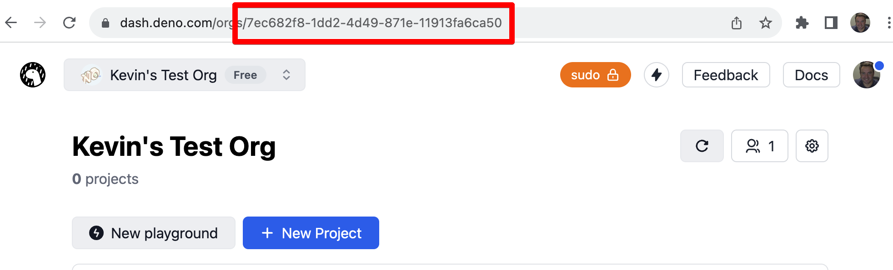

# Deno Deploy REST API

Developers can provision projects, domains, KV databases, and other resources using the Deno Deploy REST API.

## Endpoint and authentication

The base URL for the Deno Deploy REST API v1 is below.

```
https://api.deno.com/v1/
```

The v1 API uses [HTTP bearer token](https://swagger.io/docs/specification/authentication/bearer-authentication/) authentication. You can create an access token to use the API in the dashboard [here](https://dash.deno.com/account#access-tokens).

Most API requests will also require your organization ID. You can retrieve yours by looking in the address bar of your browser in the Deno Dashboard while viewing the project list for your organization.



Using both your organization ID and your access token, you can test your API access by listing all the projects associated with your organization. Here is an example Deno script you can use to access the API.

```typescript
// Replace these with your own!
const organizationId = "a75a9caa-b8ac-47b3-a423-3f2077c58731";
const token = "ddo_u7mo08lBNHm8GMGLhtrEVfcgBsCuSp36dumX";

const res = await fetch(
  `https://api.deno.com/v1/organizations/${organizationId}/projects`,
  {
    method: "GET",
    headers: {
      Authorization: `Bearer ${token}`,
    },
  },
);

const response = await res.json();
console.log(response);
```
