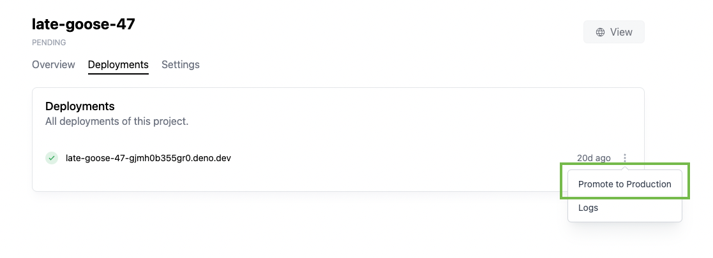

:::info Legacy Documentation

You are viewing legacy documentation for Deno Deploy Classic. We recommend
migrating to the new
<a href="/deploy/early-access/">Deno Deploy<sup>EA</sup></a> platform.

:::

A deployment is a snapshot of the code and environment variables required to run
an application. A new deployment can be created
[via `deployctl`](./deployctl.md#deploy) or automatically via Deploy's Github
integration if configured.

Deployments are immutable after they have been created. To deploy a new version
of the code for an application, a new deployment must be created. Once created,
deployments remain accessible.

All available deployments are listed on your project page under the
`Deployments` tab, pictured below. Old deployments can be deleted
[via `deployctl`](./deployctl.md#delete) and
[via API](https://apidocs.deno.com/#delete-/deployments/-deploymentId-).


## Custom domains

There can also be other URLs that can point to a deployment, like
[custom domains](custom-domains).

## Branch domains

`<projectname--branchname>.deno.dev` is also supported.

## Production vs. preview deployments

All deployments have a preview URL that can be used to view this specific
deployment. Preview URLs have the format
`{project_name}-{deployment_id}.deno.dev`.


A deployment can either be a production or a preview deployment. These
deployments do not have any differences in runtime functionality. The only
distinguishing factor is that a project's production deployment will receive
traffic from the project URL (e.g. `myproject.deno.dev`), and from custom
domains in addition to traffic to the deployment's preview URL.

## Promoting preview deployments to production deployments via Deno Deploy Classic UI

Preview deployments can be "promoted" to production via the Deno Deploy Classic
UI:

1. Navigate to the project page.
2. Click on the **Deployments** tab.
3. Click on the three dots next to the deployment you want to promote to
   production and select **Promote to Production**
   

Promoting deployments to production is restricted to deployments that already
use the production KV database. This is particularly relevant for GitHub
deployments that use a different database for preview and production
deployments. Deployments (even those that use the preview KV database) can
always be redeployed to production using
[the `deployctl deployments redeploy` command](./deployctl.md#production-domains).

## Creating production deployments via `deployctl`

If you are deploying your Deno code with `deployctl`, you can deploy directly to
production with the `--prod` flag:

```sh
deployctl deploy --prod --project=helloworld main.ts
```
