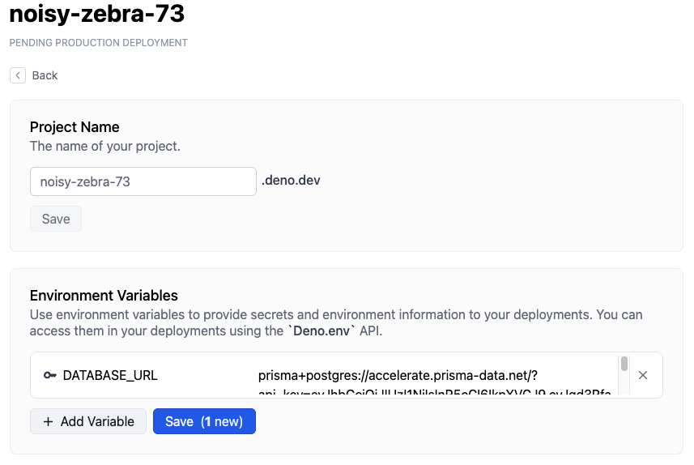

:::info Legacy Documentation

You are viewing legacy documentation for Deno Deploy Classic. We recommend
migrating to the new
<a href="/deploy/">Deno Deploy</a> platform.

:::

This tutorial covers how to connect to a Prisma Postgres database from an
application deployed on Deno Deploy.

## Setup Postgres

There are several ways to set up a Prisma Postgre database for your Prisma
project. This guide covers the most common approaches.

### Method 1: Using Prisma CLI

Run the following command to initialize a new Prisma project with a database:

```bash
npx prisma init --db
```

This will prompt you to select your preferred region and database name. Once
completed, you'll find the `DATABASE_URL` connection string in your `.env` file.

### Method 2: Using `npx create-db`

Alternatively, you can use the dedicated database creation tool:

```bash
npx create-db@latest
```

This command will provide you with two connection strings tied to the same
database:

**Prisma ORM optimized connection string:**

```txt
prisma+postgres://accelerate.prisma-data.net/?api_key=<api_key>
```

**Standard Prisma Postgres connection string:**

```txt
postgresql://<username>:<password>@db.prisma.io:5432/postgres
```

In order to keep the database created with `npx create-db`, you must follow
through with the claim process. That can be done via the claim link provided in
the terminal.

The Prisma ORM optimized connection string (`prisma+postgres://`) only works
with the Prisma ORM, while the standard Prisma Postgre connection string can be
used with other database tools and libraries.

## Create a project in Deno Deploy

Next, let's create a project in Deno Deploy Classic and set it up with the
requisite environment variables:

1. Go to [https://dash.deno.com/new](https://dash.deno.com/new) (Sign in with
   GitHub if you didn't already) and click on **Create an empty project** under
   **Deploy your own code**.
2. Now click on the **Settings** button available on the project page.
3. Navigate to **Environment Variables** Section and add the following secret.

- `DATABASE_URL` - The value should be set to the connection string you saved in
  the last step.



## Write code that connects to Postgres

Now that you have your database set up, let's create a simple application that
connects to the Prisma Postgres database using Prisma ORM.

### 1. Install dependencies

First, install the required dependencies:

```bash
deno install npm:@prisma/client
deno install npm:@prisma/extension-accelerate
deno install npm:dotenv-cli
```

:::note

The `dotenv-cli` package is needed because Prisma Client doesn't read `.env`
files by default on Deno.

:::

### 2. Create the database schema

With your database connection configured, you can now apply the data model to
your database:

```bash
deno run -A npm:prisma migrate dev --name init
```

This command creates a new SQL migration file and runs it against your database.

### 3. Update your Prisma schema

Edit your `prisma/schema.prisma` file to define a `Log` model and configure it
for Deno:

```ts
generator client {
  provider = "prisma-client"
  output   = "../generated/prisma"
  runtime  = "deno"
}

datasource db {
  provider = "postgresql"
  url      = env("DATABASE_URL")
}

model Log {
  id      Int    @id @default(autoincrement())
  level   Level
  message String
  meta    Json
}

enum Level {
  Info
  Warn
  Error
}
```

### 4. Create your application

Create `index.ts` in your project root with the following content:

```typescript
import { serve } from "https://deno.land/std@0.140.0/http/server.ts";
import { withAccelerate } from "npm:@prisma/extension-accelerate";
import { PrismaClient } from "./generated/prisma/client.ts";

const prisma = new PrismaClient().$extends(withAccelerate());

async function handler(request: Request) {
  // Ignore /favicon.ico requests:
  const url = new URL(request.url);
  if (url.pathname === "/favicon.ico") {
    return new Response(null, { status: 204 });
  }

  const log = await prisma.log.create({
    data: {
      level: "Info",
      message: `${request.method} ${request.url}`,
      meta: {
        headers: JSON.stringify(request.headers),
      },
    },
  });
  const body = JSON.stringify(log, null, 2);
  return new Response(body, {
    headers: { "content-type": "application/json; charset=utf-8" },
  });
}

serve(handler);
```

### 4. Test your application locally

Start your application locally to test the database connection:

```bash
npx dotenv -- deno run -A ./index.ts
```

Visit `http://localhost:8000` in your browser. Each request will create a new
log entry in your database and return the log data as JSON.

## Deploy application to Deno Deploy Classic

Once you have finished writing your application, you can deploy it on Deno
Deploy Classic.

To do this, go back to your project page at
`https://dash.deno.com/projects/<project-name>`.

You should see a couple of options to deploy:

- [Github integration](ci_github)
- [`deployctl`](./deployctl.md)
  ```sh
  deployctl deploy --project=<project-name> <application-file-name>
  ```

Unless you want to add a build step, we recommend that you select the GitHub
integration.

For more details on the different ways to deploy on Deno Deploy Classic and the
different configuration options, read [here](how-to-deploy).
