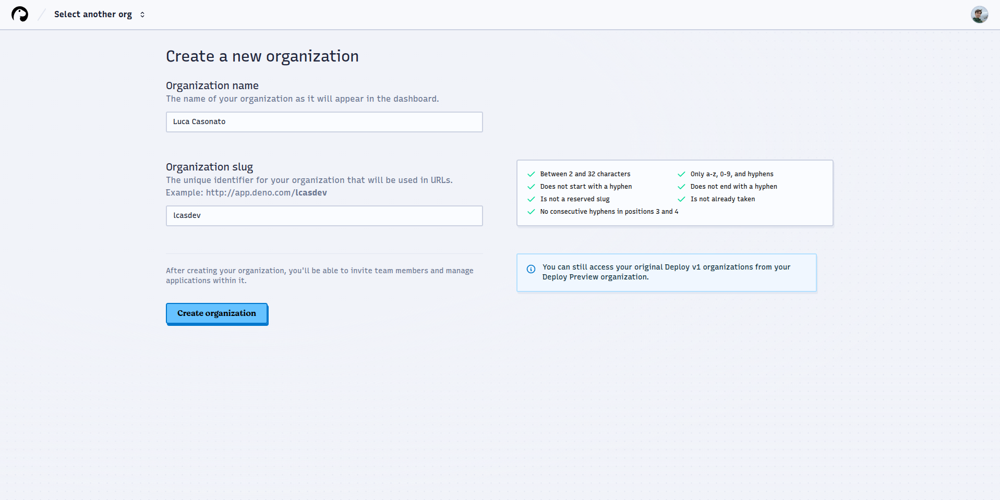

:::info

You are viewing the documentation for Deno DeployEA. Looking for
Deploy Classic documentation? [View it here](/deploy/).

:::

:::note

Deno DeployEA is in private beta. To use Deno Deploy
EA you must join the Early Access program from the
[Deploy Classic account settings page](https://dash.deno.com/account#early-access).

After joining the Early Access program, you may still not immediately have
access to Deno DeployEA as we are rolling out access in waves.

:::

## Create an organization

To get started with Deno DeployEA, you must first create a Deno
DeployEA organization. You can do this by visiting
[app.deno.com](http://app.deno.com).

Upon first visiting the dashboard, you’ll be greeted by the Deno Deploy
EA organization creation screen:

You can not currently create an organization that has the same slug as any
project name in Deploy Classic.

Currently, the organization name and organization slug can not be changed after
organization creation.

## Create an app

After creating an organization, you will be redirected to the organization apps
page, where you can see the list of all organizations in the app. From here you
can navigate to the organization settings, and the custom domains list which
manages the custom domains attached to your organization.

To create an app, press the `+ New App` button:

An application is a single deployed web service with one build configuration,
build history, environment variables, attached custom domains, a linked GitHub
repository, etc.

## Select a repo

Next, you will need to select the GitHub repository to deploy your app code
from. At time of writing, you must deploy from a GitHub repository.

If your repository does not show up, use the `Add another GitHub account` or
`Configure GitHub App permissions` buttons in the user/org, or repo dropdowns to
grant the Deno Deploy GitHub app permission to deploy your repositories.

> ⏳ We do not yet support deploying mono-repos (for example, repos where the
> actual application lives entirely in a subdirectory).

## Configure your app

After selecting a GitHub repository, Deno DeployEA will automatically
attempt to detect the kind of application you are deploying and determine
appropriate build configuration. You can see the detected configuration in the
`App Config` box on the top right.

If the build configuration was incorrectly detected, or you want to make changes
to it, click the `Edit build config` button to open the build config drawer.

## Configure your build

In the build config drawer you can edit the framework preset. If you are not
using a framework, or are using a framework that is not in the list, select
`No Preset`.

You can then edit multiple options depending on what preset you have selected:

### install command

If you need to install dependencies before running the build command, such as
`npm install`, `deno install`, or similar, enter this command here. If you are
deploying a Deno application that does not have a `package.json`, you can
usually leave this empty.

### Build command

The command to execute to take your source code and build/bundle/compile the
application to be able to deploy it. This could be a framework build command
such as `next build`, a build task in your `package.json` or `deno.json`, or a
any other shell script. If your application does not have a build command, such
as a server-side Deno application with a JavaScript or TypeScript entrypoint,
you can leave this field empty.

### Runtime configuration

For most frameworks there are no options to configure here, as Deno Deploy
EA will figure out the ideal runtime configuration for the app based
on the framework preset. When a framework is not configured, you can choose here
whether the app is a `Dynamic` app that needs to execute code server side for
every request, such as an API server, server-side rendered application, etc., or
a `Static` app that consists only of a set of static files that need to be
hosted.

### Dynamic Entrypoint

The JavaScript or TypeScript file that should be executed to start the
application. This is the file path that you would pass locally to `deno
run` or
`node` to start the app. The path has to be relative to the working directory.

### Dynamic arguments

Additional command line arguments to pass to the app on startup, after the
entrypoint. These are arguments that are passed to the application not to Deno
itself.

### Static Directory

The directory in the working directory that contains the static files to be
served. For example,`dist`,`_site`, or`.output`.

### Single Page App mode

Whether the application is a single page app that should have the root
`index.html` served for any paths that do not exist as files in the static
directory, instead of a 404 page.

Closing the drawer saves the settings.

### Environment variables

On this page, you can also add environment variables by pressing the
`Add/Edit environment variables` button:

In this drawer, press the `+ Add variable` button to create a new environment
variable for this project. You can give it a name, a value, and select whether
this variable should be saved in plain text (you can view the value from the
console later), or as a secret (you can not view the value from the console
later).

You can also select what contexts the environment variable should be available
in. The available contexts are:

- **Production:** requests hitting your application through one of the
  production domains, such as `<app>.<org>.deno.net`, or a custom domain.
- **Development:** requests hitting preview domains, or git branch domains of
  your application.

Environment variables must be added to at least one context, but can be added to
multiple, or even all contexts.

To save the environment variables, press the save button. You can re-open the
drawer to edit / remove environment variables you have added.

You can also edit the app name on this page, and select which region(s) the
application should be served from.

## Build and deploy your app

Finally, you can press the `Create App` button to create the app. This will
create the app and immediately trigger the first build:

On the build page you can see live streaming build logs split into multiple
sections:

- **Prepare:** cloning the GitHub repository and restoring build cache
- **Install:** executing the install command, and any framework specific
  pre-install setup
- **Build:** executing the build command, any framework specific pre- and
  post-build setup, and preparing the build artifact for deployment
- **Warm up:** sending a request to the preview URL of the deployment to ensure
  it starts up correctly. The logs shown in the Warm up section are Runtime
  logs, not build logs.
- **Route:** Deno Deploy is rolling out the new version of this build into all
  global regions.

In the top left of this build is a button to cancel the build. For failed
builds, there is also a button to restart the build.

For completed builds, the top right shows the preview URL of the build. Further
down all timelines that this build is deployed to are shown, such as
`Production`, or `Git Branch` timelines.

You can also see how the build was triggered on this page. This can either be
`manual action`, for builds triggered through the UI, or `GitHub repo` for
builds triggered through the GitHub integration.

You can view the application through either the preview URL, or any of the other
URLs shown in the timelines list.

## Monitor your application

After visiting your application, you can view telemetry about your application
in the form of the logs and traces available in our observability panels. You
can visit these pages by clicking the respective buttons in the left sidebar.

### Logs

The logs page shows all recent logs in the project. By default logs from all
contexts (production and development) are shown, but using the filter button and
search bar at the top, the shown logs can be restricted. For example, to filter
to only production logs, add `context:production` to the search bar. To only
show logs from a certain revision, use `revision:<id>` etc.

You can also use full text search in the search bar. The full text search fill
filter down the log entries to only those containing the text written,
case-insensitively.

By default logs from the last hour are shown. The time picker in the top right
can be used to adjust the time frame that logs are shown for. The time zone of
the timestamps shown is the time zone set in the time picker.

The "view trace" button on the right of a log line shows up if a log line is
correlated with a trace. This happens when a log line occurs within an active
trace. Clicking this button will open the respective trace as an overlay.

### Traces

The traces page shows all recent traces in the project. By default traces from
all contexts (production and development) are shown, but using the filter button
and search bar at the top, the shown traces can be restricted. For example, to
filter to only production traces, add `context:production` to the search bar. To
only show traces from a certain revision, use `revision:<id>` etc.

All traces that contain an incoming HTTP request are shown in the list. The text
shown for each trace is the path of the request, and the duration of the trace
in milliseconds.

Clicking on a trace will open the trace view, which shows the full trace
including all spans and logs that are part of the trace.

For each span in the trace you can see the duration of the span, the name of the
span, the start and end time, and the recorded attributes. By clicking on a span
in the timeline, the details of that span will be shown in the summary panel at
the bottom.

The logs that are emitted as part of a given span are shown in the logs tab at
the bottom. Changing the selected span will update which logs are shown in this
panel.
