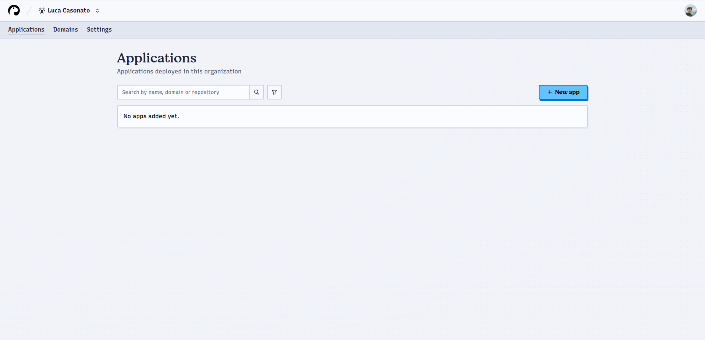
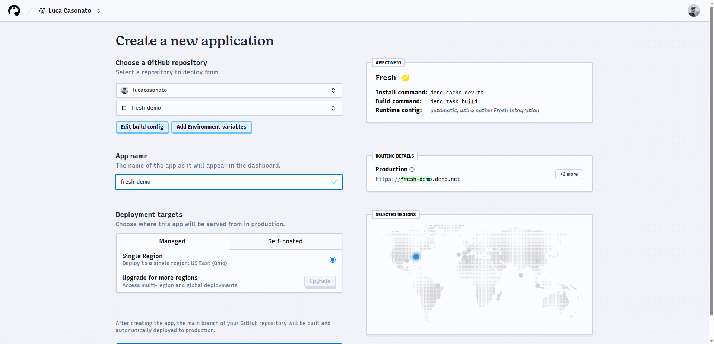
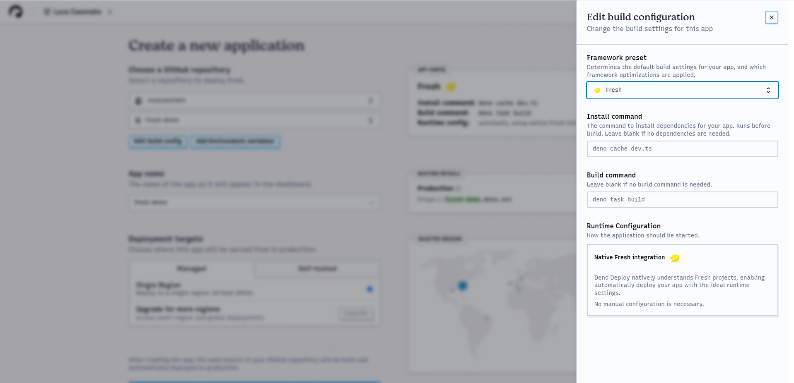

:::info

You are viewing the documentation for Deploy Early Access. Looking for Deploy
Classic documentation? [View it here](/deploy/).

:::

# Deploying Your First Application

This guide walks you through deploying your first application on Deno Deploy
**EA**.

## Creating a New App

1. From your organization's dashboard, click the "+ New App" button
2. You'll be taken to the app creation page

## Selecting a GitHub Repository

1. Choose the GitHub organization or user account that contains your repository
2. Select the repository you want to deploy

> **Note**: If your repository doesn't appear, use the "Add another GitHub
> account" or "Configure GitHub App permissions" buttons to grant the Deno
> Deploy GitHub app the necessary permissions.

## Configuring Your App

Deno DeployEA will attempt to automatically detect your application
type and suggest appropriate build settings:

1. Review the detected configuration in the "App Config" box
2. If necessary, click "Edit build config" to adjust the settings

### Build Configuration

In the build config drawer, you can configure:

1. **Framework preset**: Select a supported framework or "No Preset" if using a
   custom setup
2. **Install command**: Command to install dependencies (e.g., `npm install`,
   `deno install`)
3. **Build command**: Command to build your application (e.g., `next build`,
   `deno task build`)
4. **Runtime configuration**: Choose between Dynamic (server-rendered) or Static
   (pre-built files)

For Dynamic apps, specify:

- **Entrypoint**: The main file to execute (e.g., `main.ts`, `server.js`)
- **Arguments**: Any command-line arguments to pass to the application

For Static apps, specify:

- **Directory**: The folder containing built assets (e.g., `dist`, `_site`,
  `.output`)
- **Single Page App mode**: Whether to serve `index.html` for routes that don't
  match static files

### Environment Variables

To add environment variables:

1. Click "Add/Edit environment variables"
2. Add variables one by one or paste from a `.env` file
3. For each variable, specify:
   - Name and value
   - Whether it's a secret (hidden after creation)
   - Which contexts it applies to (Production, Development, or both)

## Creating and Deploying Your App

1. Click "Create App" to finalize the setup
2. Deno DeployEA will immediately begin building your application

On the build page, you'll see live streaming build logs broken into sections:

- **Prepare**: Repository cloning and cache setup
- **Install**: Dependency installation
- **Build**: Application building and artifact preparation
- **Warm up**: Initial request to ensure the application starts correctly
- **Route**: Global deployment of the new version

## Monitoring Your Deployment

After your app is deployed:

1. Use the preview URL to verify your application is working correctly
2. Monitor logs and traces through the observability panels in the sidebar

### Viewing Logs

The logs page shows console output from your application:

You can filter logs by:

- Context (production/development)
- Revision ID
- Time range
- Full text search

### Analyzing Traces

The traces page shows detailed execution information for requests:

Clicking on a trace reveals the full waterfall view with timing information:

## Next Steps

Congratulations! Your first app is now deployed on Deno Deploy
**EA**. From here, you can:

- [Set up a custom domain](../guides/custom-domains) for your application
- [Configure environment variables](../guides/environment-variables) for
  different contexts
- Explore the [reference documentation](../reference/) for advanced features

For additional help with your deployment, [contact Deno support](../support).
