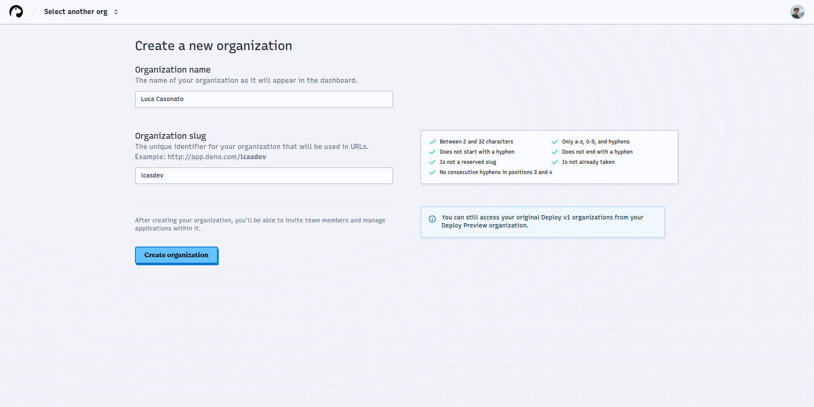
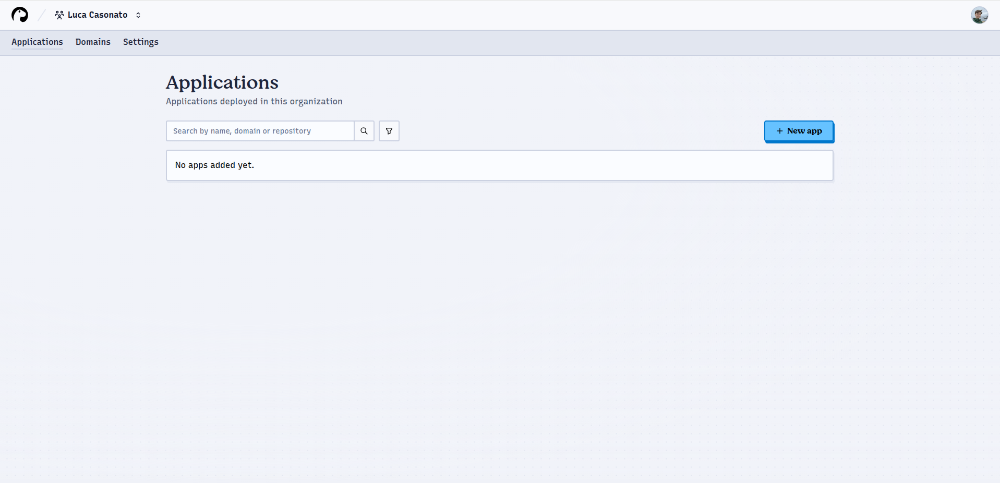
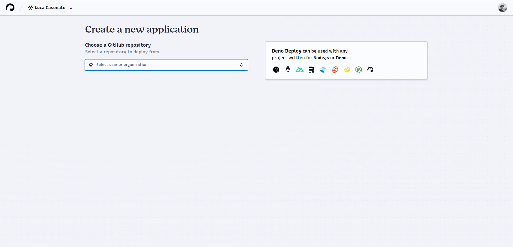
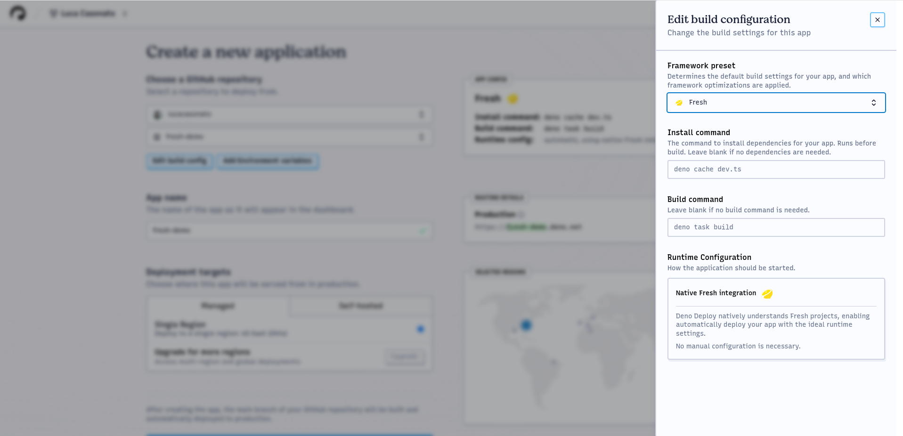
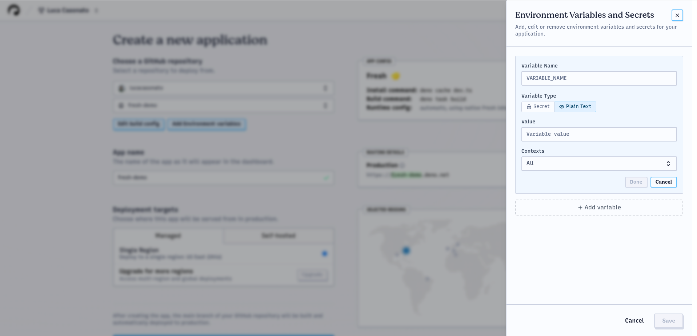
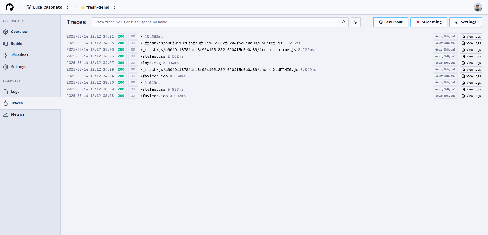
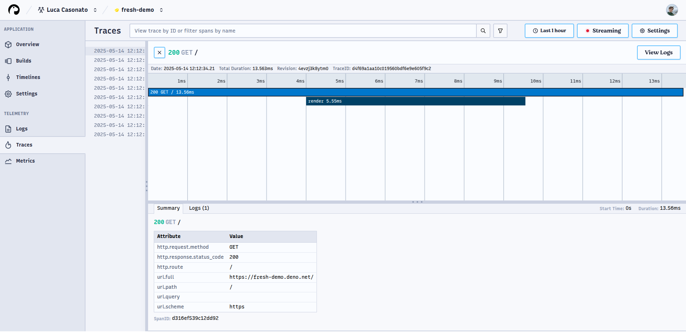

## Create an organization

Deno Deploy will eventually replace Deno Deploy Classic. Until that time both
systems will be available simultaneously. By creating an organisation for use
with Deploy it is possible to explore Deploy without disrupting projects already
using Deploy Classic.

To get started with Deno Deploy:

1. Visit [console.deno.com](http://console.deno.com)
2. Create an organization:

Note that you cannot create an organization with the same slug as any existing
project in Deploy Classic. Organization names and slugs cannot be changed after
creation.

## Create an app

After creating an organization, you'll be directed to the organization apps
page, which shows all your applications and provides access to organization
settings and custom domains.

To create an app, press the `+ New App` button:

An application is a single deployed web service with one build configuration,
build history, environment variables, attached custom domains, a linked GitHub
repository, etc.

## Select a repo

1. Choose the GitHub repository for your application:

If your repository doesn't appear, use the `Add another GitHub account` or
`Configure GitHub App permissions` buttons to grant the Deno Deploy GitHub app
access to your repositories.

> ⏳ Mono-repos (repositories where the application lives in a subdirectory) are
> not yet supported.

## Configure your app

Deno Deploy automatically attempts to detect your application type and configure
an appropriate build setup. You can see the detected configuration in the
`App Config` box:

To modify this configuration, click `Edit build config`.

## Configure your build

In the build config drawer, you can customize:

### Framework preset

Select your framework or choose `No Preset` if using a custom setup.

### Install command

Command for installing dependencies (e.g., `npm install`, `deno install`). This
can be empty for Deno applications without a `package.json`.

### Build command

Command to compile/bundle your application (e.g., `next build`,
`deno task build`). Leave empty if your application doesn't require building.

### Runtime configuration

For most frameworks there are no options to configure here, as Deno Deploy will
figure out the ideal runtime configuration for the app based on the framework
preset. When a framework is not configured, you can choose here whether the app
is a `Dynamic` app that needs to execute code server side for every request,
such as an API server, server-side rendered application, etc., or a `Static` app
that consists only of a set of static files that need to be hosted.

### Dynamic Entrypoint

The JavaScript or TypeScript file that should be executed to start the
application. This is the file path that you would pass locally to `deno
run` or
`node` to start the app. The path has to be relative to the working directory.

### Dynamic arguments

Additional command line arguments to pass to the app on startup, after the
entrypoint. These are arguments that are passed to the application not to Deno
itself.

### Static Directory

The directory in the working directory that contains the static files to be
served. For example,`dist`,`_site`, or`.output`.

### Single Page App mode

Whether the application is a single page app that should have the root
`index.html` served for any paths that do not exist as files in the static
directory, instead of a 404 page.

Closing the drawer saves the settings.

### Environment variables

To add environment variables:

1. Click `Add/Edit environment variables`
2. Click `+ Add variable` in the drawer
3. Enter the name and value
4. Choose whether it's a plain text variable or secret
5. Select the contexts where it should be available:
   - **Production**: For requests to production domains
   - **Development**: For requests to preview/branch domains
6. Click `Save` to apply your changes

## Build and deploy your app

1. Click `Create App` to create the application and start the first build
2. Watch the build progress through the live logs:

The build logs show these stages:

- **Prepare**: Cloning the repository and restoring caches
- **Install**: Running the install command and framework-specific setup
- **Build**: Executing the build command and preparing the deployment artifact
- **Warm up**: Testing the deployment with a request
- **Route**: Deploying the build to global regions

You can cancel a build with the button in the top-left corner, or restart failed
builds from the same location.

After completion, the top-right shows the preview URL, and below that, all
timelines where the build is deployed.

## Monitor your application

After deploying, use the observability tools to monitor your application:

### Logs

View application logs with filtering options for context, revision, and text
content:

Use the search bar to filter logs (e.g., `context:production`, `revision:<id>`).
The time picker adjusts the displayed time range.

If a log is associated with a trace, you can click "View trace" to see the
corresponding trace information.

### Traces

View request traces with detailed timing information:

Click any trace to open the trace view showing all spans in a waterfall
visualization:

The trace view shows:

- Timeline of spans with duration
- Span details including attributes
- Logs emitted during the span To save the environment variables, press the save
  button. You can re-open the drawer to edit / remove environment variables you
  have added.

You can also edit the app name on this page, and select which region(s) the
application should be served from.

## Build and deploy your app

Finally, you can press the `Create App` button to create the app. This will
create the app and immediately trigger the first build:

On the build page you can see live streaming build logs split into multiple
sections:

- **Prepare:** cloning the GitHub repository and restoring build cache
- **Install:** executing the install command, and any framework specific
  pre-install setup
- **Build:** executing the build command, any framework specific pre- and
  post-build setup, and preparing the build artifact for deployment
- **Warm up:** sending a request to the preview URL of the deployment to ensure
  it starts up correctly. The logs shown in the Warm up section are Runtime
  logs, not build logs.
- **Route:** Deno Deploy is rolling out the new version of this build into all
  global regions.

In the top left of this build is a button to cancel the build. For failed
builds, there is also a button to restart the build.

For completed builds, the top right shows the preview URL of the build. Further
down all timelines that this build is deployed to are shown, such as
`Production`, or `Git Branch` timelines.

You can also see how the build was triggered on this page. This can either be
`manual action`, for builds triggered through the UI, or `GitHub repo` for
builds triggered through the GitHub integration.

You can view the application through either the preview URL, or any of the other
URLs shown in the timelines list.

## Monitor your application

After visiting your application, you can view telemetry about your application
in the form of the logs and traces available in our observability panels. You
can visit these pages by clicking the respective buttons in the left sidebar.

### Logs

The logs page shows all recent logs in the project. By default logs from all
contexts (production and development) are shown, but using the filter button and
search bar at the top, the shown logs can be restricted. For example, to filter
to only production logs, add `context:production` to the search bar. To only
show logs from a certain revision, use `revision:<id>` etc.

You can also use full text search in the search bar. The full text search fill
filter down the log entries to only those containing the text written,
case-insensitively.

By default logs from the last hour are shown. The time picker in the top right
can be used to adjust the time frame that logs are shown for. The time zone of
the timestamps shown is the time zone set in the time picker.

The "view trace" button on the right of a log line shows up if a log line is
correlated with a trace. This happens when a log line occurs within an active
trace. Clicking this button will open the respective trace as an overlay.

### Traces

The traces page shows all recent traces in the project. By default traces from
all contexts (production and development) are shown, but using the filter button
and search bar at the top, the shown traces can be restricted. For example, to
filter to only production traces, add `context:production` to the search bar. To
only show traces from a certain revision, use `revision:<id>` etc.

All traces that contain an incoming HTTP request are shown in the list. The text
shown for each trace is the path of the request, and the duration of the trace
in milliseconds.

Clicking on a trace will open the trace view, which shows the full trace
including all spans and logs that are part of the trace.

For each span in the trace you can see the duration of the span, the name of the
span, the start and end time, and the recorded attributes. By clicking on a span
in the timeline, the details of that span will be shown in the summary panel at
the bottom.

The logs that are emitted as part of a given span are shown in the logs tab at
the bottom. Changing the selected span will update which logs are shown in this
panel.
