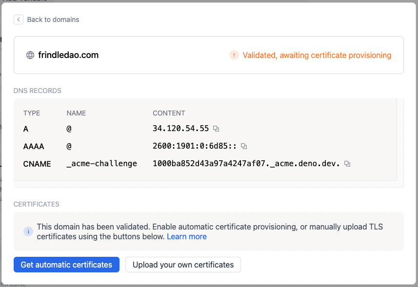

# Custom domains

By default a project can be reached at its preview URL, which is
`$PROJECT_ID.deno.dev`, e.g. `dead-clam-55.deno.dev`. You can also add a custom
domain by following the instructions below.

## **Step 1:** Add your custom domain in the Deno Deploy dashboard

1. Click the "Settings" button on the project page, then select "Domains" from
   the sidebar.
2. Enter the domain name you wish to add to the project and press "Add." Note
   that you must own the domain that you want to add to a project. If you do not
   own a domain yet, you can register one at a domain registrar like Google
   Domains, Namecheap, or gandi.net.
   

3. The domain is added to the domains list and will have a "setup" badge.
4. Click on the "setup" badge to visit the domain setup page, which will display
   the list of DNS records that need to be created/updated for your domain.
   

## **Step 2:** Update your custom domain's DNS records

Go to the DNS configuration panel of your domain registrar (or the service
you're using to manage DNS) and enter the records as described on the domain
setup page.

## **Step 3:** Validate that the DNS records have been updated

Go back to the Deno Deploy dashboard and click the **Validate** button on the
domain setup page. It will check if the DNS records are correctly set and if so,
update the status to "Validated, awaiting certificate provisioning."

## **Step 4:** Provision a certificate for your custom domain

At this point you have two options. 99% of the time, you should choose the first
option.

1. Let us automatically provision a certificate using Let's Encrypt.

   To do this, press the **Get automatic certificates** button. Provisioning a
   TLS certificate can take up to a minute. It is possible that the provisioning
   fails if your domain specifies a CAA record that prevents
   [Let's Encrypt](https://letsencrypt.org/) from provisioning certificates.
   Certificates will be automatically renewed around 30 days before the
   certificate expires. When you have been issued certificates successfully, you
   will see a green checkmark like this:

   

2. Manually upload a certificate and private key.

   To manually upload a certificate chain and private key, press the **Upload
   your own certificates** button. You will be prompted to upload a certificate
   chain and private key. The certificate chain needs to be complete and valid,
   and your leaf certificate needs to be at the top of the chain.
