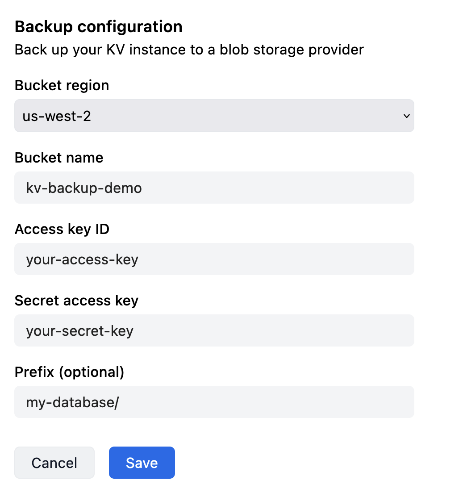

<deno-admonition></deno-admonition>

KV databases hosted on Deno Deploy can be continuously backed up to your own
S3-compatible storage buckets. This is in addition to the replication and
backups that we internally perform for all data stored in hosted Deno KV
databases to ensure high availability and data durability.

This backup happens continuously with very little lag, enabling
_[point-in-time-recovery](https://en.wikipedia.org/wiki/Point-in-time_recovery)_
and live replication. Enabling backup for KV databases unlocks various
interesting use-cases:

- Retrieving a consistent snapshot of your data at any point in time in the past
- Running a read-only data replica independent of Deno Deploy
- Pushing data into your favorite data pipeline by piping mutations into
  streaming platforms and analytical databases like Kafka, BigQuery and
  ClickHouse

## Configuring backup to Amazon S3

First you must create a bucket on AWS:

<deno-tabs group-id="aws-tool">
<deno-tab value="console" label="AWS Console" default>

1. Go to the [AWS S3 console](https://s3.console.aws.amazon.com/s3/home)
2. Click "Create bucket"
3. Enter a bucket name and choose a AWS region, then scroll down and click
   "Next"

</deno-tab>
<deno-tab value="cli" label="AWS CLI">

1. Install the
   [AWS CLI](https://docs.aws.amazon.com/cli/latest/userguide/getting-started-install.html)
2. Run
   `aws s3api create-bucket --bucket <bucket-name> --region <region> --create-bucket-configuration LocationConstraint=<region>`
   (replace `<bucket-name>` and `<region>` with your own values)

</deno-tab>
</deno-tabs>

Then, create an IAM policy with `PutObject` access to the bucket, attach it to
an IAM user, and create access keys for that user:

<deno-tabs group-id="aws-tool">
<deno-tab value="console" label="AWS Console" default>

1. Go to the [AWS IAM console](https://console.aws.amazon.com/iam/home)
2. Click "Policies" in the left sidebar
3. Click on "Create policy"
4. Select the "JSON" the policy editor and paste the following policy:
   ```json
   {
      "Version": "2012-10-17",
      "Statement": [
         {
            "Sid": "KVBackup",
            "Effect": "Allow",
            "Action": "s3:PutObject",
            "Resource": "arn:aws:s3:::<bucket-name>/*"
         }
      ]
   }
   ```
   Replace `<bucket-name>` with the name of the bucket you created earlier.
5. Click "Review policy"
6. Enter a name for the policy and click "Create policy"
7. Click "Users" in the left sidebar
8. Click "Add user"
9. Enter a name for the user and click "Next"
10. Click "Attach policies directly"
11. Search for the policy you created earlier and click the checkbox next to it
12. Click "Next"
13. Click "Create user"
14. Click on the user you just created
15. Click "Security credentials" and then "Create access key"
16. Select "Other", then click "Next"
17. Enter a description for the access key and click "Create access key"
18. Copy the access key ID and secret access key and save them somewhere safe.
    You will need them later, and you will not be able to retrieve them again.

</deno-tab>
<deno-tab value="cli" label="AWS CLI">

1. Copy the following command to your terminal, and replace `<bucket-name>` with
   the name of the bucket you created earlier, then run it:
   ```
   aws iam create-policy --policy-name <policy-name> --policy-document '{"Version":"2012-10-17","Statement":[{"Sid":"KVBackup","Effect":"Allow","Action":"s3:PutObject","Resource":"arn:aws:s3:::<bucket-name>/*"}]}'
   ```
2. Copy the following command to your terminal, and replace `<user-name>` with a
   name for the user you are creating, then run it:
   ```
   aws iam create-user --user-name <user-name>
   ```
3. Copy the following command to your terminal, and replace `<policy-arn>` with
   the ARN of the policy you created in step 1, and `<user-name>` with the name
   of the user you created in the previous step, then run it:
   ```
   aws iam attach-user-policy --policy-arn <policy-arn> --user-name <user-name>
   ```
4. Copy the following command to your terminal, and replace `<user-name>` with
   the name of the user you created in step 2, then run it:
   ```
   aws iam create-access-key --user-name <user-name>
   ```
5. Copy the access key ID and secret access key and save them somewhere safe.
   You will need them later, and you will not be able to retrieve them again.

</deno-tab>
</deno-tabs>

Now visit the [Deno Deploy dashboard](https://dash.deno.com), and click on the
"KV" tab in your project. Scroll to the "Backup" section, and click on "AWS S3".
Enter the bucket name, access key ID, and secret access key you created earlier,
and the region the bucket is in. Then click "Save".



The backup will start immediately. Once the data has been backed up, and
continous backup is active, you will see the status change to "Active".

## Configuring backup to Google Cloud Storage

Google Cloud Storage (GCS) is compatible with the S3 protocol, and can also be
used as a backup target.

First you must create a bucket on GCP:

<deno-tabs group-id="gcp-tool">
<deno-tab value="console" label="GCP Console" default>

1. Go to the
   [GCP Cloud Storage console](https://console.cloud.google.com/storage/browser)
2. Click on "Create" in the top bar
3. Enter a bucket name, choose a location, and click "Create"

</deno-tab>
<deno-tab value="cli" label="gcloud CLI">

1. Install the [gcloud CLI](https://cloud.google.com/sdk/docs/install)
2. Run `gcloud storage buckets create <bucket-name> --location <location>`
   (replace `<bucket-name>` and `<location>` with your own values)

</deno-tab>
</deno-tabs>

Then, create a service account with `Storage Object Admin` access to the bucket,
and create an HMAC access key for the service account:

<deno-tabs group-id="gcp-tool">
<deno-tab value="console" label="GCP Console" default>

1. Go to the [GCP IAM console](https://console.cloud.google.com/iam-admin/iam)
2. Click on "Service accounts" in the left sidebar
3. Click on "Create service account"
4. Enter a name for the service account and click "Done"
5. Copy the email for the service account you just created. You will need it
   later.
6. Go to the
   [GCP Cloud Storage console](https://console.cloud.google.com/storage/browser)
7. Click on the bucket you created earlier
8. Click on "Permissions" in the toolbar
9. Click "Grant access"
10. Paste the email for the service account you copied earlier into the "New
    principals" field
11. Select "Storage Object Admin" from the "Select a role" dropdown
12. Click "Save"
13. Click on "Settings" in the left sidebar (still in the Cloud Storage console)
14. Click on the "Interoperability" tab
15. Click on "Create a key for a service account"
16. Select the service account you created earlier
17. Click "Create key"
18. Copy the access key and secret access key and save them somewhere safe. You
    will need them later, and you will not be able to retrieve them again.

</deno-tab>
<deno-tab value="cli" label="gcloud CLI">

1. Run the following command, replacing `<service-account-name>` with a name for
   the service account you are creating:
   ```
   gcloud iam service-accounts create <service-account-name>
   ```
2. Run the following command, replacing `<bucket-name>` with the name of the
   bucket you created earlier, and `<service-account-email>` with the email of
   the service account you created in the previous step:
   ```
   gsutil iam ch serviceAccount:<service-account-email>:objectAdmin gs://<bucket-name>
   ```
3. Run the following command, replacing `<service-account-email>` with the email
   of the service account you created in the previous step:
   ```
   gcloud storage hmac create <service-account-email>
   ```
4. Copy the `accessId` and `secret` and save them somewhere safe. You will need
   them later, and you will not be able to retrieve them again.

</deno-tab>
</deno-tabs>

Now visit the [Deno Deploy dashboard](https://dash.deno.com), and click on the
"KV" tab in your project. Scroll to the "Backup" section, and click on "Google
Cloud Storage". Enter the bucket name, access key ID, and secret access key you
created earlier, and the region the bucket is in. Then click "Save".

The backup will start immediately. Once the data has been backed up, and
continous backup is active, you will see the status change to "Active".

## Using backups

S3 backups can be used with the `denokv` tool. Please refer to the
[documentation](https://github.com/denoland/denokv) for more details.
