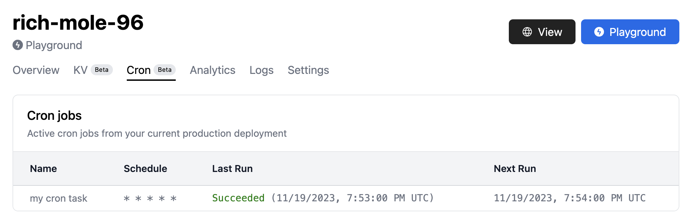

<deno-admonition></deno-admonition>

The [`Deno.cron`](https://deno.land/api?s=Deno.cron&unstable=) interface enables
you to configure JavaScript or TypeScript code that executes on a configurable
schedule using [cron syntax](https://en.wikipedia.org/wiki/Cron). In the example
below, we configure a block of JavaScript code that will execute every minute.

```ts
Deno.cron("Log a message", "* * * * *", () => {
  console.log("This will print once a minute.");
});
```

It's also possible to use JavaScript objects to define the cron schedule. In the
example below, we configure a block of JavaScript code that will execute once an
hour.

```ts
Deno.cron("Log a message", { hour: { every: 1 } }, () => {
  console.log("This will print once an hour.");
});
```

`Deno.cron` takes three arguments:

- A human-readable name for the cron task
- A cron schedule string or JavaScript object that defines a schedule on which
  the cron job will run
- a function to be executed on the given schedule

If you are new to cron syntax, there are a number of third party modules
[like this one](https://www.npmjs.com/package/cron-time-generator) that will
help you generate cron schedule strings.

## Retrying failed runs

Failed cron invocations are automatically retried with a default retry policy.
If you would like to specify a custom retry policy, you can use the
`backoffSchedule` property to specify an array of wait times (in milliseconds)
to wait before retrying the function call again. In the following example, we
will attempt to retry failed callbacks three times - after one second, five
seconds, and then ten seconds.

```ts
Deno.cron("Retry example", "* * * * *", () => {
  throw new Error("Deno.cron will retry this three times, to no avail!");
}, {
  backoffSchedule: [1000, 5000, 10000],
});
```

## Design and limitations

Below are some design details and limitations to be aware of when using
`Deno.cron`.

### Tasks must be defined at the top level module scope

The [`Deno.cron`](https://deno.land/api?s=Deno.cron&unstable=) interface is
designed to support static definition of cron tasks based on pre-defined
schedules. All `Deno.cron` tasks must be defined at the top-level of a module.
Any nested `Deno.cron` definitions (e.g. inside
[`Deno.serve`](https://deno.land/api?s=Deno.serve&unstable=) handler) will
result in an error or will be ignored.

If you need to schedule tasks dynamically during your Deno program execution,
you can use the [Deno Queues](./queue_overview) APIs.

### Time zone

`Deno.cron` schedules are specified using UTC time zone. This helps avoid issues
with time zones which observe daylight saving time.

### Overlapping executions

It's possible for the next scheduled invocation of your cron task to overlap
with the previous invocation. If this occurs, `Deno.cron` will skip the next
scheduled invocation in order to avoid overlapping executions.

### Day-of-week numeric representation

`Deno.cron` does not use 0-based day-of-week numeric representation. Instead, it
uses 1-7 (or SUN-SAT) to represent Sunday through Saturday. This may be
different compared to other cron engines which use 0-6 representation.

## Usage on Deno Deploy

With [Deno Deploy](https://www.deno.com/deploy), you can run your background
tasks on V8 isolates in the cloud. When doing so, there are a few considerations
to keep in mind.

### Differences with Deno CLI

Like other Deno runtime built-ins (like queues and Deno KV), the `Deno.cron`
implementation works slightly differently on Deno Deploy.

#### How cron works by default

The implementation of `Deno.cron` in the Deno runtime keeps execution state
in-memory. If you run multiple Deno programs that use `Deno.cron`, each program
will have its own independent set of cron tasks.

#### How cron works on Deno Deploy

Deno Deploy provides a serverless implementation of `Deno.cron` that is designed
for high availability and scale. Deno Deploy automatically extracts your
`Deno.cron` definitions at deployment time, and schedules them for execution
using on-demand isolates. Your latest production deployment defines the set of
active cron tasks that are scheduled for execution. To add, remove, or modify
cron tasks, simply modify your code and create a new production deployment.

Deno Deploy guarantees that your cron tasks are executed at least once per each
scheduled time interval. This generally means that your cron handler will be
invoked once per scheduled time. In some failure scenarios, the handler may be
invoked multiple times for the same scheduled time.

### Cron dashboard

When you make a production deployment that includes a cron task, you can view a
list of all your cron tasks in the
[Deploy dashboard](https://dash.deno.com/projects) under the `Cron` tab for your
project.



### Pricing

`Deno.cron` invocations are charged at the same rate as inbound HTTP requests to
your deployments. Learn more about pricing
[here](https://deno.com/deploy/pricing).

### Deploy-specific limitations

- `Deno.cron` is only available for production deployments (not preview
  deployments)
- The exact invocation time of your `Deno.cron` handler may vary by up to a
  minute from the scheduled time

## Cron configuration examples

Here are a few common cron configurations, provided for your convenience.

```ts title="Run once a minute"
Deno.cron("Run once a minute", "* * * * *", () => {
  console.log("Hello, cron!");
});
```

```ts title="Run every fifteen minutes"
Deno.cron("Run every fifteen minutes", "*/15 * * * *", () => {
  console.log("Hello, cron!");
});
```

```ts title="Run once an hour, on the hour"
Deno.cron("Run once an hour, on the hour", "0 * * * *", () => {
  console.log("Hello, cron!");
});
```

```ts title="Run every three hours"
Deno.cron("Run every three hours", "0 */3 * * *", () => {
  console.log("Hello, cron!");
});
```

```ts title="Run every day at 1am"
Deno.cron("Run every day at 1am", "0 1 * * *", () => {
  console.log("Hello, cron!");
});
```

```ts title="Run every Wednesday at midnight"
Deno.cron("Run every Wednesday at midnight", "0 0 * * WED", () => {
  console.log("Hello, cron!");
});
```

```ts title="Run on the first of the month at midnight"
Deno.cron("Run on the first of the month at midnight", "0 0 1 * *", () => {
  console.log("Hello, cron!");
});
```
