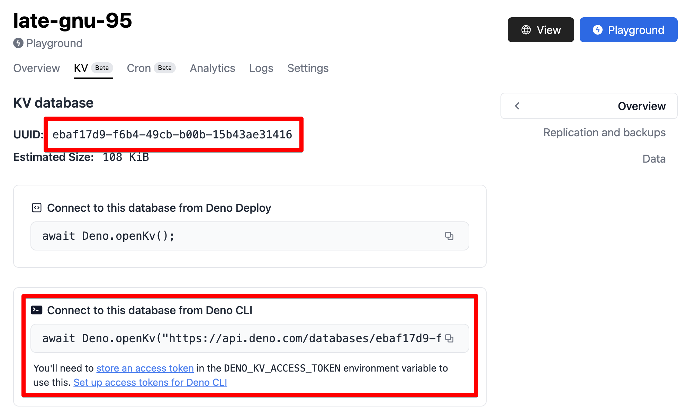

import Tabs from "@theme/Tabs";
import TabItem from "@theme/TabItem";

Connecting to a Deno KV database in Node.js is supported via our
[official client library on npm](https://www.npmjs.com/package/@deno/kv). You
can find usage instructions for this option below.

## Installation and usage

Use your preferred npm client to install the client library for Node.js using
one of the commands below.

<deno-tabs group-id="npm-client">
  <deno-tab value="npm" label="npm">

```sh
npm install @deno/kv
```

  </deno-tab>
  <deno-tab value="pnpm" label="pnpm">

```sh
pnpm add @deno/kv
```

  </deno-tab>
  <deno-tab value="yarn" label="yarn">

```sh
yarn add @deno/kv
```

  </deno-tab>
</deno-tabs>

Once you've added the package to your Node project, you can import the `openKv`
function (supports both ESM `import` and CJS `require`-based usage):

```js
import { openKv } from "@deno/kv";

// Connect to a KV instance
const kv = await openKv("<KV Connect URL>");

// Write some data
await kv.set([ "users", "alice" ], { name: "Alice" });

// Read it back
const result = await kv.get([ "users", "alice" ]);
console.log(result.value); // { name: "Alice" }
```

By default, the access token used for authentication comes from the
`DENO_KV_ACCESS_TOKEN` environment variable. You can also pass it explicitly:

```js
import { openKv } from "@deno/kv";

const kv = await openKv("<KV Connect URL>", { accessToken: myToken });
```

Once your Deno KV client is initialized, the same API available in Deno may
be used in Node as well.

## KV Connect URLs

Connecting to a KV database outside of Deno requires a 
[KV Connect](https://github.com/denoland/denokv/blob/main/proto/kv-connect.md)
URL. A KV Connect URL for a database hosted on Deno Deploy will be in this
format: `https://api.deno.com/databases/<database-id>/connect`.

The `database-id` for your project can be found in the
[Deno Deploy dashboard](https://dash.deno.com/projects), under the project's 
"KV" tab.



## More information

More information about how to use the Deno KV module for Node can be found on
the project's [README page](https://www.npmjs.com/package/@deno/kv).
