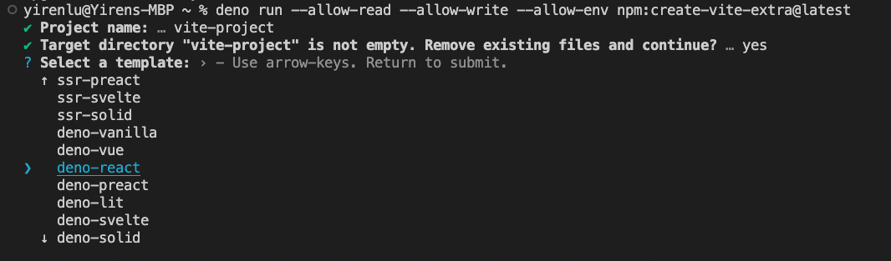
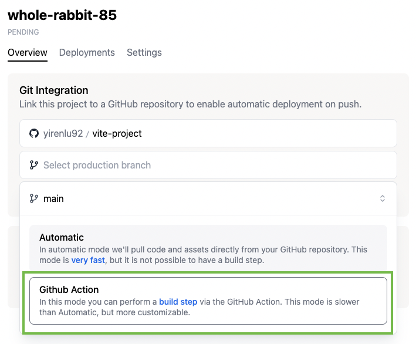
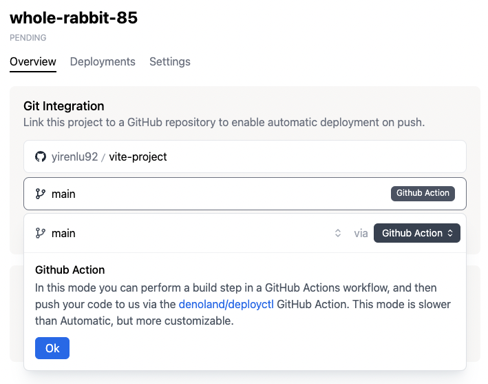
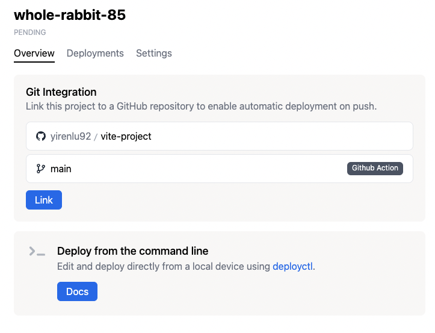
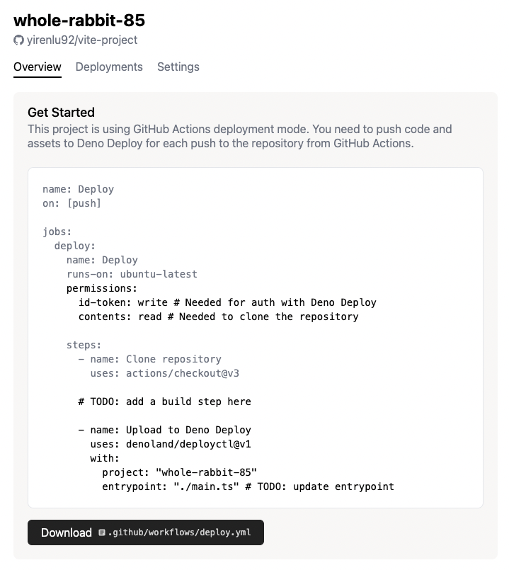

# CI and GitHub Actions

Deno Deploy's Git integration enables deployment of code changes that are pushed
to a GitHub repository. Commits on the production branch will be deployed as a
production deployment. Commits on all other branches will be deployed as a
preview deployment.

There are two modes of operation for the Git integration:

1. Select your organization name, and repository. _If your repository or
   organization does not show up, make sure the [Deno Deploy GitHub App][ghapp]
   is installed on your repository._
2. Select a production branch. Code deployed from this branch will be deployed
   as a production deployment instead of a preview deployment.
3. Choose either **Automatic** or **GitHub Actions** deployment mode.
   - **Automatic**: Deno Deploy will automatically pull code and assets from
     your repository source every time you push, and deploy it. This mode is
     very fast, but does not allow for a build step. _This is the recommended
     mode for most users._
   - **GitHub Actions**: In this mode, you push your code and assets to Deno
     Deploy from a GitHub Actions workflow. This allows you to perform a build
     step before deploying. Below, we go into more detail about the different
     configurations for **Automatic** and **Github Actions** mode.

## Automatic

If you select **Automatic** mode above, you'll subsequently have to select a
file in your Github repo as the "entrypoint" file. The entry file is simply the
file that Deno will run.

## GitHub Action

**GitHub Action** mode enables you to add a build step to your deployment
process by leveraging the `deployctl` [Github action][deploy-action]:

1. Navigate to `<project-name>` project page and select your Github repo under
   the **Git integration** card.

   

2. Select your branch for the production branch, and in the popup that appears,
   select **Github Action**

   

3. Click **Ok**

   

4. Click **Link**

   

5. This should take you to a next page, where you see a preview of a
   `deploy.yml` file that you can download. Download the file and add it to your
   Github project under `.github/workflows/deploy.yml`

   

6. Modify the `deploy.yml` file as appropriate with your build step, Deno
   project name, and entrypoint file:

   ```yml
   job:
   permissions:
       id-token: write # This is required to allow the GitHub Action to authenticate with Deno Deploy.
       contents: read
   steps:
       - name: Deploy to Deno Deploy
       uses: denoland/deployctl@v1
       with:
           project: my-project # the name of the project on Deno Deploy
           entrypoint: main.ts # the entrypoint to deploy
   ```

   By default the entire contents of the repository will be deployed. This can
   be changed by specifying the `root` option.

   ```yml
   - name: Deploy to Deno Deploy
   uses: denoland/deployctl@v1
   with:
       project: my-project
       entrypoint: index.js
       root: dist
   ```

   The `entrypoint` can either be a relative path, file name, or an absolute
   URL. If it is a relative path, it will be resolved relative to the `root`.
   Both absolute `file:///` and `https://` URLs are supported.

   To deploy the `./dist` directory using the
   [std/http/file_server.ts][fileserver] module, you can use the following
   configuration:

   ```yml
   - name: Deploy to Deno Deploy
   uses: denoland/deployctl@v1
   with:
       project: my-project
       entrypoint: https://deno.land/std@$STD_VERSION/http/file_server.ts
       root: dist
   ```

   See
   [deployctl README](https://github.com/denoland/deployctl/blob/main/action/README.md)
   for more details.

[fileserver]: https://deno.land/std/http/file_server.ts
[ghapp]: https://github.com/apps/deno-deploy
[deploy-action]: https://github.com/denoland/deployctl/blob/main/action/README.md
