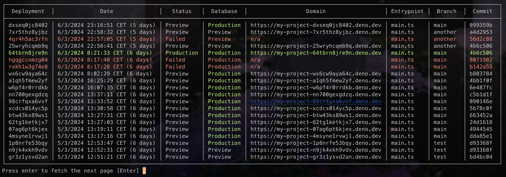
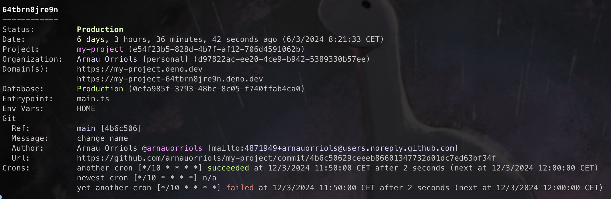

# Using deployctl on the command line

`deployctl` is a command line tool (CLI) that lets you operate the Deno Deploy
platform without leaving your terminal. With it you can deploy your code, create
and manage your projects and their deployments, and monitor their usage and
logs.

## Dependencies

The only dependency for `deployctl` is the Deno runtime. You can install it by
running the following command:

```sh
curl -fsSL https://deno.land/install.sh | sh
```

You don't need to setup a Deno Deploy account beforhand. It will be created
along the way when you deploy your first project.

## Install `deployctl`

With the Deno runtime installed, you can install the `deployctl` utility with
the following command:

```sh
deno install -Arf jsr:@deno/deployctl
```

The `-A` option in the deno install command grants all permissions to the
installed script. You can opt not to use it, in which case you will be prompted
to grant the necessary permissions when needed during the execution of the tool.

## Deploy

To perform a new deployment of your code, navigate to the root directory of your
project and execute:

```shell
deployctl deploy
```

### Project and Entrypoint

If this is the first deployment of the project, `deployctl` will guess the
project name based on the Git repo or directory it is in. Similarly, it will
guess the entrypoint by looking for files with common entrypoint names (main.ts,
src/main.ts, etc). After the first deployment, the settings used will be stored
in a config file (by default deno.json).

You can specify the project name and/or the entrypoint using the `--project` and
`--entrypoint` arguments respectively. If the project does not exist, it will be
created automatically. By default it is created in the personal organization of
the user, but it can also be created in a custom organization by specifying the
`--org` argument. If the organization does not exist yet, it will also be
created automatically.

```shell
deployctl deploy --project=helloworld --entrypoint=src/entrypoint.ts --org=my-team
```

### Include and Exclude Files

By default, deployctl deploys all the files in the current directory
(recursively, except node_modules directories). You can customize this behavior
using the `--include` and `--exclude` arguments (also supported in the config
file). These arguments accept specific files, whole directories and globs. Here
are some examples:

- Include only source and static files:

  ```shell
  deployctl deploy --include=./src --include=./static
  ```

- Include only Typescript files:

  ```shell
  deployctl deploy --include=**/*.ts
  ```

- Exclude local tooling and artifacts

  ```shell
  deployctl deploy --exclude=./tools --exclude=./benches
  ```

A common pitfall is to not include the source code modules that need to be run
(entrypoint and dependencies). The following example will fail because `main.ts`
is not included:

```shell
deployctl deploy --include=./static --entrypoint=./main.ts
```

The entrypoint can also be a remote script. A common use case for this is to
deploy an static site using `std/http/file_server.ts` (more details in
[Static Site Tutorial](https://docs.deno.com/deploy/tutorials/static-site)):

```shell
deployctl deploy --include=dist --entrypoint=jsr:@std/http/file_server
```

You can set env variables using `--env` (to set individual environment
variables) or `--env-file` (to load one or more environment files). These
options can be combined and used multiple times:

```shell
deployctl deploy --env-file --env-file=.other-env --env=DEPLOYMENT_TS=$(date +%s)
```

The deployment will have access to these variables using `Deno.env.get()`. Be
aware that the env variables set with `--env` and `--env-file` are specific for
the deployment being created and are not added to the list of
[env variables configured for the project](./environment-variables.md).

### Production Deployments

Each deployment you create have a unique URL. In addition, a project has a
"production URL" and custom domains routing trafffic to its "production"
deployment. Deployments can be promoted to production at any time, or created
directly as production using the `--prod` flag:

```shell
deployctl deploy --prod
```

Learn more about production deployments in the [Deployments](./deployments)
docs.

## Deployments

The deployments subcommand groups all the operations around specific
deployments.

### List

You can list your deployments with:

```shell
$ deployctl deployments list

┌───────────────────────────────────────────────────────────────────────────────────────────────────────────────────────────────────────────────────────┐
│  Deployment  │              Date              │   Status   │  Database  │                  Domain                  │ Entrypoint │  Branch  │  Commit  │
├───────────────────────────────────────────────────────────────────────────────────────────────────────────────────────────────────────────────────────┤
│ dxseq0jc8402 │ 6/3/2024 23:16:51 CET (5 days) │ Preview    │ Production │ https://my-project-dxseq0jc8402.deno.dev │ main.ts    │ main     │ 099359b  │
│ 7xr5thz8yjbz │ 6/3/2024 22:58:32 CET (5 days) │ Preview    │ Preview    │ https://my-project-7xr5thz8yjbz.deno.dev │ main.ts    │ another  │ a4d2953  │
│ 4qr4h5ac3rfn │ 6/3/2024 22:57:05 CET (5 days) │ Failed     │ Preview    │ n/a                                      │ main.ts    │ another  │ 56d2c88  │
│ 25wryhcqmb9q │ 6/3/2024 22:56:41 CET (5 days) │ Preview    │ Preview    │ https://my-project-25wryhcqmb9q.deno.dev │ main.ts    │ another  │ 4b6c506  │
│ 64tbrn8jre9n │ 6/3/2024 8:21:33 CET (6 days)  │ Production │ Production │ https://my-project-64tbrn8jre9n.deno.dev │ main.ts    │ main     │ 4b6c506  │
│ hgqgccnmzg04 │ 6/3/2024 8:17:40 CET (6 days)  │ Failed     │ Production │ n/a                                      │ main.ts    │ main     │ 8071902  │
│ rxkh1w3g74e8 │ 6/3/2024 8:17:28 CET (6 days)  │ Failed     │ Production │ n/a                                      │ main.ts    │ main     │ b142a59  │
│ wx6cw9aya64c │ 6/3/2024 8:02:29 CET (6 days)  │ Preview    │ Production │ https://my-project-wx6cw9aya64c.deno.dev │ main.ts    │ main     │ b803784  │
│ a1qh5fmew2yf │ 5/3/2024 16:25:29 CET (6 days) │ Preview    │ Production │ https://my-project-a1qh5fmew2yf.deno.dev │ main.ts    │ main     │ 4bb1f0f  │
│ w6pf4r0rrdkb │ 5/3/2024 16:07:35 CET (6 days) │ Preview    │ Production │ https://my-project-w6pf4r0rrdkb.deno.dev │ main.ts    │ main     │ 6e487fc  │
│ nn700gexgdzq │ 5/3/2024 13:37:11 CET (6 days) │ Preview    │ Production │ https://my-project-nn700gexgdzq.deno.dev │ main.ts    │ main     │ c5b1d1f  │
│ 98crfqxa6vvf │ 5/3/2024 13:33:52 CET (6 days) │ Preview    │ Production │ https://my-project-98crfqxa6vvf.deno.dev │ main.ts    │ main     │ 090146e  │
│ xcdcs014yc5p │ 5/3/2024 13:30:58 CET (6 days) │ Preview    │ Production │ https://my-project-xcdcs014yc5p.deno.dev │ main.ts    │ main     │ 5b78c0f  │
│ btw43kx89ws1 │ 5/3/2024 13:27:31 CET (6 days) │ Preview    │ Production │ https://my-project-btw43kx89ws1.deno.dev │ main.ts    │ main     │ 663452a  │
│ 62tg1ketkjx7 │ 5/3/2024 13:27:03 CET (6 days) │ Preview    │ Production │ https://my-project-62tg1ketkjx7.deno.dev │ main.ts    │ main     │ 24d1618  │
│ 07ag6pt6kjex │ 5/3/2024 13:19:11 CET (6 days) │ Preview    │ Production │ https://my-project-07ag6pt6kjex.deno.dev │ main.ts    │ main     │ 4944545  │
│ 4msyne1rvwj1 │ 5/3/2024 13:17:16 CET (6 days) │ Preview    │ Production │ https://my-project-4msyne1rvwj1.deno.dev │ main.ts    │ main     │ dda85e1  │
│ 1p8nrfe53bqy │ 5/3/2024 12:53:47 CET (6 days) │ Preview    │ Production │ https://my-project-1p8nrfe53bqy.deno.dev │ main.ts    │ test     │ d93368f  │
│ n9jk4xkh9vdv │ 5/3/2024 12:52:31 CET (6 days) │ Preview    │ Preview    │ https://my-project-n9jk4xkh9vdv.deno.dev │ main.ts    │ test     │ d93368f  │
│ gr3z1ysvd2an │ 5/3/2024 12:51:21 CET (6 days) │ Preview    │ Preview    │ https://my-project-gr3z1ysvd2an.deno.dev │ main.ts    │ test     │ bd4bc04  │
└───────────────────────────────────────────────────────────────────────────────────────────────────────────────────────────────────────────────────────┘
Press enter to fetch the next page [Enter]
```



This command outputs pages of 20 deployments by default. You can iterate over
the pages with the enter key, and use the `--page` and `--limit` options to
query a specific page and page size.

Like with the rest of commands, you can use the `--project` option to specify
the project of which to list deployments, if you are not in a project directory
or want to list deployments from a different project.

### Show

Get all the details of a particular deployment using:

```bash
deployctl deployments show

64tbrn8jre9n
------------
Status:		Production
Date:		6 days, 3 hours, 29 minutes, 55 seconds ago (6/3/2024 8:21:33 CET)
Project:	soft-newt-53 (e54f23b5-828d-4b7f-af12-706d4591062b)
Organization:	Arnau Orriols [personal] (d97822ac-ee20-4ce9-b942-5389330b57ee)
Domain(s):	https://soft-newt-53.deno-staging.dev
		https://soft-newt-53-64tbrn8jre9n.deno-staging.dev
Database:	Production (0efa985f-3793-48bc-8c05-f740ffab4ca0)
Entrypoint:	main.ts
Env Vars:	HOME
Git
  Ref:		main [4b6c506]
  Message:	change name
  Author:	Arnau Orriols @arnauorriols [mailto:4871949+arnauorriols@users.noreply.github.com]
  Url:		https://github.com/arnauorriols/soft-newt-53/commit/4b6c50629ceeeb86601347732d01dc7ed63bf34f
Crons:		another cron [*/10 * * * *] succeeded at 12/3/2024 11:50:00 CET after 2 seconds (next at 12/3/2024 12:00:00 CET)
		newest cron [*/10 * * * *] n/a
		yet another cron [*/10 * * * *] failed at 12/3/2024 11:40:00 CET after 2 seconds (next at 12/3/2024 11:51:54 CET)
```



If no deployment is specified, the command shows the details of the current
production deployment of the project. To see the details of the last deployment,
use `--last`, and to see the details of a particular deployment, use `--id` (or
positional argument). You can also use `--next` or `--prev` to navigate the
deployments chronologically. For example, to see the details of the second to
last deployment, you can do:

```shell
deployctl deployments show --last --prev
```

## Local Development

For local development you can use the `deno` CLI. To install `deno`, follow the
instructions in the
[Deno manual](https://deno.land/manual/getting_started/installation).

After installation, you can run your scripts locally:

```shell
$ deno run --allow-net=:8000 ./main.ts
Listening on http://localhost:8000
```

To watch for file changes add the `--watch` flag:

```shell
$ deno run --allow-net=:8000 --watch ./main.ts
Listening on http://localhost:8000
```

For more information about the Deno CLI, and how to configure your development
environment and IDE, visit the Deno Manual's [Getting Started][manual-gs]
section.

[manual-gs]: https://deno.land/manual/getting_started

# TODO: json piping

# TODO: decide if text snippet or screenshot
