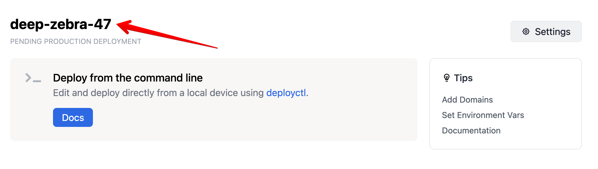

# Using deployctl on the command line

[`deployctl`](https://github.com/denoland/deployctl) is a command line tool
(CLI) that lets you work with the Deno Deploy platform.

## Getting started

If you haven't already, you can
[install the Deno runtime](/runtime/manual/getting_started/installation) using
one of the commands below:

import Tabs from '@theme/Tabs'; import TabItem from '@theme/TabItem';

<Tabs groupId="operating-systems">
  <TabItem value="mac" label="macOS" default>

```sh
curl -fsSL https://deno.land/x/install/install.sh | sh
```

</TabItem>
  <TabItem  value="windows" label="Windows">

```powershell
irm https://deno.land/install.ps1 | iex
```

</TabItem>
  <TabItem value="linux" label="Linux">

```sh
curl -fsSL https://deno.land/x/install/install.sh | sh
```

</TabItem>
</Tabs>

After Deno is installed, install the [`deployctl`](./deployctl.md) utility:

```
deno install -A --no-check -r -f https://deno.land/x/deploy/deployctl.ts
```

You can confirm `deployctl` has been installed correctly by running:

```
deployctl --help
```

Now, you're ready to deploy a Deno script from the command line!

### Sign up for Deno Deploy and create a blank project

If you haven't already, now is the time to
[sign up for a Deno Deploy account](https://dash.deno.com). After signing up,
[click the "New Project" button here](https://dash.deno.com). Near the top of
the page, you'll see an option to "create a blank project" - choose that option
now, as we will need one of these projects to complete our deployment process.


After creating the project, make a note of the name that's generated for you -
you'll need this project name when deploying from the command line.



In this example, the project name is `deep-zebra-47` - we'll use this as an
example name in the commands below.

### Create and export a Deploy access token

In order to use `deployctl` to control your Deno Deploy account from the command
line, you'll need an access token.

This token
[can be found in the dashboard here](https://dash.deno.com/account#access-tokens).
Click "New Access Token", give the token a name, and copy your newly minted
token to a secure location on your computer.

In your terminal, you'll need to export this token as a system environment
variable that can be used by `deployctl`.

<Tabs groupId="shells">
<TabItem value="bash" label="macOS / Linux" default>

```sh
export DENO_DEPLOY_TOKEN=your_access_token_here
```

</TabItem>

<TabItem  value="powershell" label=" Windows (PowerShell)">

```powershell
$env:DENO_DEPLOY_TOKEN = 'your_access_token_here'
```

</TabItem>
</Tabs>

### Deploy!

Now that you have a project created and an access token created, you're ready to
deploy your application. In the same directory as the `server.ts` file you
created before, run this command:

```sh
deployctl deploy --project=deep-zebra-47 --prod server.ts
```

In a few moments, your Hello World server will be deployed across ~30 data
centers around the world, ready to handle large volumes of traffic.

## Usage

To deploy a local script:

    deployctl deploy --project=helloworld main.ts

To deploy a remote script:

    deployctl deploy --project=helloworld https://deno.com/examples/hello.js

To deploy a remote script without static files:

    deployctl deploy --project=helloworld --no-static https://deno.com/examples/hello.js

To ignore the node_modules directory while deploying:

    deployctl deploy --project=helloworld --exclude=node_modules main.tsx

See the help message (`deployctl -h`) for more details.

## `deno` CLI and local development

For local development you can use the `deno` CLI. To install `deno`, follow the
instructions in the
[Deno manual](https://deno.land/manual/getting_started/installation).

After installation, you can run your scripts locally:

```shell
$ deno run --allow-net=:8000 https://deno.com/examples/hello.js
Listening on http://localhost:8000
```

To watch for file changes add the `--watch` flag:

```shell
$ deno run --allow-net=:8000 --watch ./main.js
Listening on http://localhost:8000
```

For more information about the Deno CLI, and how to configure your development
environment and IDE, visit the Deno Manual's [Getting Started][manual-gs]
section.

[manual-gs]: https://deno.land/manual/getting_started
