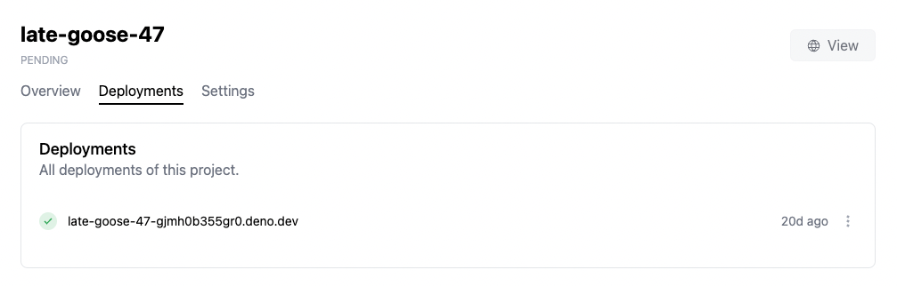
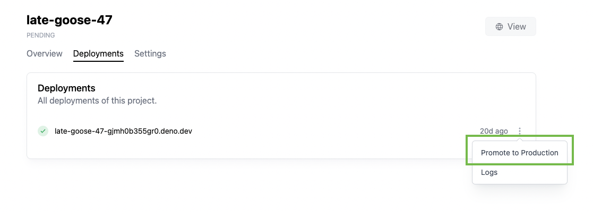

# Deployments

A deployment is a snapshot of the code and environment variables required to run
an application. A new deployment can be created via `deployctl` or automatically
via Deploy's Github integration if configured.

Deployments are immutable after they have been created. To deploy a new version
of the code for an application, a new deployment must be created. Once created,
deployments remain accessible.

All available deployments are listed on the
https://dash.deno.com/projects/project-name/deployments page. Old deployments
can be
[deleted via the API](https://docs.deno.com/deploy/api/rest/deployments#delete-a-deployment).

## Custom domains

There can also be other URLs that can point to a deployment, like
[custom domains](custom-domains).

## Branch domains

`<projectname--branchname>.deno.dev` is also supported.

## Production vs. preview deployments

All deployments have a preview URL that can be used to view this specific
deployment. Preview URLs have the format
`{project_name}-{deployment_id}.deno.dev`.



A deployment can either be a production or a preview deployment. These
deployments do not have any differences in runtime functionality. The only
distinguishing factor is that a project's production deployment will receive
traffic from the project URL (e.g. `myproject.deno.dev`), and from custom
domains in addition to traffic to the deployment's preview URL.

## Promoting preview deployments to production deployments via Deno Deploy UI

Preview deployments can be "promoted" to production via the Deno Deploy UI:

1. Navigate to the project page.
2. Click on the **Deployments** tab.
3. Click on the three dots next to the deployment you want to promote to
   production and select **Promote to Production**
   

## Creating production deployments via `deployctl`

If you are deploying your Deno code with `deployctl`, you can deploy to
production with the `--prod` flag:

```sh
deployctl deploy --prod --project=helloworld main.ts
```
