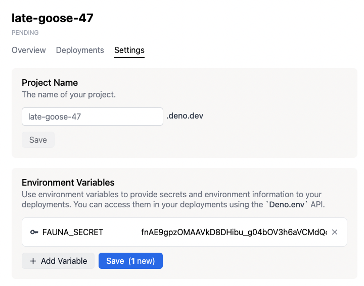

# Environment variables

Environment variables are useful to store values like access tokens of web
services. Each deployment has a set of environment variables defined at the
moment of creation and accessible from the code via the `Deno.env` API. There
are 2 ways to define the environment variables of a deployment:

## Project environment variables

You can define environment variables at the project level. When you create a
deployment, it will get the set of environment variables the the project has
defined _at that particular moment_.

For convenience, When you change the environment variables of a project, the
current production deployment is _redeployed_, creating a new production
deployment with the new set of environment variables.

:::note

Deployments are immutable, including their environment variables. Changing the
environment variables of a project does not change the environment variables of
existing deployments.

:::

To add an environment variable to your project, click on the **Settings** button
on the project page and then on **Environment Variables** from the sidebar. Fill
in the key/value fields and click on "Add" to add an environment variable to
your project.

## Deployment environment variables

When deploying using `deployctl`, you can specify environment variables
[using the `--env` or `--env-file` flags](./deployctl.md#environment-variables),
complementing the environment variables already defined for the project. These
env variables will be specific for the deployment being created.

### Default environment variables

Every deployment has the following environment variables preset, which you can
access from your code.

1. `DENO_REGION`

   It holds the region code of the region in which the deployment is running.
   You can use this variable to serve region-specific content.

   You can refer to the region code from the [regions page](regions).

1. `DENO_DEPLOYMENT_ID`

   It holds the ID of the deployment.
