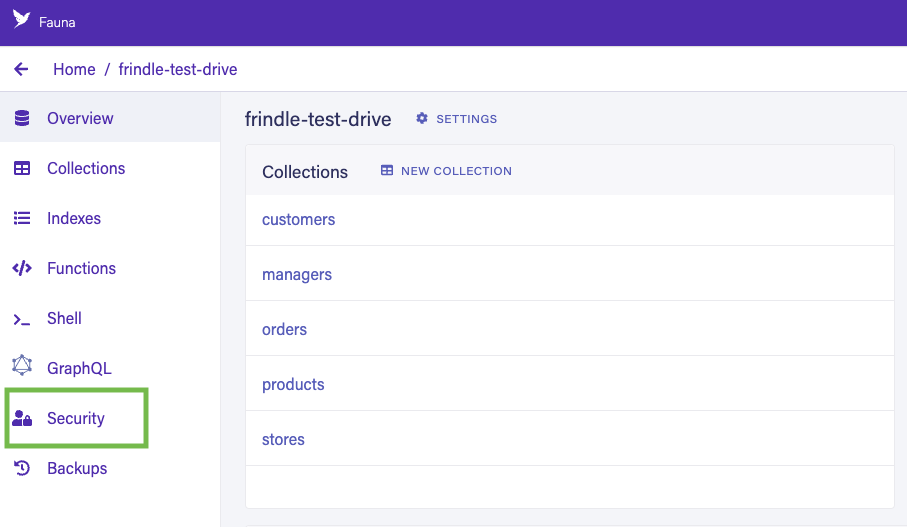

# Connect to FaunaDB

FaunaDB calls itself "the data API for modern applications." It's a database
with a GraphQL interface that enables you to use GraphQL to interact with it.
Since you communicate with it using HTTP requests, you don't need to manage
connections, which works well for serverless applications.

This tutorial covers how to connect to a Fauna database from an application
deployed on Deno Deploy.

You can find a more comprehensive tutorial that builds a sample application on
top of Fauna [here](../tutorials/tutorial-faunadb).

## Get credentials from Fauna

We assume that you've already created a Fauna instance at
https://dashboard.fauna.com.

To access your Fauna database programmatically, you'll need to generate a
credential:

1. Click on **Security** section inside your particular database and click on
   **New Key**. 

2. Select **Server** role and click on **Save**. Copy the secret. You'll need it
   for the next step.

## Create a project in Deno Deploy

Next, let's create a project on Deno Deploy and set it up with the requisite
environment variables:

1. Go to [https://dash.deno.com/new](https://dash.deno.com/new) (Sign in with
   GitHub if you didn't already) and click on **+ Empty Project** under **Deploy
   from the command line**.
2. Now click on the **Settings** button available on the project page.
3. Navigate to the **Environment Variables** section and add the following
   secrets.

- `FAUNA_SECRET` - The value should be the secret we created in the previous
  step. 

## Write code that connects to Fauna

While with Node there is a Fauna JavaScript driver, with Deno, you should use
the graphql endpoint.

Fauna has a graphql endpoint for its database, and it generates essential
mutations like `create`, `update`, `delete` for a data type defined in the
schema. For example, Fauna will generate a mutation named `createQuote` to
create a new quote in the database for the data type `Quote`.

To interact with Fauna, we need to make a POST request to its graphql endpoint
with appropriate query and parameters to get the data in return. So let's
construct a generic function that will handle those things.

```javascript
import query from "https://esm.sh/faunadb@4.7.1";
import Client from "https://esm.sh/faunadb@4.7.1";

// Grab the secret from the environment.
const token = Deno.env.get("FAUNA_SECRET");
if (!token) {
  throw new Error("environment variable FAUNA_SECRET not set");
}

var client = new Client.Client({
  secret: token,
  // Adjust the endpoint if you are using Region Groups
  endpoint: "https://db.fauna.com/",
});
// HEAD
client.query(query.ToDate("2018-06-06"));
//
client
  .query(query.ToDate("2018-06-06"))
  //1e2f378 (Add some more pages)
  .then(function (res) {
    console.log("Result:", res);
  })
  .catch(function (err) {
    console.log("Error:", err);
  });
```

## Deploy application to Deno Deploy

Once you have finished writing your application, you can deploy it on Deno
Deploy.

To do this, go back to your project page at
`https://dash.deno.com/projects/<project-name>`.

You should see a couple options to deploy:

- [Github integration](ci_github)
- [`deployctl`](./deployctl.md)
  ```sh
  deployctl deploy --project=<project-name> <application-file-name>
  ```

Unless you want to add a build step, we recommend that you select the Github
integration.

For more details on the different ways to deploy on Deno Deploy and the
different configuration options, read [here](how-to-deploy).
