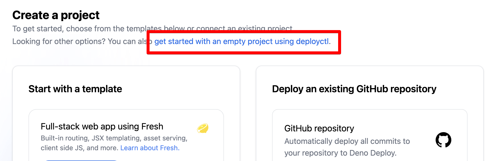
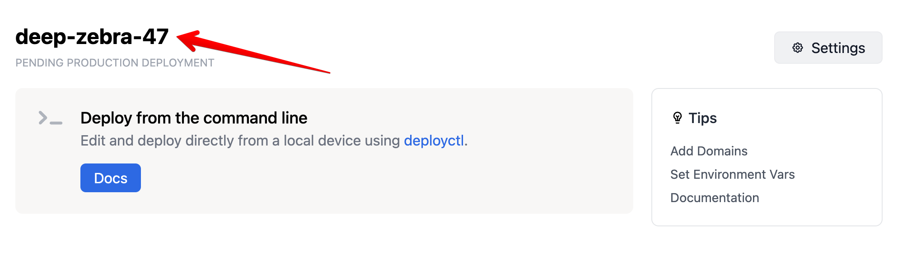

# Deno Deploy Quick Start

Deno Deploy is a globally distributed platform for serverless JavaScript
applications. Your JavaScript, TypeScript, and WebAssembly code runs on managed
servers geographically close to your users, enabling low latency and faster
response times. Deploy applications run on fast, light-weight
[V8 isolates](https://deno.com/blog/anatomy-isolate-cloud) rather than virtual
machines, powered by the [Deno runtime](/runtime/manual).

Let's deploy your first application - it should only take a few minutes.

## Option 1: Start with a template

If you'd like to start out by deploying a pre-built template application, simply
[log in to the Deno Deploy dashboard](https://dash.deno.com) and click the "New
Project" button. You can choose to deploy a starter web application using
[Fresh](https://fresh.deno.dev) or any of our supported web frameworks.

## Option 2: Start with an existing app

If you already have a Deno project hosted on GitHub, you can immediately import
it in Deno Deploy. [From the Deno Deploy dashboard](https://dash.deno.com),
click the "New Project" button and choose the option to "Select a repository".
Follow the on-screen instructions to deploy your existing application.

## Option 3: Start with a playground

A [playground](./playgrounds.md) is a browser-based editor that enables you to
write and run JavaScript code right away. This is a great choice for just
kicking the tires on Deno and Deno Deploy!
[From the Deno Deploy dashboard](https://dash.deno.com), click the "New Project"
button and choose any of the options with a "Try with a playground" button.

## Option 4: Start from scratch

If you'd like to develop and deploy a simple application locally, follow these
instructions to get started. We'll use the [`deployctl`](./deployctl.md) command
line utility to deploy a local Deno script from your computer.

### Install Deno and `deployctl`

If you haven't already, you can 
[install the Deno runtime](/runtime/manual/getting_started/installation) 
using one of the commands below:

import Tabs from '@theme/Tabs'; import TabItem from '@theme/TabItem';

<Tabs groupId="operating-systems">
  <TabItem value="mac" label="macOS" default>

```sh
curl -fsSL https://deno.land/install.sh | sh
```

</TabItem>
  <TabItem  value="windows" label="Windows">

```powershell
irm https://deno.land/install.ps1 | iex
```

</TabItem>
  <TabItem value="linux" label="Linux">

```sh
curl -fsSL https://deno.land/install.sh | sh
```

</TabItem>
</Tabs>

After Deno is installed, install the [`deployctl`](./deployctl.md) utility:

```console
deno install -A --no-check -r -f https://deno.land/x/deploy/deployctl.ts
```

You can confirm `deployctl` has been installed correctly by running:

```console
deployctl --help
```

Now, you're ready to deploy a Deno script from the command line!

### Write and test a Deno program

Create a file called `server.ts` in your terminal, and include the following
"Hello World" web server:

```ts title="server.ts"
Deno.serve(() => new Response("Hello, world!"));
```

You can test that it works by running it with the command below:

```console
deno run --allow-net server.ts
```

Your server should be viewable at [localhost:8000](http://localhost:8000). 
Now let's run this code on the edge with Deno Deploy!

### Sign up for Deno Deploy and create a blank project

If you haven't already, now is the time to 
[sign up for a Deno Deploy account](https://dash.deno.com). After signing up,
[click the "New Project" button here](https://dash.deno.com). Near the top of
the page, you'll see an option to "create a blank project" - choose that option
now, as we will need one of these projects to complete our deployment process.



After creating the project, make a note of the name that's generated for you - 
you'll need this project name when deploying from the command line.



In this example, the project name is `deep-zebra-47` - we'll use this as an
example name in the commands below.

### Create and export a Deploy access token

In order to use `deployctl` to control your Deno Deploy account from the 
command line, you'll need an access token.

This token 
[can be found in the dashboard here](https://dash.deno.com/account#access-tokens).
Click "New Access Token", give the token a name, and copy your newly minted token
to a secure location on your computer.

In your terminal, you'll need to export this token as a system environment
variable that can be used by `deployctl`. 

<Tabs groupId="shells">
<TabItem value="bash" label="macOS / Linux" default>

```sh
export DENO_DEPLOY_TOKEN=your_access_token_here
```

</TabItem>

<TabItem  value="powershell" label=" Windows (PowerShell)">

```powershell
$env:DENO_DEPLOY_TOKEN = 'your_access_token_here'
```

</TabItem>
</Tabs>

### Deploy!

Now that you have a project created and an access token created, you're ready
to deploy your application. In the same directory as the `server.ts` file you
created before, run this command:

```sh
deployctl deploy --project=deep-zebra-47 --prod server.ts
```

In a few moments, your Hello World server will be deployed across ~30 data 
centers around the world, ready to handle large volumes of traffic.

## Next Steps

Now that you've created your first project, you can 
[check out the kinds of apps](./use-cases.md) you can run on Deploy. You could 
also skip right to [setting up your own custom domain](./custom-domains.md).
We're so excited to see what you'll ship with Deploy!
