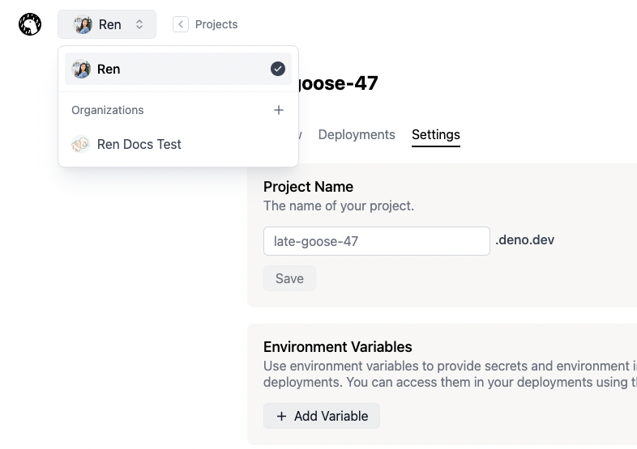

**Organizations** allow you to collaborate with other users. A project created
in an organization is accessible to all members of the organization. Users
should first signup for Deno Deploy before they can be added to an organization.

Currently, all organization members have full access to the organization. They
can add/remove members, and create/delete/modify all projects in the
organization.

### Create an organization

1. On your Deploy dashboard, click on the organization dropdown in the top left
   of the screen, in the navigation bar.
   
2. Select **Organization +**.
3. Enter a name for your organization and click on **Create**.

### Add members

1. Select the desired organization in the organization dropdown in the top left
   of the screen, in the navigation bar.
2. Click on the **Members** icon button.
3. Under the **Members** panel, click on **+ Invite member**.
   > **Note:** Users should first signup for Deno Deploy using
   > [this link](https://dash.deno.com/signin) before you invite them.
4. Enter the GitHub username of the user and click on **Invite**.

Deploy will send the user an invite email. They can then can either accept or
decline your invite. Once they accept the invite, they're added to your
organization and shown in the members panel.

Pending invites are displayed in the **Invites** panel. You can revoke pending
invites by clicking on the delete icon next to the pending invite.

### Remove members

1. Select the desired organization in the organization dropdown in the top left
   of the screen, in the navigation bar.
2. Click on the **Members** icon button.
3. In the **Members** panel, click on the delete button beside the user you want
   to remove.
