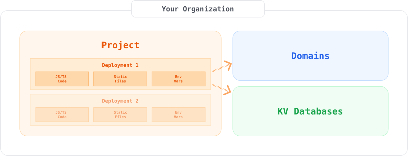

# About Subhosting

A powerful use case for Deno Deploy is using our isolate cloud to run untrusted
code on behalf of your end users. There are a number of scenarios where you
might be interested in doing this:

- You are a SaaS provider that wants to empower your customers to extend your
  platform with custom code
- You are an infrastructure provider that would like to enable your customers to
  run Deno-powered edge functions
- You are building a browser-based editor for user code (possibly for
  education), and you'd like a place to execute that code in a controlled and
  secure way

In cases like these, you might consider using Deno Deploy's full-featured
[REST API](/deploy/api/rest) to implement
[**subhosting**](https://deno.com/subhosting). "Subhosting" is what we call the
scenario where you use Deno Deploy to run your users' untrusted code in a secure
and scalable environment designed for
[multitenancy](https://www.ibm.com/topics/multi-tenant).

## Quick start example

Looking for the smallest possible example that shows how to deploy code to
Deno's isolate cloud? We've got you covered below. Once you've skimmed over it,
you can read on for more details about subhosting.

```ts
// 1.) Get API access info ready
const accessToken = Deno.env.get("DEPLOY_ACCESS_TOKEN");
const orgId = Deno.env.get("DEPLOY_ORG_ID");
const API = "https://api.deno.com/v1";
const headers = {
  Authorization: `Bearer ${accessToken}`,
  "Content-Type": "application/json",
};

// 2.) Create a new project
const pr = await fetch(`${API}/organizations/${orgId}/projects`, {
  method: "POST",
  headers,
  body: JSON.stringify({
    name: null, // randomly generates project name
  }),
});
const project = await pr.json();

// 3.) Deploy a "hello world" server to the new project
const dr = await fetch(`${API}/projects/${project.id}/deployments`, {
  method: "POST",
  headers,
  body: JSON.stringify({
    entryPointUrl: "main.ts",
    assets: {
      "main.ts": {
        "kind": "file",
        "content": `Deno.serve(() => new Response("Hello, World!"));`,
        "encoding": "utf-8",
      },
    },
    envVars: {},
  }),
});
console.log(dr.status);
```

## How subhosting works

To build subhosting with Deno Deploy, it helps to understand some key resources
within the system. These resources are also represented in the
[REST API](/deploy/api/rest).



- [**Organizations**](/deploy/api/rest/organizations): Organizations are a
  container for all data related to a subhosting implementation. Other Deploy
  users can be invited to collaborate on an organization, and
  [access tokens](https://dash.deno.com/account#access-tokens) can give
  developers with organization access the ability to modify resources within the
  org via API. New organizations can be created in the
  [Deploy dashboard](https://dash.deno.com/orgs/new).
- [**Projects**](/deploy/api/rest/projects): a project is a container for
  **deployments**, and the analytics and usage information for all deployments
  within a project.
- [**Deployments**](/deploy/api/rest/deployments): a deployment is a set of
  configuration, runnable code, and supporting static files that can run on an
  isolate in Deno Deploy. Deployments have an entry file that can launch a
  server, can have a [Deno KV](/deploy/kv/manual) database associated with them,
  and can be set up to run on custom domains.
- [**Domains**](/deploy/api/rest/domains): custom domains that can be associated
  with deployments, giving them a unique URL.

The steps to implement subhosting are roughly as follows:

1. [Create an organization](./getting_started) and get an access token for the
   REST API
1. [Create a project](./projects_and_deployments), and then create your first
   deployment for that project
1. [Provision a domain](../../api/rest/domains.md) and associate that domain
   with a deployment

Using these techniques, you can package up user code as "deployments", and
execute that code on a Deno-provisioned URL or a custom URL you can configure
yourself.

## REST API reference and OpenAPI spec

For a complete reference for the REST API used to implement subhosting, you can
[check out the docs here](/deploy/api/rest). The Deno Deploy REST API also
provides an [OpenAPI specification](https://api.deno.com/v1/openapi.json) which
can be used with [a number of OpenAPI-compatible tools](https://openapi.tools/).
