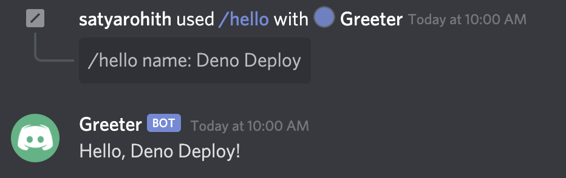

# Discord Slash Command

Discord has a new feature called **Slash Commands**. They allow you to type `/`
followed by a command name to perform some action. For example, you can type
`/giphy cats` (a built-in command) to get some cat gifs.

Discord Slash Commands work by making a request to a URL whenever someone issues
a command. You don't need your app to be running all the time for Slash Commands
to work, which makes Deno Deploy a perfect solution to build such commands.

In this post, let's see how we can build a hello world Slash Command using Deno
Deploy.

## **Step 1:** Create an application on Discord Developer Portal

1. Go to
   [https://discord.com/developers/applications](https://discord.com/developers/applications)
   (login using your discord account if required).
2. Click on **New Application** button available at left side of your profile
   picture.
3. Name your application and click on **Create**.
4. Go to **Bot** section, click on **Add Bot**, and finally on **Yes, do it!**
   to confirm.

That's it. A new application is created which will hold our Slash Command. Don't
close the tab as we need information from this application page throughout our
development.

## **Step 2:** Register Slash command with Discord app

Before we can write some code, we need to curl a Discord endpoint to register a
Slash Command in our app.

Fill `BOT_TOKEN` with the token available in the **Bot** section and `CLIENT_ID`
with the ID available on the **General Information** section of the page and run
the command on your terminal.

```sh
BOT_TOKEN='replace_me_with_bot_token'
CLIENT_ID='replace_me_with_client_id'
curl -X POST \
-H 'Content-Type: application/json' \
-H "Authorization: Bot $BOT_TOKEN" \
-d '{"name":"hello","description":"Greet a person","options":[{"name":"name","description":"The name of the person","type":3,"required":true}]}' \
"https://discord.com/api/v8/applications/$CLIENT_ID/commands"
```

This will register a Slash Command named `hello` that accepts a parameter named
`name` of type string.

## **Step 3:** Create and deploy the hello world Slash Command on Deno Deploy

Next, we need to create a server to respond to Discord when it makes a POST
request with someone's slash command.

1. Navigate to https://dash.deno.com/new and click **Play** under the
   **Playground** card.
2. On the next page, in the editor, click the **Settings** icon on the top menu.
   In the modal that pops up, select **+ Add Variable**.
3. Input `DISCORD_PUBLIC_KEY` as KEY. The VALUE should be the public key
   available in **General Information** section in the Discord application page.
4. Copy and paste the following code into the editor:

   ```ts
   // Sift is a small routing library that abstracts away details like starting a
   // listener on a port, and provides a simple function (serve) that has an API
   // to invoke a function for a specific path.
   import {
     json,
     serve,
     validateRequest,
   } from "https://deno.land/x/sift@0.6.0/mod.ts";
   // TweetNaCl is a cryptography library that we use to verify requests
   // from Discord.
   import nacl from "https://cdn.skypack.dev/tweetnacl@v1.0.3?dts";

   // For all requests to "/" endpoint, we want to invoke home() handler.
   serve({
     "/": home,
   });

   // The main logic of the Discord Slash Command is defined in this function.
   async function home(request: Request) {
     // validateRequest() ensures that a request is of POST method and
     // has the following headers.
     const { error } = await validateRequest(request, {
       POST: {
         headers: ["X-Signature-Ed25519", "X-Signature-Timestamp"],
       },
     });
     if (error) {
       return json({ error: error.message }, { status: error.status });
     }

     // verifySignature() verifies if the request is coming from Discord.
     // When the request's signature is not valid, we return a 401 and this is
     // important as Discord sends invalid requests to test our verification.
     const { valid, body } = await verifySignature(request);
     if (!valid) {
       return json(
         { error: "Invalid request" },
         {
           status: 401,
         },
       );
     }

     const { type = 0, data = { options: [] } } = JSON.parse(body);
     // Discord performs Ping interactions to test our application.
     // Type 1 in a request implies a Ping interaction.
     if (type === 1) {
       return json({
         type: 1, // Type 1 in a response is a Pong interaction response type.
       });
     }

     // Type 2 in a request is an ApplicationCommand interaction.
     // It implies that a user has issued a command.
     if (type === 2) {
       const { value } = data.options.find((option) => option.name === "name");
       return json({
         // Type 4 responds with the below message retaining the user's
         // input at the top.
         type: 4,
         data: {
           content: `Hello, ${value}!`,
         },
       });
     }

     // We will return a bad request error as a valid Discord request
     // shouldn't reach here.
     return json({ error: "bad request" }, { status: 400 });
   }

   /** Verify whether the request is coming from Discord. */
   async function verifySignature(
     request: Request,
   ): Promise<{ valid: boolean; body: string }> {
     const PUBLIC_KEY = Deno.env.get("DISCORD_PUBLIC_KEY")!;
     // Discord sends these headers with every request.
     const signature = request.headers.get("X-Signature-Ed25519")!;
     const timestamp = request.headers.get("X-Signature-Timestamp")!;
     const body = await request.text();
     const valid = nacl.sign.detached.verify(
       new TextEncoder().encode(timestamp + body),
       hexToUint8Array(signature),
       hexToUint8Array(PUBLIC_KEY),
     );

     return { valid, body };
   }

   /** Converts a hexadecimal string to Uint8Array. */
   function hexToUint8Array(hex: string) {
     return new Uint8Array(
       hex.match(/.{1,2}/g)!.map((val) => parseInt(val, 16)),
     );
   }
   ```

5. Click **Save & Deploy** to deploy the server
6. Note the project URL once the file has been deployed. It will be on the upper
   right hand side of the editor, and end in `.deno.dev`.

## **Step 3:** Configure Discord application to use our URL as interactions endpoint URL

1. Go back to your application (Greeter) page on Discord Developer Portal
2. Fill **INTERACTIONS ENDPOINT URL** field with the Deno Deploy project URL
   from above and click on **Save Changes**.

The application is now ready. Let's proceed to the next section to install it.

## **Step 4:** Install the Slash Command on your Discord server

So to use the `hello` Slash Command, we need to install our Greeter application
on our Discord server. Here are the steps:

1. Go to **OAuth2** section of the Discord application page on Discord Developer
   Portal
2. Select `applications.commands` scope and click on the **Copy** button below.
3. Now paste and visit the URL on your browser. Select your server and click on
   **Authorize**.

Open Discord, type `/hello Deno Deploy` and press **Enter**. The output will
look something like below.



Congratulations for completing the tutorial! Go ahead and build some awesome
Discord Slash Commands! And do share them with us on **deploy** channel of
[the Deno Discord server](https://discord.gg/deno).
