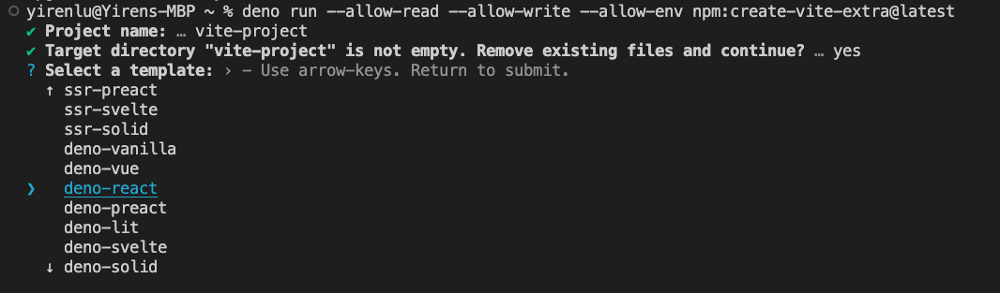
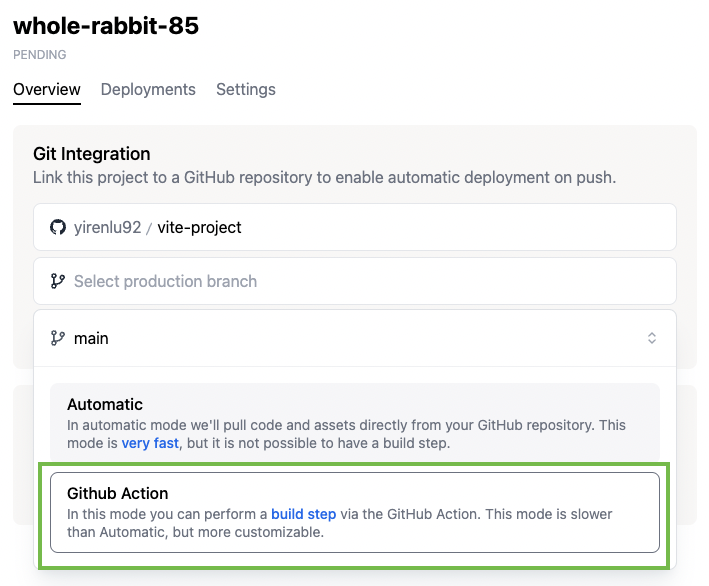
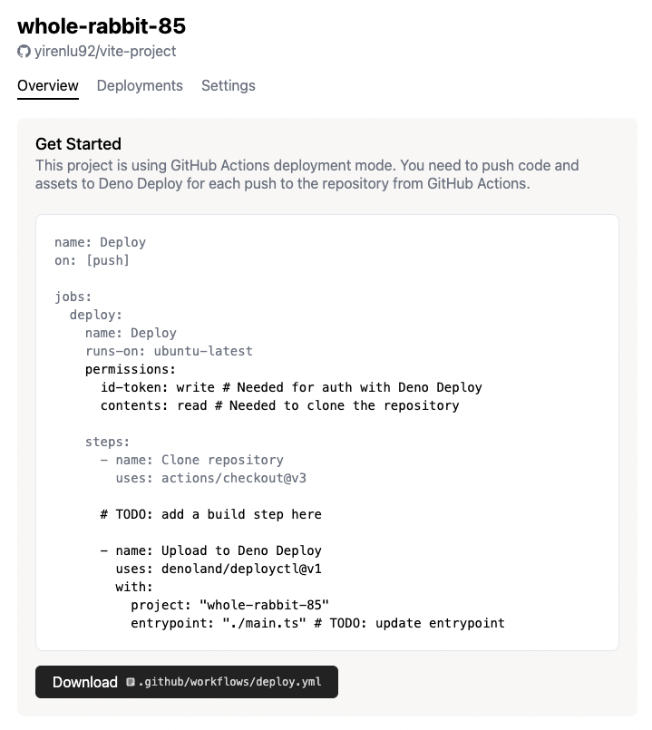

# Deploy a React app with Vite

This tutorial covers how to deploy a Vite Deno and React app on Deno Deploy.

## **Step 1:** Create Vite app

Let's use [Vite](https://vitejs.dev/) to quickly scaffold a Deno and React app:

```sh
deno run --allow-read --allow-write --allow-env npm:create-vite-extra@latest
```

We'll name our project `vite-project`. Be sure to select `deno-react` in the
project configuration.

Then, `cd` into the newly created project folder.

## **Step 2:** Build repo

```sh
deno task build
```

## **Step 3:** Create a new Deno project

Navigate to https://dash.deno.com/new and click the **+Empty Project** button
under **Deploy from command line**.

On the next page, grab the project name, in this case `late-goose-47`.

## **Step 4:** Deploy the static site to Deno Deploy

There are a couple of ways you can deploy the Vite site to Deno Deploy.

### Github integration

The first way is via the Github integration.

Recall that the Github integration has two modes:

- **Automatic**: Deno Deploy will automatically pull code and assets from your
  repository source every time you push and deploy it. This mode is very fast
  but does not allow for a build step.
- **GitHub Actions**: In this mode, you push your code and assets to Deno Deploy
  from a GitHub Actions workflow. This allows you to perform a build step before
  deploying.

Since there is a build step here, you will need to use the Github Actions mode.

1. Navigate to `<project-name>` project page and select `vite-project` under the
   **Git integration** card.

   

2. Select your branch for the production branch, and in the popup that appears,
   select **Github Action**

   

3. Click **Ok**

   

4. Click **Link**

   

5. This should take you to the next page, where you will see a preview of a
   `deploy.yml` file that you can download. Download the file and add it to your
   `vite-project` under `.github/workflows/deploy.yml`

   

6. Modify the `deploy.yml` file so that it looks like this:

   ```
   name: Deploy
   on: [push]

   jobs:
   deploy:
       name: Deploy
       runs-on: ubuntu-latest
       permissions:
       id-token: write # Needed for auth with Deno Deploy
       contents: read # Needed to clone the repository

       steps:
       - name: Clone repository
           uses: actions/checkout@v3

       - name: Install Deno
           uses: denoland/setup-deno@v1

       - name: Build
           run: deno task build

       - name: Deploy to Deno Deploy
           uses: denoland/deployctl@v1
           with:
           project: "<project-name>"
           entrypoint: https://deno.land/std/http/file_server.ts
           root: dist
   ```

   For this example there are two build steps:

   - setting up Deno
   - running `deno task build`

   You will also have to set the entrypoint file to
   `https://deno.land/std/http/file_server.ts`, and the root to `/dist`.

   Note that this is not a file that exists in the Vite repo itself. Instead, it
   is an external program. When run, this program uploads all the static asset
   files in your current repo (`vite-project/dist`) to Deno Deploy. Then when
   you navigate to the deployment URL, it serves up the local directory.

   Once the `deploy.yml` file has been pushed to your Github repo, every time
   code is pushed to the Github repo, it will also be pushed to Deno Deploy,
   with the build step run first.

### `deployctl`

Alternatively, you can use `deployctl` directly to deploy `vite-project` to Deno
Deploy.

```
cd /dist
deployctl deploy --project=<project-name> https://deno.land/std@0.171.0/http/file_server.ts
```
