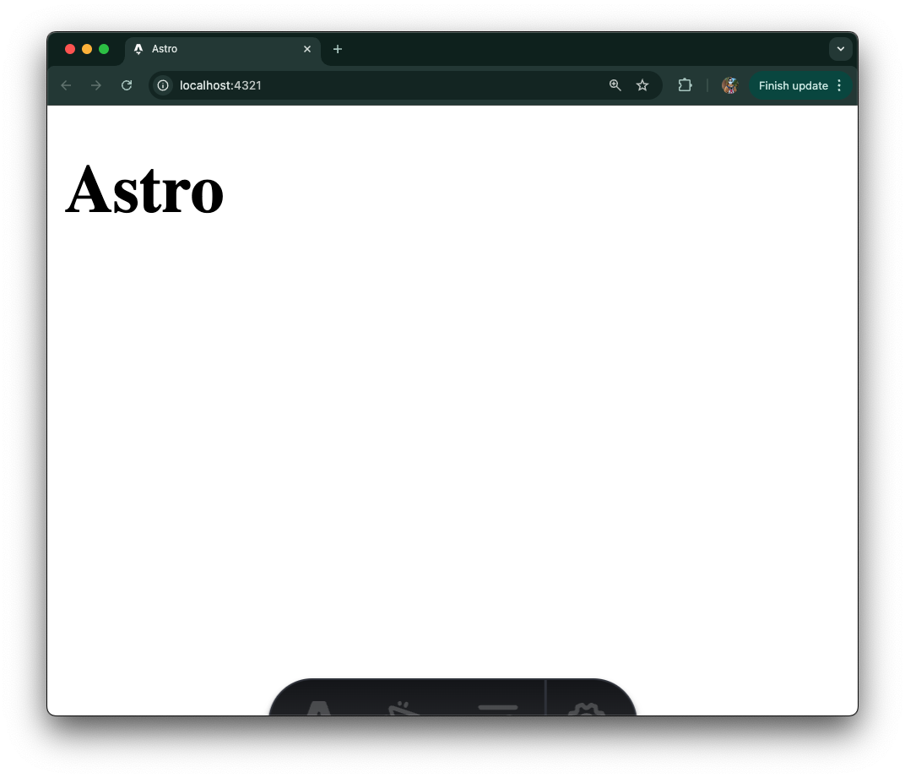
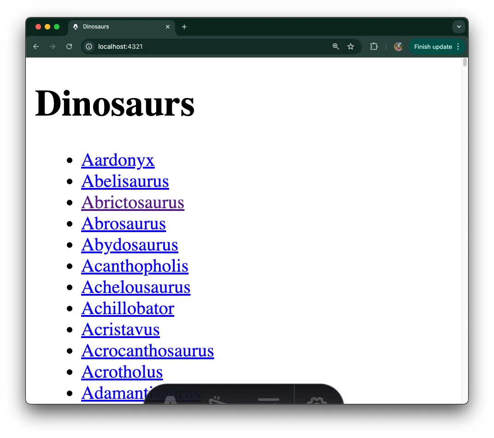
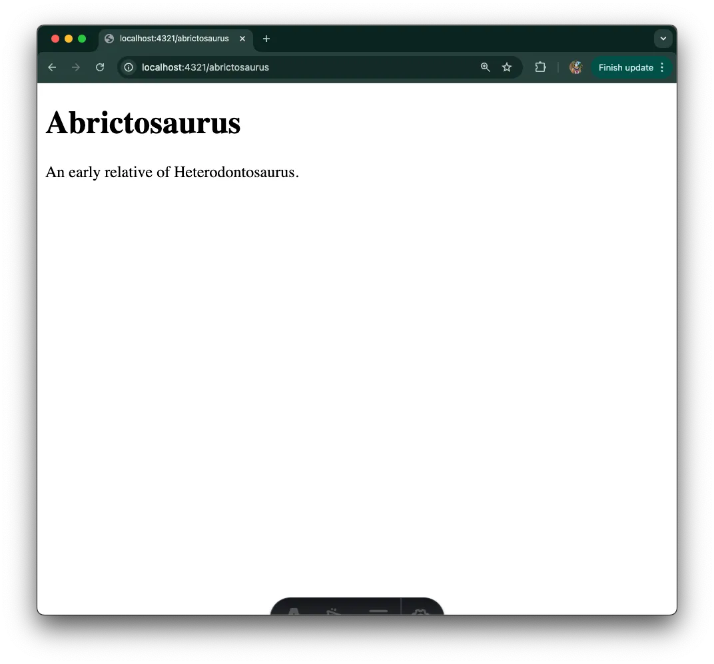

[Astro](https://astro.build/) is a modern web framework focused on
content-centric websites, which leverages islands architecture and sends zero
JavaScript to the client by default. And with the recent release of
[Deno 2](https://deno.com/2), now
[backwards compatible with Node and npm](https://deno.com/blog/v2.0#backwards-compatible-forward-thinking),
the experience of using Astro and Deno has improved.

We’ll go over how to build a simple Astro project using Deno:

- [Scaffold an Astro project](#scaffold-an-astro-project)
- [Update index page](#update-index-page-to-list-all-dinosaurs)
- [Add a dynamic SSR page](#add-a-dynamic-ssr-page)
- [What’s next?](#whats-next)

Feel free to skip directly to
[the source code](https://github.com/denoland/examples/tree/main/with-astro) or
follow along below!

## Scaffold an Astro project

Astro provides a CLI tool to quickly scaffold a new Astro project. In your
terminal, run the command `deno init --npm astro@latest` to create a new Astro
project with Deno. For this tutorial, we’ll select the “Empty” template so we
can start from scratch, and skip installing dependencies so we can install them
with Deno later:

```jsx
deno -A npm:create-astro@latest

 astro   Launch sequence initiated.

   dir   Where should we create your new project?
         ./dino-app

  tmpl   How would you like to start your new project?
         Empty

    ts   Do you plan to write TypeScript?
         Yes

   use   How strict should TypeScript be?
         Strict

  deps   Install dependencies?
         No
      ◼  No problem!
         Remember to install dependencies after setup.

   git   Initialize a new git repository?
         Yes

      ✔  Project initialized!
         ■ Template copied
         ■ TypeScript customized
         ■ Git initialized

  next   Liftoff confirmed. Explore your project!

 Enter your project directory using cd ./dino-app
 Run npm run dev to start the dev server. CTRL+C to stop.
 Add frameworks like react or tailwind using astro add.

 Stuck? Join us at https://astro.build/chat

╭─────╮  Houston:
│ ◠ ◡ ◠  Good luck out there, astronaut! 🚀
╰──🍫─╯
```

As of Deno 2,
[Deno can also install packages with the new `deno install` command](https://deno.com/blog/v2.0#deno-is-now-a-package-manager-with-deno-install).
So let’s run
[`deno install`](https://docs.deno.com/runtime/reference/cli/install/) with the
flag `--allow-scripts` to execute any npm lifecycle scripts:

```bash
deno install --allow-scripts
```

To see what commands we have, let’s run `deno task`:

```bash
deno task
Available tasks:
- dev (package.json)
    astro dev
- start (package.json)
    astro dev
- build (package.json)
    astro check && astro build
- preview (package.json)
    astro preview
- astro (package.json)
    astro
```

We can start the Astro server with `deno task dev`:



## Update index page to list all dinosaurs

Our app will display facts about a variety of dinosaurs. The first page to
create will be the index page that lists links to all dinosaurs in our
“database”.

First, let’s create the data that will be used in the app. In this example,
we’ll hardcode the data in a json file, but you can use any data storage in
practice. We’ll create a `data` folder in the root of the project, then a
`dinosaurs.json` file with
[this text](https://github.com/denoland/tutorial-with-react/blob/main/api/data.json)
in it.

> ⚠️️ In this tutorial we hard code the data. But you can connect to
> [a variety of databases](https://docs.deno.com/runtime/tutorials/connecting_to_databases/)
> and
> [even use ORMs like Prisma](https://docs.deno.com/runtime/tutorials/how_to_with_npm/prisma/)
> with Deno.

Once we have the data, let’s create an index page that lists all of the
dinosaurs. In the `./src/pages/index.astro` page, let’s write the following:

```jsx
---
import data from "../../data/dinosaurs.json";
---

<html lang="en">
	<head>
		<meta charset="utf-8" />
		<link rel="icon" type="image/svg+xml" href="/favicon.svg" />
		<meta name="viewport" content="width=device-width" />
		<meta name="generator" content={Astro.generator} />
		<title>Dinosaurs</title>
	</head>
	<body>
		<h1>Dinosaurs</h1>
		<ul>
			{data.map((dinosaur) => (
				<li>
					<a href={`/${dinosaur.name.toLowerCase()}`}>{ dinosaur.name }</a>
				</li>
			))}
		</ul>
	</body>
</html>
```

Let’s start the server with `deno task dev` and point our browser to
`localhost:4321`:



Awesome! But when you click on a dinosaur, it 404’s. Let’s fix that.

## Add a dynamic SSR page

Our app will display facts about a variety of dinosaurs. In order to do that,
we’ll create a dynamic server-side rendered (”SSR”), which
[offers better performance for end users while improving your pages SEO](https://deno.com/blog/the-future-and-past-is-server-side-rendering).

Next, let’s create a new file under `/src/pages/` called `[dinosaur].astro`. At
the top of the file, we'll add some logic to pull data from our hardcoded data
source and filter that against the `dinosaur` parameter set from the URL path.
At the bottom, we’ll render the data. Your file should look like this:

```jsx
---
import data from "../../data/dinosaurs.json";
const { dinosaur } = Astro.params;
const dinosaurObj = data.find((item) => item.name.toLowerCase() === dinosaur);
if (!dinosaurObj) return Astro.redirect("/404");
const { name, description } = dinosaurObj;
---

<h1>{ name }</h1>

<p>
    { description }
</p>
```

> ⚠️️ The
> [Deno language server](https://docs.deno.com/runtime/reference/lsp_integration/)
> does not currently support `.astro` files, so you may experience false red
> squigglies. We're working on improving this experience.

Let’s run it with `deno task dev`, and point our browser to
`localhost:4321/abrictosaurus`:



It works!

## What’s next

We hope this tutorial gives you a good idea of how to get started building with
Astro and Deno. You can learn more about Astro and
[their progressive approach to building websites](https://docs.astro.build/en/getting-started/).
If you’re interested in swapping out our hardcoded data store, here are some
resources on
[connecting to databases with Deno](https://docs.deno.com/runtime/tutorials/connecting_to_databases/),
including
[Planetscale](https://docs.deno.com/runtime/tutorials/how_to_with_npm/planetscale/),
[Redis](https://docs.deno.com/runtime/tutorials/how_to_with_npm/redis/), and
more. Or you can learn how to
[deploy your Astro project to Deno Deploy](https://deno.com/blog/astro-on-deno),
or follow these guides on how to self-host Deno to
[AWS](https://docs.deno.com/runtime/tutorials/aws_lightsail/),
[Digital Ocean](https://docs.deno.com/runtime/tutorials/digital_ocean/), and
[Google Cloud Run](https://docs.deno.com/runtime/tutorials/google_cloud_run/).
