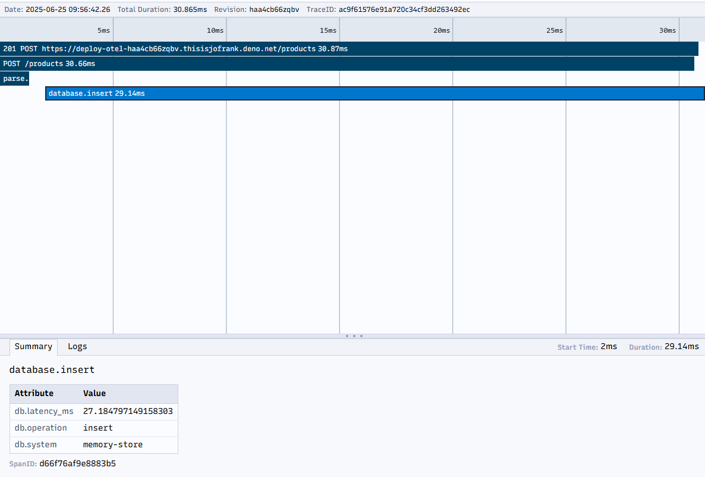

Deno Deploy<sup>EA</sup> includes built-in OpenTelemetry support that
automatically captures traces for HTTP requests, database queries, and other
operations. This tutorial shows how to add custom OpenTelemetry instrumentation
to your applications for more detailed observability.

## Prerequisites

1. A [GitHub](https://github.com) account
2. [Deno installed](https://docs.deno.com/runtime/manual/getting_started/installation)
   on your local machine
3. Access to the
   [Deno Deploy Early Access program](https://dash.deno.com/account#early-access)
4. Basic familiarity with
   [OpenTelemetry concepts](https://opentelemetry.io/docs/concepts/)

## Create a basic API application

First, let's create a simple API server that we'll instrument with
OpenTelemetry:

```ts title="main.ts"
const dataStore: Record<string, string> = {};

async function handler(req: Request): Promise<Response> {
  const url = new URL(req.url);

  // Simulate random latency
  await new Promise((resolve) => setTimeout(resolve, Math.random() * 200));

  try {
    // Handle product listing
    if (url.pathname === "/products" && req.method === "GET") {
      return new Response(JSON.stringify(Object.values(dataStore)), {
        headers: { "Content-Type": "application/json" },
      });
    }

    // Handle product creation
    if (url.pathname === "/products" && req.method === "POST") {
      const data = await req.json();
      const id = crypto.randomUUID();
      dataStore[id] = data;
      return new Response(JSON.stringify({ id, ...data }), {
        status: 201,
        headers: { "Content-Type": "application/json" },
      });
    }

    // Handle product retrieval by ID
    if (url.pathname.startsWith("/products/") && req.method === "GET") {
      const id = url.pathname.split("/")[2];
      const product = dataStore[id];

      if (!product) {
        return new Response("Product not found", { status: 404 });
      }

      return new Response(JSON.stringify(product), {
        headers: { "Content-Type": "application/json" },
      });
    }

    // Handle root route
    if (url.pathname === "/") {
      return new Response("Product API - Try /products endpoint");
    }

    return new Response("Not Found", { status: 404 });
  } catch (error) {
    console.error("Error handling request:", error);
    return new Response("Internal Server Error", { status: 500 });
  }
}

console.log("Server running on http://localhost:8000");
Deno.serve(handler, { port: 8000 });
```

Save this file and run it locally:

```sh
deno run --allow-net main.ts
```

Test the API with curl or a browser to ensure it works:

```sh
# List products (empty at first)
curl http://localhost:8000/products

# Add a product
curl -X POST http://localhost:8000/products \
  -H "Content-Type: application/json" \
  -d '{"name": "Test Product", "price": 19.99}'
```

## Add OpenTelemetry instrumentation

Now, let's add custom OpenTelemetry instrumentation to our application. Create a
new file called `instrumented-main.ts`:

```ts title="instrumented-main.ts"
import { trace } from "npm:@opentelemetry/api@1";

// Get the OpenTelemetry tracer
const tracer = trace.getTracer("product-api");

const dataStore: Record<string, string> = {};

// Simulate a database operation with custom span
async function queryDatabase(
  operation: string,
  data?: unknown,
): Promise<unknown> {
  return await tracer.startActiveSpan(`database.${operation}`, async (span) => {
    try {
      // Add attributes to the span for better context
      span.setAttributes({
        "db.system": "memory-store",
        "db.operation": operation,
      });

      // Simulate database latency
      const delay = Math.random() * 100;
      await new Promise((resolve) => setTimeout(resolve, delay));

      // Add latency information to the span
      span.setAttributes({ "db.latency_ms": delay });

      if (operation === "list") {
        return Object.values(dataStore);
      } else if (operation === "get") {
        return dataStore[data as string];
      } else if (operation === "insert") {
        const id = crypto.randomUUID();
        dataStore[id] = data as string;
        return { id, data };
      }

      return null;
    } catch (error) {
      // Record any errors to the span
      span.recordException(error);
      span.setStatus({ code: trace.SpanStatusCode.ERROR });
      throw error;
    } finally {
      // End the span when we're done
      span.end();
    }
  });
}

async function handler(req: Request): Promise<Response> {
  // Create a parent span for the entire request
  return await tracer.startActiveSpan(
    `${req.method} ${new URL(req.url).pathname}`,
    async (parentSpan) => {
      const url = new URL(req.url);

      // Add request details as span attributes
      parentSpan.setAttributes({
        "http.method": req.method,
        "http.url": req.url,
        "http.route": url.pathname,
      });

      try {
        // Handle product listing
        if (url.pathname === "/products" && req.method === "GET") {
          const products = await queryDatabase("list");
          return new Response(JSON.stringify(products), {
            headers: { "Content-Type": "application/json" },
          });
        }

        // Handle product creation
        if (url.pathname === "/products" && req.method === "POST") {
          // Create a span for parsing request JSON
          const data = await tracer.startActiveSpan(
            "parse.request.body",
            async (span) => {
              try {
                const result = await req.json();
                return result;
              } catch (error) {
                span.recordException(error);
                span.setStatus({ code: trace.SpanStatusCode.ERROR });
                throw error;
              } finally {
                span.end();
              }
            },
          );

          const result = await queryDatabase("insert", data);
          return new Response(JSON.stringify(result), {
            status: 201,
            headers: { "Content-Type": "application/json" },
          });
        }

        // Handle product retrieval by ID
        if (url.pathname.startsWith("/products/") && req.method === "GET") {
          const id = url.pathname.split("/")[2];
          parentSpan.setAttributes({ "product.id": id });

          const product = await queryDatabase("get", id);

          if (!product) {
            parentSpan.setAttributes({
              "error": true,
              "error.type": "not_found",
            });
            return new Response("Product not found", { status: 404 });
          }

          return new Response(JSON.stringify(product), {
            headers: { "Content-Type": "application/json" },
          });
        }

        // Handle root route
        if (url.pathname === "/") {
          return new Response("Product API - Try /products endpoint");
        }

        parentSpan.setAttributes({ "error": true, "error.type": "not_found" });
        return new Response("Not Found", { status: 404 });
      } catch (error) {
        console.error("Error handling request:", error);
        // Record the error in the span
        parentSpan.recordException(error);
        parentSpan.setAttributes({
          "error": true,
          "error.type": error.name,
          "error.message": error.message,
        });
        parentSpan.setStatus({ code: trace.SpanStatusCode.ERROR });

        return new Response("Internal Server Error", { status: 500 });
      } finally {
        // End the parent span when we're done
        parentSpan.end();
      }
    },
  );
}

console.log(
  "Server running with OpenTelemetry instrumentation on http://localhost:8000",
);
Deno.serve(handler, { port: 8000 });
```

Run the instrumented version locally:

```sh
deno run --allow-net instrumented-main.ts
```

Test the API again with curl to generate some traces.

## Create a GitHub repository

1. Go to [GitHub](https://github.com) and create a new repository.

2. Initialize your local directory as a Git repository:

```sh
git init
git add .
git commit -m "Add OpenTelemetry instrumented API"
```

3. Add your GitHub repository as a remote and push your code:

```sh
git remote add origin https://github.com/your-username/otel-demo-app.git
git branch -M main
git push -u origin main
```

## Deploy to Deno Deploy Early Access

1. Navigate to [app.deno.com](https://app.deno.com)
2. Select your organization or create a new one if needed
3. Click "+ New App"
4. Select the GitHub repository you created earlier
5. Configure the build settings:
   - Framework preset: No preset
   - Runtime configuration: Dynamic
   - Entrypoint: `instrumented-main.ts`

6. Click "Create App" to start the deployment process

## Generate sample traffic

To generate sample traces and metrics, let's send some traffic to your deployed
application:

1. Copy your deployment URL from the Deno Deploy dashboard

2. Send several requests to different endpoints:

```sh
# Store your app URL in a variable
APP_URL=https://your-app-name.your-org-name.deno.net

# Get the root route
curl $APP_URL/

# List products (empty at first)
curl $APP_URL/products

# Add some products
curl -X POST $APP_URL/products -H "Content-Type: application/json" -d '{"name": "Laptop", "price": 999.99}'
curl -X POST $APP_URL/products -H "Content-Type: application/json" -d '{"name": "Headphones", "price": 129.99}'
curl -X POST $APP_URL/products -H "Content-Type: application/json" -d '{"name": "Mouse", "price": 59.99}'

# List products again
curl $APP_URL/products

# Try to access a non-existent product (will generate an error span)
curl $APP_URL/products/nonexistent-id
```

## Explore OpenTelemetry traces and metrics

Now let's explore the observability data collected by Deno Deploy:

1. From your application dashboard, click "Traces" in the sidebar
   - You'll see a list of traces for each request to your application
   - You can filter traces by HTTP method or status code using the search bar

2. Select one of your `/products` POST traces to see detailed information:
   - The parent span for the entire request
   - Child spans for database operations
   - The span for parsing the request body

   

3. Click on individual spans to see their details:
   - Duration and timing information
   - Attributes you set like `db.operation` and `db.latency_ms`
   - Any recorded exceptions

4. Click "Logs" in the sidebar to see console output with trace context:
   - Notice how logs emitted during a traced operation are automatically linked
     to the trace
   - Click "View trace" on a log line to see the associated trace

5. Click "Metrics" to view application performance metrics:
   - HTTP request counts by endpoint
   - Error rates
   - Response time distributions

🦕 The automatic instrumentation in Deno Deploy<sup>EA</sup> combined with your
custom instrumentation provides comprehensive visibility into your application's
performance and behavior.

For more information about OpenTelemetry in Deno, check out these resources:

- [OpenTelemetry in Deno documentation](/runtime/fundamentals/open_telemetry/)
- [Deno Deploy<sup>EA</sup> Observability reference](/deploy/early-access/reference/observability/)
- [OpenTelemetry official documentation](https://opentelemetry.io/docs/)
