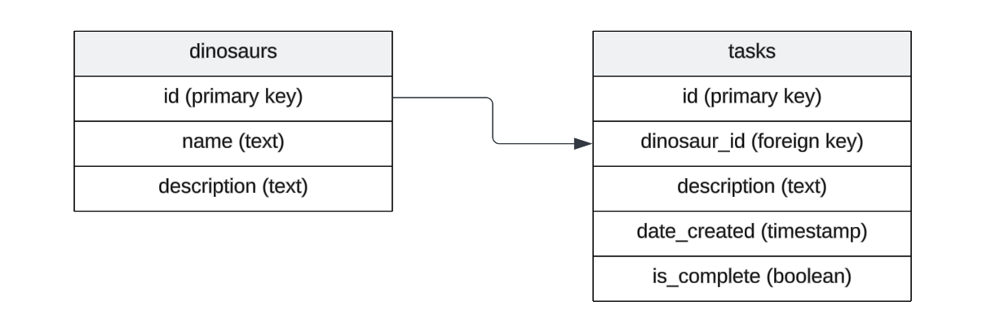

[Drizzle ORM](https://orm.drizzle.team/) is a TypeScript ORM that provides a
type-safe way to interact with your database. In this tutorial, we'll set up
Drizzle ORM with Deno and PostgreSQL to create, read, update, and delete
dinosaur data:

- [Install Drizzle](#install-drizzle)
- [Configure Drizzle](#configure-drizzle)
- [Define schemas](#define-schemas)
- [Interact with the database](#interact-with-the-database)
- [What's next?](#whats-next)

You can find all the code for this tutorial in
[this GitHub repo](https://github.com/denoland/examples/tree/main/with-drizzle).

## Install Drizzle

First, we'll install the required dependencies using Deno's npm compatibility.
We'll be using Drizzle with
[Postgres](https://orm.drizzle.team/docs/get-started-postgresql), but you can
also use [MySQL](https://orm.drizzle.team/docs/get-started-mysql) or
[SQLite](https://orm.drizzle.team/docs/get-started-sqlite). (If you don't have
Postgres, you can [install it here](https://www.postgresql.org/download/).)

```bash
deno install npm:drizzle-orm npm:drizzle-kit npm:pg npm:@types/pg
```

This installs Drizzle ORM and its associated tools —
[drizzle-kit](https://orm.drizzle.team/docs/kit-overview) for schema migrations,
[pg](https://www.npmjs.com/package/pg) for PostgreSQL connectivity, and
[the TypeScript types for PostgreSQL](https://www.npmjs.com/package/@types/pg).
These packages will allow us to interact with our database in a type-safe way
while maintaining compatibility with Deno's runtime environment.

It will also create a `deno.json` file in your project root to manage the npm
dependencies:

```json
{
  "imports": {
    "@types/pg": "npm:@types/pg@^8.11.10",
    "drizzle-kit": "npm:drizzle-kit@^0.27.2",
    "drizzle-orm": "npm:drizzle-orm@^0.36.0",
    "pg": "npm:pg@^8.13.1"
  }
}
```

## Configure Drizzle

Next, let's create a `drizzle.config.ts` file in your project root. This file
will configure Drizzle to work with your PostgreSQL database:

```tsx
import { defineConfig } from "drizzle-kit";

export default defineConfig({
  out: "./drizzle",
  schema: "./src/db/schema.ts",
  dialect: "postgresql",
  dbCredentials: {
    url: Deno.env.get("DATABASE_URL")!,
  },
});
```

These config settings determine:

- where to output migration files (`./drizzle`)
- where to find your schema definition (`./src/db/schema.ts`)
- that PostgreSQL as your database dialect, and
- how to connect to your database using the URL stored in your environment
  variables

The `drizzle-kit` will use this configuration to manage your database schema and
generate SQL migrations automatically.

We’ll also need a `.env` file in the project root containing the `DATABASE_URL`
connection string:

```bash
DATABASE_URL=postgresql://[user[:password]@][host][:port]/[dbname]
```

Be sure to replace the login credentials with yours.

Next, let's connect to the database and use Drizzle to populate our tables.

## Define schemas

There are two ways that you can define your table schema with Drizzle. If you
already have Postgres tables defined, you can infer them with `pull`; otherwise,
you can define them in code, then use Drizzle to create a new table. We'll
explore both approaches below.

### Infer schema with `pull`

If you already have Postgres tables before adding Drizzle, then you can
introspect your database schema to automatically generate TypeScript types and
table definitions with the command
[`npm:drizzle-kit pull`](https://orm.drizzle.team/docs/drizzle-kit-pull). This
is particularly useful when working with an existing database or when you want
to ensure your code stays in sync with your database structure.

Let's say our current database already has the following table schemas:



We'll run the following command to instrospect the database and populate several
files under a `./drizzle` directory:

<figure>

```bash
deno --env -A --node-modules-dir npm:drizzle-kit pull

Failed to find Response internal state key
No config path provided, using default 'drizzle.config.ts'
Reading config file '/private/tmp/deno-drizzle-example/drizzle.config.ts'
Pulling from ['public'] list of schemas

Using 'pg' driver for database querying
[✓] 2 tables fetched
[✓] 8 columns fetched
[✓] 0 enums fetched
[✓] 0 indexes fetched
[✓] 1 foreign keys fetched
[✓] 0 policies fetched
[✓] 0 check constraints fetched
[✓] 0 views fetched

[i] No SQL generated, you already have migrations in project
[✓] You schema file is ready ➜ drizzle/schema.ts 🚀
[✓] You relations file is ready ➜ drizzle/relations.ts 🚀
```

<figcaption>
We use the <code>--env</code> flag to read the <code>.env</code> file with our database url and the
<code>--node-modules-dir</code> flag to create a <code>node_modules</code> folder that will allow us
to use <code>drizzle-kit</code> correctly.
</figcaption>
</figure>
</br>

The above command will create a number of files within a `./drizzle` directory
that define the schema, track changes, and provide the necessary information for
database migrations:

- `drizzle/schema.ts`: This file defines the database schema using Drizzle ORM's
  schema definition syntax.
- `drizzle/relations.ts`: This file is intended to define relationships between
  tables using Drizzle ORM's relations API.
- `drizzle/0000_long_veda.sql`: A SQL migration file that contains the SQL
  code to create the database table(s). The code is commented out — you can
  uncomment this code if you want to run this migration to create the table(s)
  in a new environment.
- `drizzle/meta/0000_snapshot.json`: A snapshot file that represents the current
  state of your database schema.
- `drizzle/meta/_journal.json`: This file keeps track of the migrations that
  have been applied to your database. It helps Drizzle ORM know which migrations
  have been run and which ones still need to be applied.

### Define schema in Drizzle first

If you don't already have an existing table defined in Postgres (e.g. you're
starting a completely new project), you can define the tables and types in code
and have Drizzle create them.

Let's create a new directory `./src/db/` and in it, a `schema.ts` file, which
we'll populate with the below:

<figure>

```ts
// schema.ts
import {
  boolean,
  foreignKey,
  integer,
  pgTable,
  serial,
  text,
  timestamp,
} from "drizzle-orm/pg-core";

export const dinosaurs = pgTable("dinosaurs", {
  id: serial().primaryKey().notNull(),
  name: text(),
  description: text(),
});

export const tasks = pgTable("tasks", {
  id: serial().primaryKey().notNull(),
  dinosaurId: integer("dinosaur_id"),
  description: text(),
  dateCreated: timestamp("date_created", { mode: "string" }).defaultNow(),
  isComplete: boolean("is_complete"),
}, (table) => {
  return {
    tasksDinosaurIdFkey: foreignKey({
      columns: [table.dinosaurId],
      foreignColumns: [dinosaurs.id],
      name: "tasks_dinosaur_id_fkey",
    }),
  };
});
```

<figcaption>
The above represents in code the two tables, <code>dinosaurs</code> and <code>tasks</code> and their relation. <a href="https://orm.drizzle.team/docs/schemas">Learn more about using Drizzle to define schemas and their relations</a>.
</figcaption>
</figure>
</br>

Once we have defined `./src/db/schema.ts`, we can create the tables and their
specified relationship by creating a migration:

```bash
deno -A --node-modules-dir npm:drizzle-kit generate

Failed to find Response internal state key
No config path provided, using default 'drizzle.config.ts'
Reading config file '/private/tmp/drizzle/drizzle.config.ts'
2 tables
dinosaurs 3 columns 0 indexes 0 fks
tasks 5 columns 0 indexes 1 fks
```

The above command will create a `./drizzle/` folder that contains migration
scripts and logs.

## Interact with the database

Now that we have setup Drizzle ORM, we can use it to simplify managing data in
our Postgres database. First, Drizzle suggests taking the `schema.ts` and
`relations.ts` and copying them to the `./src/db` directory to use within an
application.

Let's create a `./src/db/db.ts` which exports a few helper functions that'll
make it easier for us to interact with the database:

```ts
import { drizzle } from "drizzle-orm/node-postgres";
import { dinosaurs as dinosaurSchema, tasks as taskSchema } from "./schema.ts";
import { dinosaursRelations, tasksRelations } from "./relations.ts";
import pg from "pg";
import { integer } from "drizzle-orm/sqlite-core";
import { eq } from "drizzle-orm/expressions";

// Use pg driver.
const { Pool } = pg;

// Instantiate Drizzle client with pg driver and schema.
export const db = drizzle({
  client: new Pool({
    connectionString: Deno.env.get("DATABASE_URL"),
  }),
  schema: { dinosaurSchema, taskSchema, dinosaursRelations, tasksRelations },
});

// Insert dinosaur.
export async function insertDinosaur(dinosaurObj: typeof dinosaurSchema) {
  return await db.insert(dinosaurSchema).values(dinosaurObj);
}

// Insert task.
export async function insertTask(taskObj: typeof taskSchema) {
  return await db.insert(taskSchema).values(taskObj);
}

// Find dinosaur by id.
export async function findDinosaurById(dinosaurId: typeof integer) {
  return await db.select().from(dinosaurSchema).where(
    eq(dinosaurSchema.id, dinosaurId),
  );
}

// Find dinosaur by name.
export async function findDinosaurByName(name: string) {
  return await db.select().from(dinosaurSchema).where(
    eq(dinosaurSchema.name, name),
  );
}

// Find tasks based on dinosaur id.
export async function findDinosaurTasksByDinosaurId(
  dinosaurId: typeof integer,
) {
  return await db.select().from(taskSchema).where(
    eq(taskSchema.dinosaurId, dinosaurId),
  );
}

// Update dinosaur.
export async function updateDinosaur(dinosaurObj: typeof dinosaurSchema) {
  return await db.update(dinosaurSchema).set(dinosaurObj).where(
    eq(dinosaurSchema.id, dinosaurObj.id),
  );
}

// Update task.
export async function updateTask(taskObj: typeof taskSchema) {
  return await db.update(taskSchema).set(taskObj).where(
    eq(taskSchema.id, taskObj.id),
  );
}

// Delete dinosaur by id.
export async function deleteDinosaurById(id: typeof integer) {
  return await db.delete(dinosaurSchema).where(
    eq(dinosaurSchema.id, id),
  );
}

// Delete task by id.
export async function deleteTask(id: typeof integer) {
  return await db.delete(taskSchema).where(eq(taskSchema.id, id));
}
```

Now we can import some of these helper functions to a script where we can
perform some simple CRUD operations on our database. Let's create a new file
`./src/script.ts`:

```ts
import {
  deleteDinosaurById,
  findDinosaurByName,
  insertDinosaur,
  insertTask,
  updateDinosaur,
} from "./db/db.ts";

// Create a new dinosaur.
await insertDinosaur({
  name: "Denosaur",
  description: "Dinosaurs should be simple.",
});

// Find that dinosaur by name.
const res = await findDinosaurByName("Denosaur");

// Create a task with that dinosaur by its id.
await insertTask({
  dinosaurId: res.id,
  description: "Remove unnecessary config.",
  isComplete: false,
});

// Update a dinosaur with a new description.
const newDeno = {
  id: res.id,
  name: "Denosaur",
  description: "The simplest dinosaur.",
};
await updateDinosaur(newDeno);

// Delete the dinosaur (and any tasks it has).
await deleteDinosaurById(res.id);
```

We can run it and it will perform all of the actions on the database:

```ts
deno -A --env ./src/script.ts
```

## What's next?

Drizzle ORM is a popular data mapping tool to simplify managing and maintaining
data models and working with your database. Hopefully, this tutorial gives you a
start on how to use Drizzle in your Deno projects.

Now that you have a basic understanding of how to use Drizzle ORM with Deno, you
could:

1. Add more complex database relationships
2. [Implement a REST API](https://docs.deno.com/examples/) using
   [Hono](https://jsr.io/@hono/hono) to serve your dinosaur data
3. Add validation and error handling to your database operations
4. Write tests for your database interactions
5. [Deploy your application to the cloud](https://docs.deno.com/runtime/tutorials/#deploying-deno-projects)

🦕 Happy coding with Deno and Drizzle ORM! The type-safety and simplicity of
this stack make it a great choice for building modern web applications.
