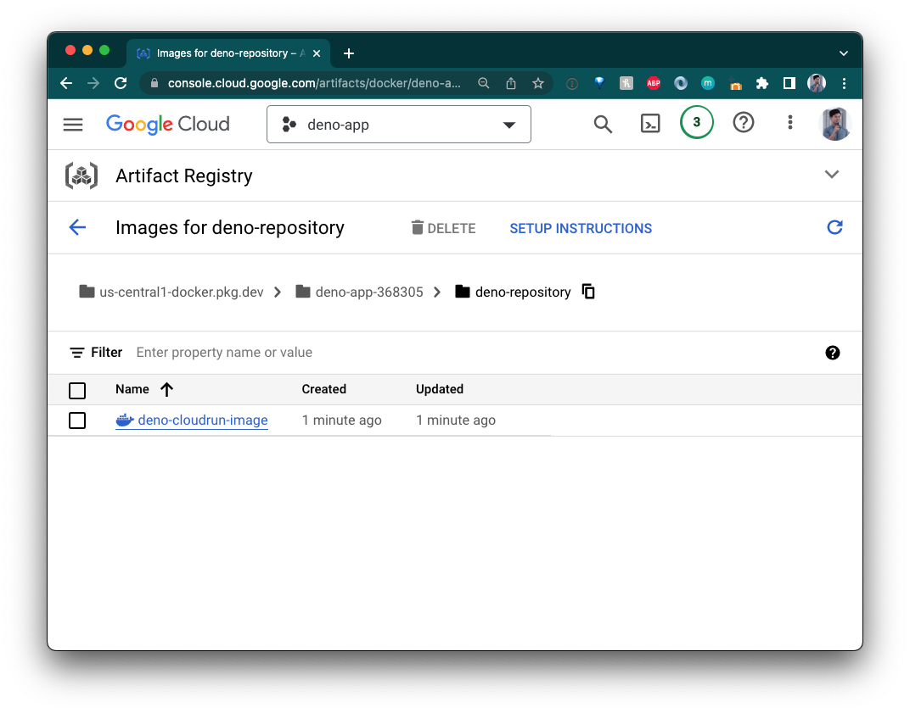

[Google Cloud Run](https://cloud.google.com/run) is a managed compute platform
that lets you run containers on Google's scalable infrastructure.

This How To guide will show you how to use Docker to deploy your Deno app to
Google Cloud Run.

First, we'll show you how to deploy manually, then we'll show you how to
automate it with GitHub Actions.

Pre-requisites:

- [Google Cloud Platform account](https://cloud.google.com/gcp)
- [`docker` CLI](https://docs.docker.com/engine/reference/commandline/cli/)
  installed
- [`gcloud`](https://cloud.google.com/sdk/gcloud) installed

## Manual Deployment

### Create `Dockerfile` and `docker-compose.yml`

To focus on the deployment, our app will simply be a `main.ts` file that returns
a string as an HTTP response:

```ts title="main.ts"
import { Application } from "jsr:@oak/oak";

const app = new Application();

app.use((ctx) => {
  ctx.response.body = "Hello from Deno and Google Cloud Run!";
});

await app.listen({ port: 8000 });
```

Then, we'll create two files -- `Dockerfile` and `docker-compose.yml` -- to
build the Docker image.

In our `Dockerfile`, let's add:

```Dockerfile
FROM denoland/deno

EXPOSE 8000

WORKDIR /app

ADD . /app

RUN deno install --entrypoint main.ts

CMD ["run", "--allow-net", "main.ts"]
```

Then, in our `docker-compose.yml`:

```yml
version: "3"

services:
  web:
    build: .
    container_name: deno-container
    image: deno-image
    ports:
      - "8000:8000"
```

Let's test this locally by running `docker compose -f docker-compose.yml build`,
then `docker compose up`, and going to `localhost:8000`.


It works!

### Set up Artifact Registry

Artifact Registry is GCP's private registry of Docker images.

Before we can use it, go to GCP's
[Artifact Registry](https://console.cloud.google.com/artifacts) and click
"Create repository". You'll be asked for a name (`deno-repository`) and a region
(`us-central1`). Then click "Create".


### Build, Tag, and Push to Artifact Registry

Once we've created a repository, we can start pushing images to it.

First, let's add the registry's address to `gcloud`:

```shell
gcloud auth configure-docker us-central1-docker.pkg.dev
```

Then, let's build your Docker image. (Note that the image name is defined in our
`docker-compose.yml` file.)

```shell
docker compose -f docker-compose.yml build
```

Then, [tag](https://docs.docker.com/engine/reference/commandline/tag/) it with
the new Google Artifact Registry address, repository, and name. The image name
should follow this structure:
`{{ location }}-docker.pkg.dev/{{ google_cloudrun_project_name }}/{{ repository }}/{{ image }}`.

```shell
docker tag deno-image us-central1-docker.pkg.dev/deno-app-368305/deno-repository/deno-cloudrun-image
```

If you don't specify a tag, it'll use `:latest` by default.

Next, push the image:

```shell
docker push us-central1-docker.pkg.dev/deno-app-368305/deno-repository/deno-cloudrun-image
```

_[More info on how to push and pull images to Google Artifact Registry](https://cloud.google.com/artifact-registry/docs/docker/pushing-and-pulling)._

Your image should now appear in your Google Artifact Registry!



### Create a Google Cloud Run Service

We need an instance where we can build these images, so let's go to
[Google Cloud Run](https://console.cloud.google.com/run) and click "Create
Service".

Let's name it "hello-from-deno".

Select "Deploy one revision from an existing container image". Use the drop down
to select the image from the `deno-repository` Artifact Registry.

Select "allow unauthenticated requests" and then click "Create service". Make
sure the port is `8000`.

When it's done, your app should now be live:


Awesome!

### Deploy with `gcloud`

Now that it's created, we'll be able to deploy to this service from the `gcloud`
CLI. The command follows this structure:
`gcloud run deploy {{ service_name }} --image={{ image }} --region={{ region }} --allow-unauthenticated`.
Note that the `image` name follows the structure from above.

For this example, the command is:

```shell
gcloud run deploy hello-from-deno --image=us-central1-docker.pkg.dev/deno-app-368305/deno-repository/deno-cloudrun-image --region=us-central1 --allow-unauthenticated
```


Success!

## Automate Deployment with GitHub Actions

In order for automation to work, we first need to make sure that these both have
been created:

- the Google Artifact Registry
- the Google Cloud Run service instance

(If you haven't done that, please see the section before.)

Now that we have done that, we can automate it with a GitHub workflow. Here's
the yaml file:

```yml
name: Build and Deploy to Cloud Run

on:
  push:
    branches:
      - main

env:
  PROJECT_ID: { { PROJECT_ID } }
  GAR_LOCATION: { { GAR_LOCATION } }
  REPOSITORY: { { GAR_REPOSITORY } }
  SERVICE: { { SERVICE } }
  REGION: { { REGION } }

jobs:
  deploy:
    name: Deploy
    permissions:
      contents: "read"
      id-token: "write"

    runs-on: ubuntu-latest
    steps:
      - name: Checkout
        uses: actions/checkout@v4

      - name: Google Auth
        id: auth
        uses: "google-github-actions/auth@v0"
        with:
          credentials_json: "${{ secrets.GCP_CREDENTIALS }}"

      - name: Login to GAR
        uses: docker/login-action@v2.1.0
        with:
          registry: ${{ env.GAR_LOCATION }}-docker.pkg.dev
          username: _json_key
          password: ${{ secrets.GCP_CREDENTIALS }}

      - name: Build and Push Container
        run: |-
          docker build -t "${{ env.GAR_LOCATION }}-docker.pkg.dev/${{ env.PROJECT_ID }}/${{ env.REPOSITORY }}/${{ env.SERVICE }}:${{ github.sha }}" ./
          docker push "${{ env.GAR_LOCATION }}-docker.pkg.dev/${{ env.PROJECT_ID }}/${{ env.REPOSITORY }}/${{ env.SERVICE }}:${{ github.sha }}"

      - name: Deploy to Cloud Run
        id: deploy
        uses: google-github-actions/deploy-cloudrun@v0
        with:
          service: ${{ env.SERVICE }}
          region: ${{ env.REGION }}
          image: ${{ env.GAR_LOCATION }}-docker.pkg.dev/${{ env.PROJECT_ID }}/${{ env.REPOSITORY }}/${{ env.SERVICE }}:${{ github.sha }}

      - name: Show Output
        run: echo ${{ steps.deploy.outputs.url }}
```

The environment variables that we need to set are (the examples in parenthesis
are the ones for this repository)

- `PROJECT_ID`: your project id (`deno-app-368305`)
- `GAR_LOCATION`: the location your Google Artifact Registry is set
  (`us-central1`)
- `GAR_REPOSITORY`: the name you gave your Google Artifact Registry
  (`deno-repository`)
- `SERVICE`: the name of the Google Cloud Run service (`hello-from-deno`)
- `REGION`: the region of your Google Cloud Run service (`us-central1`)

The secret variables that we need to set are:

- `GCP_CREDENTIALS`: this is the
  [service account](https://cloud.google.com/iam/docs/service-accounts) json
  key. When you create the service account, be sure to
  [include the roles and permissions necessary](https://cloud.google.com/iam/docs/granting-changing-revoking-access#granting_access_to_a_user_for_a_service_account)
  for Artifact Registry and Google Cloud Run.

[Check out more details and examples of deploying to Cloud Run from GitHub Actions.](https://github.com/google-github-actions/deploy-cloudrun)

For reference:
https://github.com/google-github-actions/example-workflows/blob/main/workflows/deploy-cloudrun/cloudrun-docker.yml
