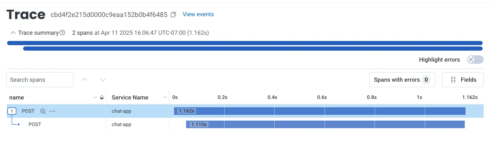
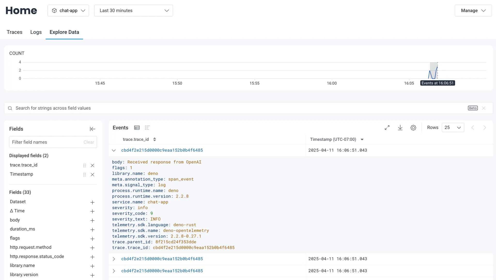

[OpenTelemetry](https://opentelemetry.io/) (often abbreviated as OTel) is an
open-source observability framework that provides a standardized way to collect
and export telemetry data such as traces, metrics and logs. Deno has built-in
support for OpenTelemetry, making it easy to instrument your applications
without adding external dependencies. This integration works out of the box with
observability platforms like [Honeycomb](https://honeycomb.io).

Honeycomb is an observability platform designed for debugging and understanding
complex, modern distributed systems.

In this tutorial, we'll build a simple application and export its telemetry data
to Honeycomb. We'll cover:

- [Set up your chat app](#set-up-your-chat-app)
- [Set up a Docker collector](#set-up-a-docker-collector)
- [Generating telemetry data](#generating-telemetry-data)
- [Viewing telemetry data](#viewing-telemetry-data)

You can find the complete source code for this tutorial
[on GitHub](https://github.com/denoland/examples/tree/main/with-honeycomb).

## Set up your chat app

For this tutorial, we'll use a simple chat application to demonstrate how to
export telemetry data. You can find the
[code for the app on GitHub](https://github.com/denoland/examples/tree/main/with-honeycomb).

Either take a copy of that repository or create a
[main.ts](https://github.com/denoland/examples/blob/main/with-honeycomb/main.ts)
file and a
[.env](https://github.com/denoland/examples/blob/main/with-honeycomb/.env.example)
file.

In order to run the app you will need an OpenAI API key. You can get one by
signing up for an account at [OpenAI](https://platform.openai.com/signup) and
creating a new secret key. You can find your API key in the
[API keys section](https://platform.openai.com/account/api-keys) of your OpenAI
account. Once you have an API key, set up an `OPENAI_API-KEY` environment
variable in your `.env` file:

```env title=".env"
OPENAI_API_KEY=your_openai_api_key
```

## Set up a Docker collector

Next, we'll set up a Docker container to run the OpenTelemetry collector. The
collector is responsible for receiving telemetry data from your application and
exporting it to Honeycomb.

If you have not already, create a free Honeycomb account and set up an
[ingest API key](https://docs.honeycomb.io/configure/environments/manage-api-keys/).

In the same directory as your `main.ts` file, create a `Dockerfile` and an
`otel-collector.yml` file. The `Dockerfile` will be used to build a Docker
image:

```dockerfile title="Dockerfile"
FROM otel/opentelemetry-collector:latest

COPY otel-collector.yml /otel-config.yml

CMD ["--config", "/otel-config.yml"]
```

`FROM otel/opentelemetry-collector:latest` - This line specifies the base image
for the container. It uses the official OpenTelemetry Collector image and pulls
the latest version.

`COPY otel-collector.yml /otel-config.yml` - This instruction copies our
configuration file named `otel-collector.yml` from the local build context into
the container. The file is renamed to `/otel-config.yml` inside the container.

`CMD ["--config", "/otel-config.yml"]` - This sets the default command that will
run when the container starts. It tells the OpenTelemetry Collector to use the
configuration file we copied in the previous step.

Next, add the following to your `otel-collector.yml` file to define how how
telemetry data should be collected and exported to Honeycomb:

```yml title="otel-collector.yml"
receivers:
  otlp:
    protocols:
      grpc:
        endpoint: 0.0.0.0:4317
      http:
        endpoint: 0.0.0.0:4318

exporters:
  otlp:
    endpoint: "api.honeycomb.io:443"
    headers:
      x-honeycomb-team: $_HONEYCOMB_API_KEY

processors:
  batch:
    timeout: 5s
    send_batch_size: 5000

service:
  pipelines:
    logs:
      receivers: [otlp]
      processors: [batch]
      exporters: [otlp]
    traces:
      receivers: [otlp]
      processors: [batch]
      exporters: [otlp]
    metrics:
      receivers: [otlp]
      processors: [batch]
      exporters: [otlp]
```

The `receivers` section configures how the collector receives data. It sets up
an OTLP (OpenTelemetry Protocol) receiver that listens on two protocols, `gRPC`
and `HTTP`, the `0.0.0.0` address means it will accept data from any source.

The `exporters` section defines where the collected data should be sent. It's
configured to send data to Honeycomb's API endpoint at `api.honeycomb.io:443`.
The configuration requires an API key for authentication, swap
`$_HONEYCOMB_API_KEY` for your actual Honeycomb API key.

The `processors` section defines how the data should be processed before export.
It uses batch processing with a timeout of 5 seconds and a maximum batch size of
5000 items.

The `service` section ties everything together by defining three pipelines. Each
pipeline is responsible for a different type of telemetry data. The logs
pipeline collects application logs. The traces pipeline is for distributed
tracing data. The metric pipeline is for performance metrics.

Build and run the docker instance to start collecting your telemetry data with
the following command:

```sh
docker build -t otel-collector . && docker run -p 4317:4317 -p 4318:4318 otel-collector
```

## Generating telemetry data

Now that we have the app and the docker container set up, we can start
generating telemetry data. Run your application with these environment variables
to send data to the collector:

```sh
OTEL_EXPORTER_OTLP_ENDPOINT=http://localhost:4318 \
OTEL_SERVICE_NAME=chat-app \
OTEL_DENO=true \
deno run --allow-net --allow-env --env-file --allow-read main.ts
```

This command:

- Points the OpenTelemetry exporter to your local collector (`localhost:4318`)
- Names your service "chat-app" in Honeycomb
- Enables Deno's OpenTelemetry integration
- Runs your application with the necessary permissions

To generate some telemetry data, make a few requests to your running application
in your browser at [`http://localhost:8000`](http://localhost:8000).

Each request will:

1. Generate traces as it flows through your application
2. Send logs from your application's console output
3. Create metrics about the request performance
4. Forward all this data through the collector to Honeycomb

## Viewing telemetry data

After making some requests to your application, you'll see three types of data
in your Honeycomb.io dashboard:

1. **Traces** - End-to-end request flows through your system
2. **Logs** - Console output and structured log data
3. **Metrics** - Performance and resource utilization data



You can drill down into individual spans to debug performance issues:



🦕 Now that you have telemetry export working, you could:

1. Add custom spans and attributes to better understand your application
2. Set up alerts based on latency or error conditions
3. Deploy your application and collector to production using platforms like:
   - [Fly.io](https://docs.deno.com/examples/deploying_deno_with_docker/)
   - [Digital Ocean](https://docs.deno.com/examples/digital_ocean_tutorial/)
   - [AWS Lightsail](https://docs.deno.com/examples/aws_lightsail_tutorial/)

For more details on OpenTelemetry configuration, check out the
[Honeycomb documentation](https://docs.honeycomb.io/send-data/opentelemetry/collector/).
