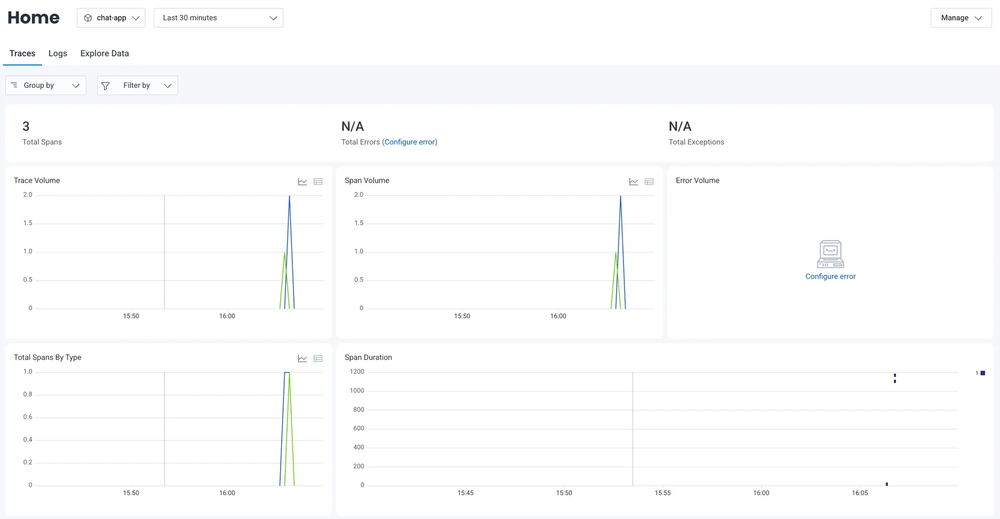
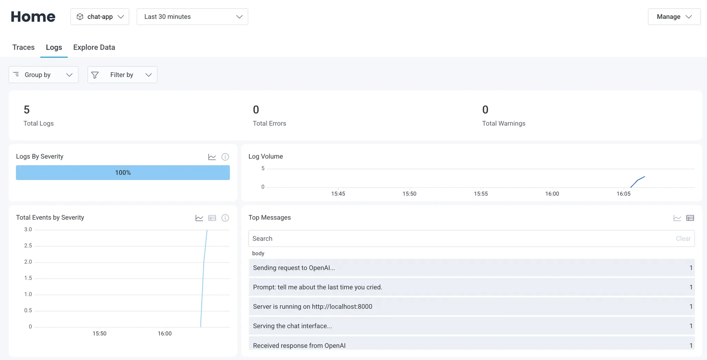

[Honeycomb.io](https://honeycomb.io) is a powerful observability platform
designed for debugging and understanding complex, modern distributed systems,
with support for real-time, high-cardinality data, as well as sophisticated
event correlation.

In this tutorial, we'll show how to export telemetry data from your Deno or
Node.js project to Honeycomb.io without any additional code or config:

- console.logs associated with HTTP requests
- traces
- metrics

You can view the source of this tutorial
[on GitHub](https://github.com/denoland/examples/tree/main/with-honeycomb).

[_Learn more about Deno's built-in OTel support and how it can level up your debugging immediately._](https://deno.com/blog/zero-config-debugging-deno-opentelemetry)

## Setup your app

Since this tutorial focuses on how to export data to Honeycomb.io, we'll use a
very simple chat application. Note that you can use any Deno (or Node.js)
program. What's important is that you run it with Deno and the following flags:

- `OTEL_SERVICE_NAME`
- `OTEL_DENO=true`
- `--unstable-otel`

This is the command we will run for this example:

```sh
OTEL_DENO=true OTEL_SERVICE_NAME=chat-app deno run --unstable-otel --allow-net --allow-read --allow-env --env-file main.ts
```

## Setup Honeycomb.io

If you haven't yet, create a free Honeycomb.io account. Once you have created an
account, you'll receive a Honeycomb.io API key. We'll need this in the next step
when we setup the OpenTelemetry collector.

Next, let's setup the OpenTelemetry collector with two new files: a `Dockerfile`
and a `otel-collector.yml` configuration file. These files will tell the
collector to export OTel data to Honeycomb.io.

In the `Dockerfile`, we'll pull from the
[`otel/opentelemetry-collector` image](https://hub.docker.com/r/otel/opentelemetry-collector).
Here, we use `latest` tag, but in production, we recommend using a specific
version:

```bash
# Dockerfile

FROM otel/opentelemetry-collector:latest

# Copy the OTel Collector config into the container
COPY otel-collector.yml /otel-config.yml

# Run the OTel Collector with the provided config
CMD ["--config", "/otel-config.yml"]
```

Next, let's create our `otel-collector.yml` . Note that your Honeycomb.io API
key is used in the `exporters` section, as the `x-honeycomb-team` header:

```yml
receivers:
  otlp:
    protocols:
      grpc:
        endpoint: 0.0.0.0:4317
      http:
        endpoint: 0.0.0.0:4318

exporters:
  otlp:
    endpoint: "api.honeycomb.io:443"
    headers:
      x-honeycomb-team: $_HONEYCOMB_API_KEY

processors:
  batch:
    timeout: 5s
    send_batch_size: 5000

service:
  pipelines:
    logs:
      receivers: [otlp]
      processors: [batch]
      exporters: [otlp]
    traces:
      receivers: [otlp]
      processors: [batch]
      exporters: [otlp]
    metrics:
      receivers: [otlp]
      processors: [batch]
      exporters: [otlp]
```

If you want more information about setting up Honeycomb.io,
[check out their documentation.](https://docs.honeycomb.io/send-data/opentelemetry/collector/)

Now we can start the OTel collector service with the following command:

```bash
$ docker build -t otel-collector . && docker run -p 4317:4317 -p 4318:4318 otel-collector

View build details: docker-desktop://dashboard/build/desktop-linux/desktop-linux/2vyhm3qruhhhb55mow5ir4hp0
2025-04-11T23:05:55.905Z	info	service@v0.123.0/service.go:197	Setting up own telemetry...
2025-04-11T23:05:55.906Z	info	service@v0.123.0/service.go:264	Starting otelcol...	{"Version": "0.123.0", "NumCPU": 14}
2025-04-11T23:05:55.906Z	info	extensions/extensions.go:41	Starting extensions...
2025-04-11T23:05:55.907Z	info	otlpreceiver@v0.123.0/otlp.go:116	Starting GRPC server	{"endpoint": "0.0.0.0:4317"}
2025-04-11T23:05:55.907Z	info	otlpreceiver@v0.123.0/otlp.go:173	Starting HTTP server	{"endpoint": "0.0.0.0:4318"}
2025-04-11T23:05:55.907Z	info	service@v0.123.0/service.go:287	Everything is ready. Begin running and processing data.
```

Once the service is running, make a few requests on your Deno app. Afterwards,
when we go to our Honeycomb.io account, we can see telemetry data:



We can view our logs:



As well as traces:


And explore each span operation within a trace:


## What's next

You can use this configuration to export telemetry data from any Deno or Node.js
program to Honeycomb.io.

You can also host this — the app and the OTel collector service — on any VPS
platform via Docker, such as
[Fly.io](https://docs.deno.com/examples/deploying_deno_with_docker/),
[Digital Ocean](https://docs.deno.com/examples/digital_ocean_tutorial/),
[Amazon](https://docs.deno.com/examples/aws_lightsail_tutorial/), and more.
