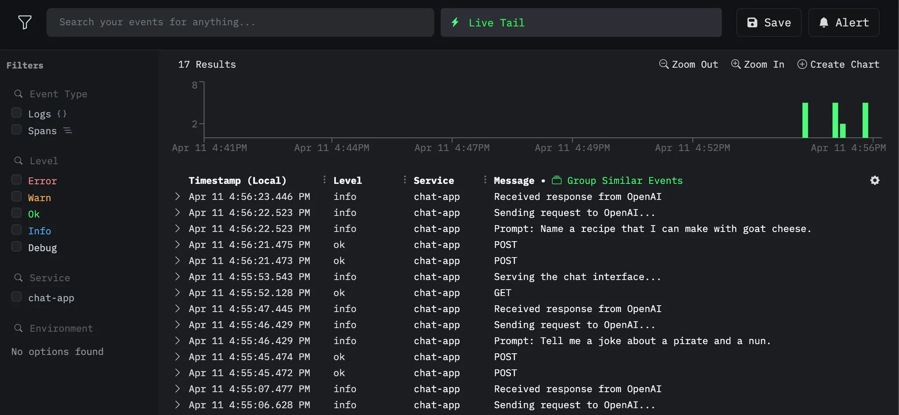
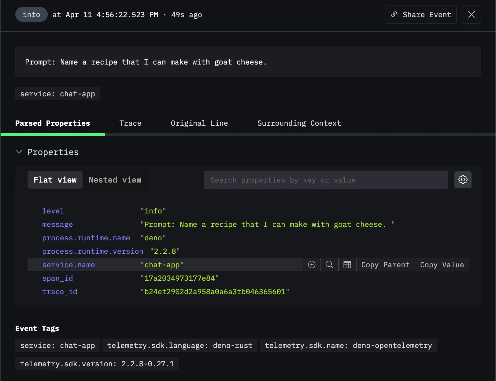
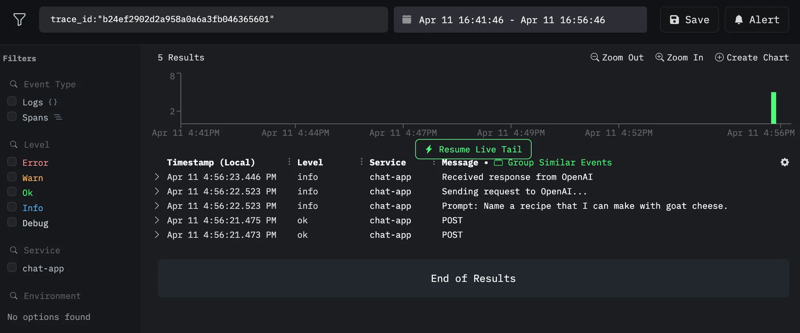
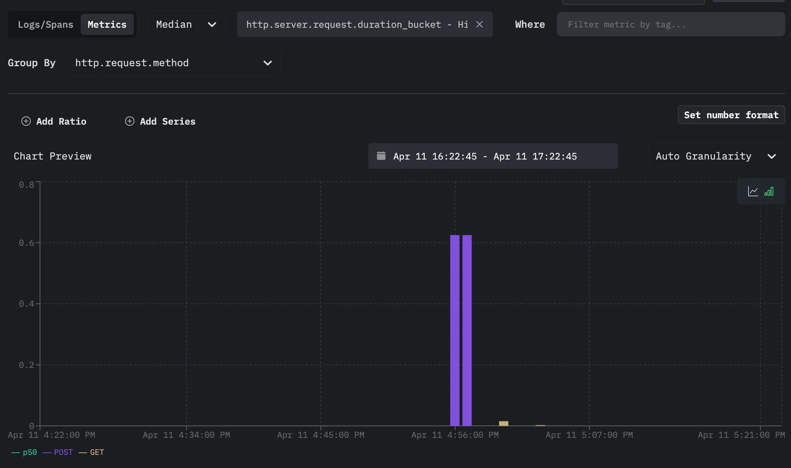

[HyperDX](https://hyperdx.io) is an open source, full-stack observability
platform designed to help developers and teams debug applications faster by
unifying logs, traces, metrics, exceptions, and session replays into a single
interface.

In this tutorial, we'll show how to export telemetry data from your Deno or
Node.js project to Hyperdx without any additional code or config:

- console.logs associated with HTTP requests
- traces
- metrics

You can view the source of this tutorial
[on GitHub](https://github.com/denoland/examples/tree/main/with-hyperdx).

[_Learn more about Deno's built-in OTel support and how it can level up your debugging without additional code._](https://deno.com/blog/zero-config-debugging-deno-opentelemetry)

## Setup your app

Since this tutorial focuses on how to export data to Hyperdx, we'll use a very
simple chat application. Note that you can use any Deno (or Node.js) program.
What's important is that you run it with Deno and the following flags:

- `OTEL_SERVICE_NAME`
- `OTEL_DENO=true`
- `--unstable-otel`

This is the command we will run for this example:

```sh
OTEL_DENO=true OTEL_SERVICE_NAME=chat-app deno run --unstable-otel --allow-net --allow-read --allow-env --env-file main.ts
```

If you haven’t yet, create a free Hyperdx account. Once you have created an
account, you’ll receive a Hyperdx API key. We’ll need this in the next step when
we setup the OpenTelemetry collector.

Next, let’s setup the OpenTelemetry collector with two new files: a `Dockerfile`
and a `otel-collector.yml` configuration file. These files will tell the
collector to export OTel data to Hyperdx.

In the `Dockerfile`, we’ll pull from the `otel/opentelemetry-collector` image.
Here, we use `latest` tag, but in production, we recommend using a specific
version:

```bash
FROM otel/opentelemetry-collector:latest

# Copy the OTel Collector config into the container
COPY otel-collector.yml /otel-config.yml

# Run the OTel Collector with the provided config
CMD ["--config", "/otel-config.yml"]
```

Next, let’s create our `otel-collector.yml` . Note that your Hyperdx API key is
used in the authorization headers under `exporters`:

```yml
receivers:
  otlp:
    protocols:
      grpc:
        endpoint: 0.0.0.0:4317
      http:
        endpoint: 0.0.0.0:4318

exporters:
  otlphttp/hdx:
    endpoint: "https://in-otel.hyperdx.io"
    headers:
      authorization: $_HYPERDX_API_KEY
    compression: gzip

processors:
  batch:

service:
  pipelines:
    traces:
      receivers: [otlp]
      processors: [batch]
      exporters: [otlphttp/hdx]
    metrics:
      receivers: [otlp]
      processors: [batch]
      exporters: [otlphttp/hdx]
    logs:
      receivers: [otlp]
      processors: [batch]
      exporters: [otlphttp/hdx]
```

[For more information about setting up OpenTelemetry with Hyperdx, refer to their documentation.](https://www.hyperdx.io/docs/install/opentelemetry)

Now we can start the OTel collector service with the following command:

```tsx
$ docker build -t otel-collector . && docker run -p 4317:4317 -p 4318:4318 otel-collector

View build details: docker-desktop://dashboard/build/desktop-linux/desktop-linux/7a06yg0bmv0lfxwpnfibvjoo6
2025-04-11T23:54:54.583Z	info	service@v0.123.0/service.go:197	Setting up own telemetry...
2025-04-11T23:54:54.584Z	info	service@v0.123.0/service.go:264	Starting otelcol...	{"Version": "0.123.0", "NumCPU": 14}
2025-04-11T23:54:54.584Z	info	extensions/extensions.go:41	Starting extensions...
2025-04-11T23:54:54.584Z	info	otlpreceiver@v0.123.0/otlp.go:116	Starting GRPC server	{"endpoint": "0.0.0.0:4317"}
2025-04-11T23:54:54.584Z	info	otlpreceiver@v0.123.0/otlp.go:173	Starting HTTP server	{"endpoint": "0.0.0.0:4318"}
2025-04-11T23:54:54.584Z	info	service@v0.123.0/service.go:287	Everything is ready. Begin running and processing data.
```

Once the service is running, make a few requests on your Deno app.

Afterwards, when we go to our Hyperdx account, we can see telemetry data. Here
are the logs:



We can click on a single log:



And view all of the logs within a single request:



You can also view metrics:



## What’s next

You can use this configuration to export telemetry data from any Deno or Node.js
program to Hyperdx.

You can also host this — the app and the OTel collector service — on any VPS
platform via Docker, such as
[Fly.io](https://docs.deno.com/examples/deploying_deno_with_docker/),
[Digital Ocean](https://docs.deno.com/examples/digital_ocean_tutorial/),
[Amazon](https://docs.deno.com/examples/aws_lightsail_tutorial/), and more.
