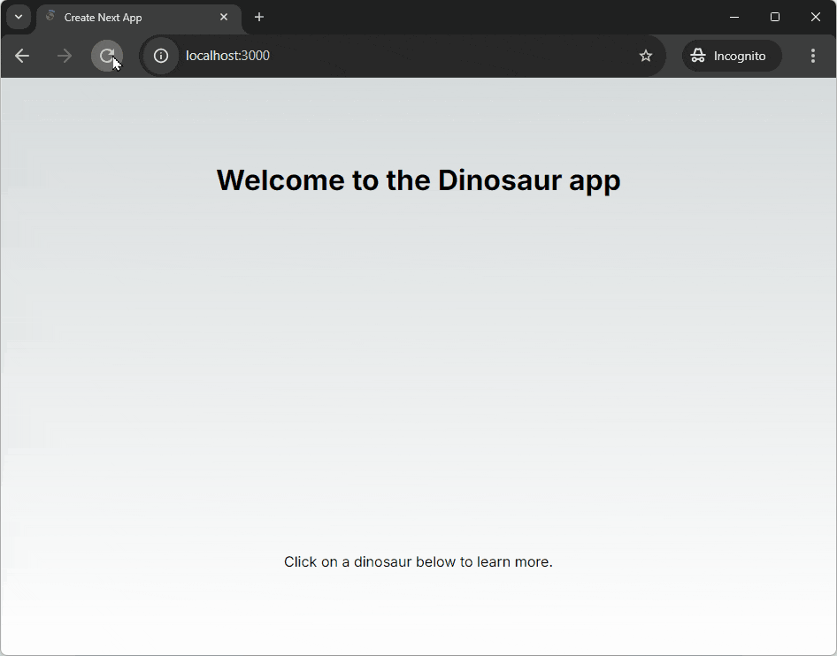

[Next.js](https://nextjs.org/) is a popular framework for building
server-side-rendered applications. It is built on top of React and provides a
lot of features out of the box.

In this tutorial, we'll build a
[simple Next.js application](https://tutorial-with-next.deno.deno.net/) and run
it with Deno. The app will display a list of dinosaurs. When you click on one,
it'll take you to a dinosaur page with more details. You can see the
[complete app on GitHub](https://github.com/denoland/tutorial-with-next/tree/main).



## Create a Next.js app with Deno

Next provides a CLI tool to quickly scaffold a new Next.js app. In your terminal
run the following command to create a new Next.js app with Deno:

```sh
deno run -A npm:create-next-app@latest
```

When prompted, select the default options to create a new Next.js app with
TypeScript.

Then, `cd` into the newly created project folder and run the following command
to install the dependencies with script execution allowed:

```sh
deno install --allow-scripts
```

Next.js has some dependencies that still rely on `Object.prototype.__proto__`
and requires CommonJS module support. To configure Deno for Next.js
compatibility, update your `deno.json` file with the following configuration:

```json deno.json
{
  "nodeModulesDir": "auto",
  "unstable": [
    "unsafe-proto",
    "sloppy-imports"
  ],
  "compilerOptions": {
    "lib": [
      "dom",
      "dom.iterable",
      "esnext"
    ],
    "strict": true,
    "jsx": "preserve"
  },
  "tasks": {
    "dev": "deno run -A --unstable-detect-cjs npm:next@latest dev",
    "build": "deno run -A --unstable-detect-cjs npm:next@latest build",
    "start": "deno run -A --unstable-detect-cjs npm:next@latest start"
  }
}
```

This configuration includes:

- `nodeModulesDir: "auto"` - Enables npm package lifecycle scripts
- `unstable: ["unsafe-proto", "sloppy-imports"]` - Required for Next.js
  compatibility
- `--unstable-detect-cjs` flag - Enables CommonJS module detection for Next.js
  dependencies

Now you can serve your new Next.js app:

```sh
deno run dev
```

This will start the Next.js development server using Deno. The `deno task dev`
command runs the Next.js development server with the necessary flags for
CommonJS compatibility.

Visit [http://localhost:3000](http://localhost:3000) to see the app in the
browser.

## Add a backend

The next step is to add a backend API. We'll create a very simple API that
returns information about dinosaurs.

We'll use Next.js's
[built in API route handlers](https://nextjs.org/docs/app/building-your-application/routing/route-handlers)
to set up our dinosaur API. Next.js uses a file-system-based router, where the
folder structure directly defines the routes.

We'll define three routes, The first route at `/api` will return the string
`Welcome to the dinosaur API`, then we'll set up `/api/dinosaurs` to return all
the dinosaurs, and finally `/api/dinosaur/[dinosaur]` to return a specific
dinosaur based on the name in the URL.

### /api/

In the `src/app` folder of your new project, create an `api` folder. In that
folder, create a `route.ts` file, which will handle requests to `/api/.

Copy and paste the following code into the `api/route.ts` file:

```ts title="route.ts"
export function GET() {
  return Response.json("welcome to the dinosaur API");
}
```

This code defines a simple route handler that returns a JSON response with the
string `welcome to the dinosaur API`.

### /api/data.json

In the `api` folder, create a `data.json` file, which will contain the hard
coded dinosaur data. Copy and paste
[this json file](https://raw.githubusercontent.com/denoland/deno-vue-example/main/api/data.json)
into the `data.json` file.

### /api/dinosaurs

In the `api` folder, create a folder called `dinosaurs`, in that create a
`route.ts` file which will handle requests to `/api/dinosaurs`. In this route
we'll read the `data.json` file and return the dinosaurs as JSON:

```ts title="route.ts"
import data from "./data.json" with { type: "json" };

export function GET() {
  return Response.json(data);
}
```

### /api/dinosaurs/[dinosaur]

And for the final route, `/api/dinosaurs/[dinosaur]`, we'll create a folder
called `[dinosaur]` in the `dinosaurs` directory. In there, create a `route.ts`
file. In this file we'll read the `data.json` file, find the dinosaur with the
name in the URL, and return it as JSON:

```ts title="route.ts"
import data from "../../data.json" with { type: "json" };

type RouteParams = { params: Promise<{ dinosaur: string }> };

export const GET = async (_request: Request, { params }: RouteParams) => {
  const { dinosaur } = await params;

  if (!dinosaur) {
    return Response.json("No dinosaur name provided.");
  }

  const dinosaurData = data.find((item) =>
    item.name.toLowerCase() === dinosaur.toLowerCase()
  );

  return Response.json(dinosaurData ? dinosaurData : "No dinosaur found.");
};
```

Now, if you run the app with `deno task dev` and visit
`http://localhost:3000/api/dinosaurs/brachiosaurus` in your browser, you should
see the details of the brachiosaurus dinosaur.

## Build the frontend

Now that we have our backend API set up, let's build the frontend to display the
dinosaur data.

### Define the dinosaur type

Firstly we'll set up a new type, to define the shape of the dinosaur data. In
the `app` directory, create a `types.ts` file and add the following code:

```ts title="types.ts"
export type Dino = { name: string; description: string };
```

### Update the homepage

We'll update the `page.tsx` file in the `app` directory to fetch the dinosaur
data from our API and display it as a list of links.

To execute client-side code in Next.js we need to use the `use Client` directive
at the top of the file. Then we'll import the modules that we'll need in this
page and export the default function that will render the page:

```tsx title="page.tsx"
"use client";

import { useEffect, useState } from "react";
import { Dino } from "./types";
import Link from "next/link";

export default function Home() {
}
```

Inside the body of the `Home` function, we'll define a state variable to store
the dinosaur data, and a `useEffect` hook to fetch the data from the API when
the component mounts:

```tsx title="page.tsx"
const [dinosaurs, setDinosaurs] = useState<Dino[]>([]);

useEffect(() => {
  (async () => {
    const response = await fetch(`/api/dinosaurs`);
    const allDinosaurs = await response.json() as Dino[];
    setDinosaurs(allDinosaurs);
  })();
}, []);
```

Beneath this, still inside the body of the `Home` function, we'll return a list
of links, each linking to the dinosaur's page:

```tsx title="page.tsx"
return (
  <main id="content">
    <h1>Welcome to the Dinosaur app</h1>
    <p>Click on a dinosaur below to learn more.</p>
    <ul>
      {dinosaurs.map((dinosaur: Dino) => {
        return (
          <li key={dinosaur.name}>
            <Link href={`/${dinosaur.name.toLowerCase()}`}>
              {dinosaur.name}
            </Link>
          </li>
        );
      })}
    </ul>
  </main>
);
```

### Create the dinosaur page

Inside the `app` directory, create a new folder called `[dinosaur]`. Inside this
folder create a `page.tsx` file. This file will fetch the details of a specific
dinosaur from the API and render them on the page.

Much like the homepage, we'll need client side code, and we'll import the
modules we need and export a default function. We'll pass the incoming to the
function and set up a type for this parameter:

```tsx title="[dinosaur]/page.tsx"
"use client";

import { useEffect, useState } from "react";
import { Dino } from "../types";
import Link from "next/link";

type RouteParams = { params: Promise<{ dinosaur: string }> };

export default function Dinosaur({ params }: RouteParams) {
}
```

Inside the body of the `Dinosaur` function we'll get the selected dinosaur from
the request, set up a state variable to store the dinosaur data, and write a
`useEffect` hook to fetch the data from the API when the component mounts:

```tsx title="[dinosaur]/page.tsx"
const selectedDinosaur = params.then((params) => params.dinosaur);
const [dinosaur, setDino] = useState<Dino>({ name: "", description: "" });

useEffect(() => {
  (async () => {
    const resp = await fetch(`/api/dinosaurs/${await selectedDinosaur}`);
    const dino = await resp.json() as Dino;
    setDino(dino);
  })();
}, []);
```

Finally, still inside the `Dinosaur` function body, we'll return a paragraph
element containing the dinosaur's name and description:

```tsx title="[dinosaur]/page.tsx"
return (
  <main id="content">
    <h1>{dinosaur.name}</h1>
    <p>{dinosaur.description}</p>
    <Link href="/">🠠 Back to all dinosaurs</Link>
  </main>
);
```

### Add some styles

Let's add some basic styles to make the app look nicer. Update your
`app/globals.css` file with the
[styles from this file](https://raw.githubusercontent.com/denoland/tutorial-with-next/refs/heads/main/src/app/globals.css).

## Run the app

Now you can run the app with `deno run dev` and visit `http://localhost:3000` in
your browser to see the list of dinosaurs. Click on a dinosaur to see more
details!

## Deploy the app

Now that you have your working Next.js app, you can deploy it to the web with
Deno Deploy<sup>EA</sup>.

For the best experience, you can deploy your app directly from GitHub, which
will set up automated deployments. Create a GitHub repository and push your app
there.

[Create a new GitHub repository](https://github.com/new), then initialize and
push your app to GitHub:

```sh
git init -b main
git remote add origin https://github.com/<your_github_username>/<your_repo_name>.git
git add .
git commit -am 'my next app'
git push -u origin main
```

Once your app is on GitHub, you can deploy it on the Deno Deploy<sup>EA</sup>
dashboard.
<a href="https://app.deno.com/" class="docs-cta deploy-cta deploy-button">Deploy
my app</a>

For a walkthrough of deploying your app, check out the
[Deno Deploy tutorial](/examples/deno_deploy_tutorial/).

🦕 Now you can build and run a Next.js app with Deno! To build on your app you
could consider [adding a database](/runtime/tutorials/connecting_to_databases/)
to replace your `data.json` file, or consider
[writing some tests](/runtime/fundamentals/testing/) to make your app reliable
and production ready.
