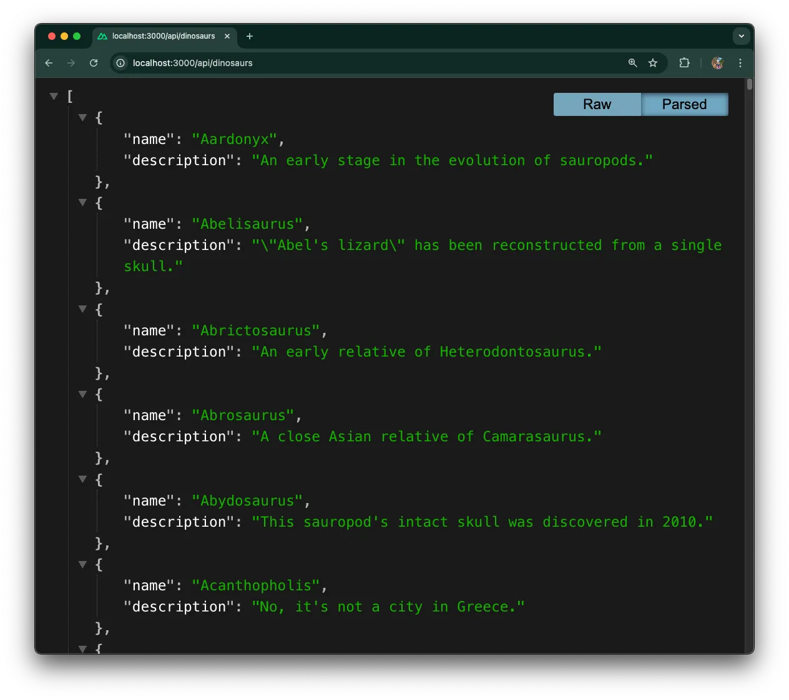
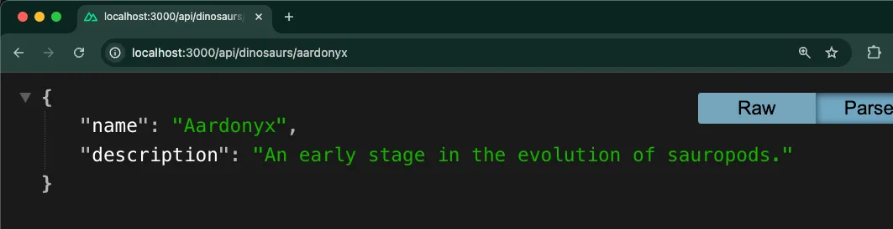

[Nuxt](https://nuxt.com/) is a framework that provides an intuitive way to
create full-stack applications based on [Vue](https://vuejs.org/). It offers
file-based routing, a variety of rendering options, and automatic code splitting
out of the box. With its modular architecture, Nuxt simplifies the development
process by providing a structured approach to building Vue applications.

In this tutorial, we'll build a simple Nuxt application with Deno that will
display a list of dinosaurs and allow you to learn more about each one when you
click on the name:

- [Scaffold a Nuxt app](#scaffold-a-nuxt-app-with-deno)
- [Setup server API routes](#setup-server-api-routes)
- [Setup Vue frontend](#setup-vue-frontend)
- [Add Tailwind](#add-tailwind)
- [Next steps](#next-steps)

You can find the code for this project in this
[repo](https://github.com/denoland/examples/tree/main/with-nuxt).

## Scaffold a Nuxt app with Deno

We can create a new Nuxt project using Deno like this:

```bash
deno -A npm:nuxi@latest init
```

We'll use Deno to manage our package dependencies, and can grab the Nuxt package
from npm. This will create a nuxt-app with this project structure:

```
NUXT-APP/
├── .nuxt/                   # Nuxt build directory
├── node_modules/           # Node.js dependencies
├── public/                 # Static files
│   ├── favicon.ico
│   └── robots.txt
├── server/                # Server-side code
│   └── tsconfig.json
├── .gitignore
├── app.vue               # Root Vue component
├── nuxt.config.ts        # Nuxt configuration
├── package-lock.json     # NPM lock file
├── package.json          # Project manifest
├── README.md
└── tsconfig.json        # TypeScript configuration
```

## Setup server API routes

Let’s first start by creating the API routes that serve the dinosaur data.

First, our
[dinosaur data](https://github.com/denoland/examples/blob/main/with-nuxt/server/api/data.json)
will live within the server directory as `server/api/data.json`:

```json title="server/api/data.json"
[
  {
    "name": "Aardonyx",
    "description": "An early stage in the evolution of sauropods."
  },
  {
    "name": "Abelisaurus",
    "description": "\"Abel's lizard\" has been reconstructed from a single skull."
  },
  {
    "name": "Abrictosaurus",
    "description": "An early relative of Heterodontosaurus."
  },
  ...etc
]
```

This is where our data will be pulled from. In a full application, this data
would come from a database.

> ⚠️️ In this tutorial we hard code the data. But you can connect
> to [a variety of databases](https://docs.deno.com/runtime/tutorials/connecting_to_databases/) and [even use ORMs like Prisma](https://docs.deno.com/runtime/tutorials/how_to_with_npm/prisma/) with
> Deno.

This app will have two API routes. They will serve the following:

- the full list of dinosaurs for an index page
- individual dinosaur information for an individual dinosaur page

Both will be `*.get.ts` files, which Nuxt automatically converts to API
endpoints to respond to `GET` requests.
[The filename convention determines both the HTTP method and the route path](https://nuxt.com/docs/guide/directory-structure/server#matching-http-method).

The initial `dinosaurs.get.ts` is fairly simple and uses
[`defineCachedEventHandler`](https://nitro.build/guide/cache) to create a cached
endpoint for better performance. This handler simply returns our full dinosaur
data array without any filtering:

```tsx title="server/api/dinosaurs.get.ts"
import data from "./data.json" with { type: "json" };

export default defineCachedEventHandler(() => {
  return data;
});
```

The `GET` route for the individual dinosaur has a little more logic. It extracts
the name parameter from the event context, performs case-insensitive matching to
find the requested dinosaur, and includes proper error handling for missing or
invalid dinosaur names. We'll create a `dinosaurs` directory, then to pass the
name parameter, we'll make a new file named `[name].get.ts`:

```tsx title="server/api/dinosaurs/[name].get.ts"
import data from "../data.json";

export default defineCachedEventHandler((event) => {
  const name = getRouterParam(event, "name");

  if (!name) {
    throw createError({
      statusCode: 400,
      message: "No dinosaur name provided",
    });
  }

  const dinosaur = data.find(
    (dino) => dino.name.toLowerCase() === name.toLowerCase(),
  );

  if (!dinosaur) {
    throw createError({
      statusCode: 404,
      message: "Dinosaur not found",
    });
  }

  return dinosaur;
});
```

Run the server with `deno task dev` and visit
[http://localhost:3000/api/dinosaurs](http://localhost:3000/api/dinosaurs) in
your browser, you should see the raw JSON response showing all of the dinosaurs!



You can also retrieve data for a single dinosaur by visiting a particular
dinosaur name, for example:
[http://localhost:3000/api/dinosaurs/aardonyx](http://localhost:3000/api/dinosaurs/aardonyx).



Next, we'll setup the frontend with Vue to display the index page and each
individual dinosaur page.

## Setup the Vue frontend

We want to set up two pages within the app:

- An index page which will list all of the dinosaurs
- An individual dinosaur page showing more information about the selected
  dinosaur.

First, create the index page. Nuxt uses
[file-system routing](https://nuxt.com/docs/getting-started/routing), so we will
create a `pages` directory in the root, and within that an index page called
`index.vue`.

To get the data, we’ll use the `useFetch` composable to hit the API endpoint we
created in the previous section:

```tsx title="pages/index.vue"
<script setup lang="ts">
const { data: dinosaurs } = await useFetch("/api/dinosaurs");
</script>

<template>
  <main id="content">
    <h1 class="text-2xl font-bold mb-4">Welcome to the Dinosaur app</h1>
    <p class="mb-4">Click on a dinosaur below to learn more.</p>
    <ul class="space-y-2">
      <li v-for="dinosaur in dinosaurs" :key="dinosaur.name">
        <NuxtLink
          :to="'/' + dinosaur.name.toLowerCase()"
          class="text-blue-600 hover:text-blue-800 hover:underline"
        >
          {{ dinosaur.name }}
        </NuxtLink>
      </li>
    </ul>
  </main>
</template>
```

For the page that shows information on each dinosaur, we'll create a new dynamic
page called `[name].vue`. This page uses Nuxt's
[dynamic route parameters](https://nuxt.com/docs/getting-started/routing#route-parameters),
where the `[name]` in the filename can be accessed in JavaScript as
`route.params.name`. We’ll use the `useRoute` composable to access the route
parameters and `useFetch` to get the specific dinosaur's data based on the name
parameter:

```tsx title="pages/[name].vue"
<script setup lang="ts">
const route = useRoute();
const { data: dinosaur } = await useFetch(
  `/api/dinosaurs/${route.params.name}`
);
</script>

<template>
  <main v-if="dinosaur">
    <h1 class="text-2xl font-bold mb-4">{{ dinosaur.name }}</h1>
    <p class="mb-4">{{ dinosaur.description }}</p>
    <NuxtLink to="/" class="text-blue-600 hover:text-blue-800 hover:underline">
      Back to all dinosaurs
    </NuxtLink>
  </main>
</template>
```

Next, we’ll have to connect these Vue components together so that they render
properly when we visit the root of the domain. Let’s update `app.vue` at the
root of the directory to serve our application’s root component. We’ll use
[`NuxtLayout`](https://nuxt.com/docs/api/components/nuxt-layout) for consistent
page structure and [`NuxtPage`](https://nuxt.com/docs/api/components/nuxt-page)
for dynamic page rendering:

```tsx title="app.vue"
<template>
  <NuxtLayout>
    <div>
      <nav class="p-4 bg-gray-100">
        <NuxtLink to="/" class="text-blue-600 hover:text-blue-800">
          Dinosaur Encyclopedia
        </NuxtLink>
      </nav>

      <div class="container mx-auto p-4">
        <NuxtPage />
      </div>
    </div>
  </NuxtLayout>
</template>;
```

Run the server with `deno task dev` and see how it looks at
[http://localhost:3000](http://localhost:3000):

<figure>

<video class="w-full" alt="Build a Nuxt app with Deno." autoplay muted loop playsinline src="./images/how-to/nuxt/nuxt-3.mp4"></video>

</figure>

Looks great!

## Add Tailwind

Like we said, we're going to add a little bit of styling to this application.
First, we'll set up a layout which will provide a consistent structure across
all pages using Nuxt's layout system with
[slot-based](https://vuejs.org/guide/components/slots) content injection:

```tsx title="layouts/default.vue"
<template>
  <div>
    <slot />
  </div>
</template>;
```

In this project, we’re also going to use [tailwind](https://tailwindcss.com/)
for some basic design, so we need to install those dependencies:

```bash
deno install -D npm:tailwindcss npm:@tailwindcss/vite
```

Then, we're going to update the `nuxt.config.ts`. Import the Tailwind dependency
and configure the Nuxt application for Deno compatibility, We'll enable
development tools, and set up Tailwind CSS:

```tsx title="nuxt.config.ts"
import tailwindcss from "@tailwindcss/vite";

export default defineNuxtConfig({
  compatibilityDate: "2025-05-15",
  devtools: { enabled: true },
  nitro: {
    preset: "deno",
  },
  app: {
    head: {
      title: "Dinosaur Encyclopedia",
    },
  },
  css: ["~/assets/css/main.css"],
  vite: {
    plugins: [
      tailwindcss(),
    ],
  },
});
```

Next, create a new css file, `assets/css/main.css`, and add an import `@import`
that imports tailwind, as well as the tailwind utilities:

```tsx title="assets/css/main.css"
@import "tailwindcss";

@tailwind base;
@tailwind components;
@tailwind utilities;
```

## Running the application

We can then run the application using:

```bash
deno task dev
```

This will start the app at localhost:3000:

<figure>

<video class="w-full" alt="Build a Nuxt app with Deno." autoplay muted loop playsinline src="./images/how-to/nuxt/nuxt-4.mp4"></video>

</figure>

And we’re done!

🦕 Next steps for a Nuxt app might be to add authentication using the
[Nuxt Auth](https://auth.nuxtjs.org/) module, implement state management with
[Pinia](https://pinia.vuejs.org/), add server-side data persistence with
[Prisma](https://docs.deno.com/examples/prisma_tutorial/) or
[MongoDB](https://docs.deno.com/examples/mongoose_tutorial/), and set up
automated testing with Vitest. These features would make it production-ready for
larger applications.
