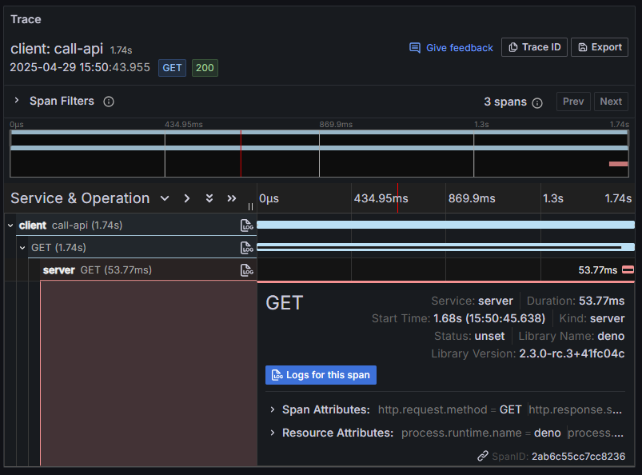

Modern applications are often built as distributed systems with multiple
services communicating with each other. When debugging issues or optimizing
performance in these systems, it's crucial to be able to trace requests as they
flow through different services. This is where distributed tracing comes in.

As of Deno 2.3, the runtime now automatically preserves trace context across
service boundaries, making end-to-end tracing in distributed systems simpler and
more powerful. This means that when one service makes a request to another, the
trace context is automatically propagated, allowing you to see the entire
request flow as a single trace.

## Setting up a distributed system

Our example system will consist of two parts:

1. A server that provides an API endpoint
2. A client that makes requests to the server

### The server

We'll set up a simple HTTP server that responds to GET requests with a JSON
message:

```ts title="server.ts"
import { trace } from "npm:@opentelemetry/api@1";

const tracer = trace.getTracer("api-server", "1.0.0");

// Create a simple API server with Deno.serve
Deno.serve({ port: 8000 }, (req) => {
  return tracer.startActiveSpan("process-api-request", async (span) => {
    // Add attributes to the span for better context
    span.setAttribute("http.route", "/");
    span.updateName("GET /");

    // Add a span event to see in traces
    span.addEvent("processing_request", {
      request_id: crypto.randomUUID(),
      timestamp: Date.now(),
    });

    // Simulate processing time
    await new Promise((resolve) => setTimeout(resolve, 50));

    console.log("Server: Processing request in trace context");

    // End the span when we're done
    span.end();

    return new Response(JSON.stringify({ message: "Hello from server!" }), {
      headers: { "Content-Type": "application/json" },
    });
  });
});
```

### The client

Now, let's create a client that will make requests to our server:

```ts title="client.ts"
import { SpanStatusCode, trace } from "npm:@opentelemetry/api@1";

const tracer = trace.getTracer("api-client", "1.0.0");

// Create a parent span for the client operation
await tracer.startActiveSpan("call-api", async (parentSpan) => {
  try {
    console.log("Client: Starting API call");

    // The fetch call inside this span will automatically:
    // 1. Create a child span for the fetch operation
    // 2. Inject the trace context into the outgoing request headers
    const response = await fetch("http://localhost:8000/");
    const data = await response.json();

    console.log(`Client: Received response: ${JSON.stringify(data)}`);

    parentSpan.addEvent("received_response", {
      status: response.status,
      timestamp: Date.now(),
    });
  } catch (error) {
    console.error("Error calling API:", error);
    if (error instanceof Error) {
      parentSpan.recordException(error);
    }
    parentSpan.setStatus({
      code: SpanStatusCode.ERROR,
      message: error instanceof Error ? error.message : String(error),
    });
  } finally {
    parentSpan.end();
  }
});
```

## Tracing with OpenTelemetry

Both the client and server code already include basic OpenTelemetry
instrumentation:

1. Create a tracer - both files create a tracer using `trace.getTracer()` with a
   name and version.

2. Create spans - We use `startActiveSpan()` to create spans that represent
   operations.

3. Add context - We add attributes and events to spans to provide more context.

4. Ending spans - We make sure to end spans when operations are complete.

## Automatic context propagation

The magic happens when the client makes a request to the server. In the client
code there is a fetch call to the server:

```ts
const response = await fetch("http://localhost:8000/");
```

Since this fetch call happens inside an active span, Deno automatically creates
a child span for the fetch operation and Injects the trace context into the
outgoing request headers.

When the server receives this request, Deno extracts the trace context from the
request headers and establishes the server span as a child of the client's span.

## Running the example

To run this example, first, start the server, giving your otel service a name:

```sh
OTEL_DENO=true OTEL_SERVICE_NAME=server deno run --unstable-otel --allow-net server.ts
```

Then, in another terminal, run the client, giving the client a different service
name to make observing the propagation clearer:

```sh
OTEL_DENO=true OTEL_SERVICE_NAME=client deno run --unstable-otel --allow-net client.ts
```

You should see:

1. The client logs "Client: Starting API call"
2. The server logs "Server: Processing request in trace context"
3. The client logs the response received from the server

## Viewing traces

To actually see the traces, you'll need an OpenTelemetry collector and a
visualization tool,
[for example Grafana Tempo](/runtime/fundamentals/open_telemetry/#quick-start).

When you visualize the traces, you'll see:

1. A parent span from the client
2. Connected to a child span for the HTTP request
3. Connected to a span from the server
4. All as part of a single trace!

For example, in Grafana, the trace visualization may look like this:



🦕 Now that you understand distributed tracing with Deno, you could extend this
to more complex systems with multiple services and async operations.

With Deno's automatic context propagation, implementing distributed tracing in
your applications has never been easier!
