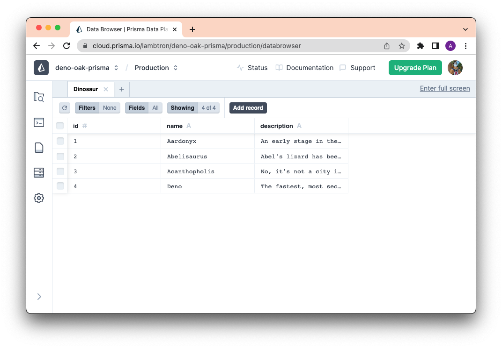

[Prisma](https://prisma.io) is a powerful ORM (Object-Relational Mapping) tool
that simplifies database interactions in your applications. In this tutorial
we'll setup a simple RESTful API in Deno using Oak and Prisma.

## Set up the application

Create a project folder `my-prisma-project` and navigate there:

```shell
mkdir my-prisma-project
cd my-prisma-project
```

Then run `prisma init` with Deno and the new direct Deno Deploy support:

```shell
npx prisma@latest init --db
```

This new `--db` flag provides direct database setup integration with the Prisma
Data Platform, automatically creating a database connection and optimizing the
configuration for Deno Deploy. The command will:

- Connect your CLI to your [Prisma Data Platform](https://console.prisma.io/)
  account
- Create a `prisma` directory with a properly configured `schema.prisma` file
- Generate a `.env` file with your `DATABASE_URL` for Prisma Postgres
- Set up the optimal configuration for Deno runtime

This will generate
[`prisma/schema.prisma`](https://www.prisma.io/docs/orm/prisma-schema). Let's
update it with the following:

:::tip

Add `runtime = "deno"` to the generator block in your schema.prisma file. This
is required for Prisma to work correctly with Deno.

:::

```ts
generator client {
  provider = "prisma-client"
  output   = "../generated/prisma"
  runtime  = "deno"
}

datasource db {
  provider = "postgresql"
  url      = env("DATABASE_URL")
}

model Dinosaur {
  id          Int     @id @default(autoincrement())
  name        String  @unique
  description String
}
```

The key settings for Deno Deploy compatibility are:

- `provider = "prisma-client"` instead of `prisma-client-js`
- `output = "../generated/prisma"` to place generated files in the correct
  location
- `runtime = "deno"` for Deno-specific optimizations

If you used `npx prisma@latest init --db`, your `.env` file should already
contain a `DATABASE_URL` with a Prisma Postgres connection string that begins
with `prisma+postgres://`.

Next, let's install the required dependencies:

```shell
deno install npm:@prisma/client
deno install npm:@prisma/extension-accelerate
deno install npm:dotenv-cli
```

These packages provide:

- `@prisma/client`: The Prisma Client for database operations
- `@prisma/extension-accelerate`: Required for Prisma Postgres
- `dotenv-cli`: For loading environment variables in local development

Next, let's create the database schema:

```shell
deno run -A npm:prisma migrate dev --name init
```

After that's complete, we'll need to generate a Prisma Client:

```shell
deno run -A npm:prisma generate
```

## Set up Accelerate in the Prisma Data Platform

> Note: If you used `npx prisma@latest init --db`, this step is already
> completed automatically as part of the initialization process.

If you initialized your project manually, you can still set up the Prisma Data
Platform:

1. Sign up for a free [Prisma Data Platform account](https://console.prisma.io).
2. Create a project.
3. Navigate to the project you created.
4. Enable Accelerate by providing your database's connection string.
5. Generate an Accelerate connection string and copy it to your clipboard.

Assign the Accelerate connection string, that begins with `prisma://`, to
`DATABASE_URL` in your `.env` file replacing your existing connection string.

Next, let's create a seed script to seed the database.

## Seed your database

Create `./prisma/seed.ts`:

```shell
touch prisma/seed.ts
```

And in `./prisma/seed.ts`:

```ts
import { Prisma, PrismaClient } from "./generated/prisma/client.ts";
import { withAccelerate } from "npm:@prisma/extension-accelerate";

const prisma = new PrismaClient({
  datasourceUrl: Deno.env.get("DATABASE_URL"),
}).$extends(withAccelerate());

const dinosaurData: Prisma.DinosaurCreateInput[] = [
  {
    name: "Aardonyx",
    description: "An early stage in the evolution of sauropods.",
  },
  {
    name: "Abelisaurus",
    description: "Abel's lizard has been reconstructed from a single skull.",
  },
  {
    name: "Acanthopholis",
    description: "No, it's not a city in Greece.",
  },
];

/**
 * Seed the database.
 */

for (const dinosaur of dinosaurData) {
  const result = await prisma.dinosaur.create({
    data: dinosaur,
  });
  console.log(`Created dinosaur with id: ${result.id}`);
}
console.log(`Seeding finished.`);

await prisma.$disconnect();
```

We can now run `seed.ts` with:

```shell
npx dotenv -- deno run -A --env prisma/seed.ts
```

:::tip

The `npx dotenv --` prefix ensures that environment variables from the `.env`
file are properly loaded, which is required since Prisma Client doesn't read
`.env` files by default in Deno.

:::

After doing so, you should be able to see your data on Prisma Studio by running
the following command:

```bash
deno run -A npm:prisma studio
```

You should see something similar to the following screenshot:


## Create your API routes

We'll use [`oak`](https://jsr.io/@oak/oak) to create the API routes. Let's keep
them simple for now.

Let's create a `main.ts` file:

```shell
touch main.ts
```

Then, in your `main.ts` file:

```ts
import { PrismaClient } from "./prisma/generated/prisma/client.ts";
import { withAccelerate } from "npm:@prisma/extension-accelerate";
import { Application, Router } from "jsr:@oak/oak";

/**
 * Initialize.
 */

const prisma = new PrismaClient({
  datasources: {
    db: {
      url: Deno.env.get("DATABASE_URL")!,
    },
  },
}).$extends(withAccelerate());

const app = new Application();
const router = new Router();

/**
 * Setup routes.
 */

router
  .get("/", (context) => {
    context.response.body = "Welcome to the Dinosaur API!";
  })
  .get("/dinosaurs", async (context) => {
    // Get all dinosaurs.
    const dinosaurs = await prisma.dinosaur.findMany();
    context.response.body = dinosaurs;
  })
  .get("/dinosaurs/:id", async (context) => {
    // Get one dinosaur by id.
    const { id } = context.params;
    const dinosaur = await prisma.dinosaur.findUnique({
      where: {
        id: Number(id),
      },
    });
    context.response.body = dinosaur;
  })
  .post("/dinosaurs", async (context) => {
    // Create a new dinosaur.
    const { name, description } = await context.request.body.json();
    const result = await prisma.dinosaur.create({
      data: {
        name,
        description,
      },
    });
    context.response.body = result;
  })
  .delete("/dinosaurs/:id", async (context) => {
    // Delete a dinosaur by id.
    const { id } = context.params;
    const dinosaur = await prisma.dinosaur.delete({
      where: {
        id: Number(id),
      },
    });
    context.response.body = dinosaur;
  });

/**
 * Setup middleware.
 */

app.use(router.routes());
app.use(router.allowedMethods());

/**
 * Start server.
 */

await app.listen({ port: 8000 });
```

Now, let's run it:

```shell
npx dotenv -- deno run -A main.ts
```

:::tip

We use `npx dotenv --` to ensure environment variables are properly loaded from
the `.env` file when running locally.

:::

Let's visit `localhost:8000/dinosaurs`:


Next, let's `POST` a new dinosaur with this `curl` command:

```shell
curl -X POST http://localhost:8000/dinosaurs -H "Content-Type: application/json" -d '{"name": "Deno", "description":"The fastest, most secure, easiest to use Dinosaur ever to walk the Earth."}'
```

You should now see a new row on Prisma Studio:



Nice!

## Deploy to Deno Deploy

With Prisma's new direct Deno Deploy support, deploying your application is
straightforward. Here's how to deploy your REST API:

### 1. Create a GitHub repository

First, create a GitHub repository and push your code:

```shell
git init -b main
git remote add origin https://github.com/<username>/my-prisma-project
git add .
git commit -m "initial commit"
git push -u origin main
```

### 2. Deploy to Deno Deploy

1. Go to [https://dash.deno.com/](https://dash.deno.com/)
2. Select your GitHub repository
3. Select the production branch (usually `main`)
4. Select **Fresh (Automatic)** mode for automatic deployments
5. In the **Build Step**, add: `deno run -A npm:prisma generate`
6. Select `main.ts` as the entry point
7. Click **Create & Deploy**

### 3. Configure environment variables

The initial deployment will fail because the `DATABASE_URL` environment variable
isn't set:

1. Navigate to your project settings in the Deno Deploy dashboard
2. In the **Environment Variables** section, click **Add Variable**
3. Set **KEY** to `DATABASE_URL`
4. Set **VALUE** to your database connection string (from your `.env` file)
5. Click **Save**

### 4. Trigger a redeploy

To trigger a redeploy with the new environment variable, make a small change and
push:

```shell
# Make a small change to trigger redeploy
echo "console.log('Deployed to Deno Deploy!');" >> main.ts
git add .
git commit -m "add deployment log"
git push origin main
```

Your application should now be successfully deployed and accessible via the Deno
Deploy URL!

## What's next?

Building your next app will be more productive and fun with Deno and Prisma,
since both technologies deliver an intuitive developer experience with data
modeling, type-safety, and robust IDE support.

With Prisma's new direct Deno Deploy support, you can now:

- Use `npx prisma@latest init --db` for seamless setup with Prisma Postgres
- Deploy directly to Deno Deploy with minimal configuration
- Leverage Prisma Accelerate for optimal edge performance
- Enjoy full TypeScript support with the `runtime = "deno"` generator option

For more advanced deployment scenarios and configuration options, check out the
[official Prisma Deno Deploy documentation](https://www.prisma.io/docs/orm/prisma-client/deployment/edge/deploy-to-deno-deploy).
