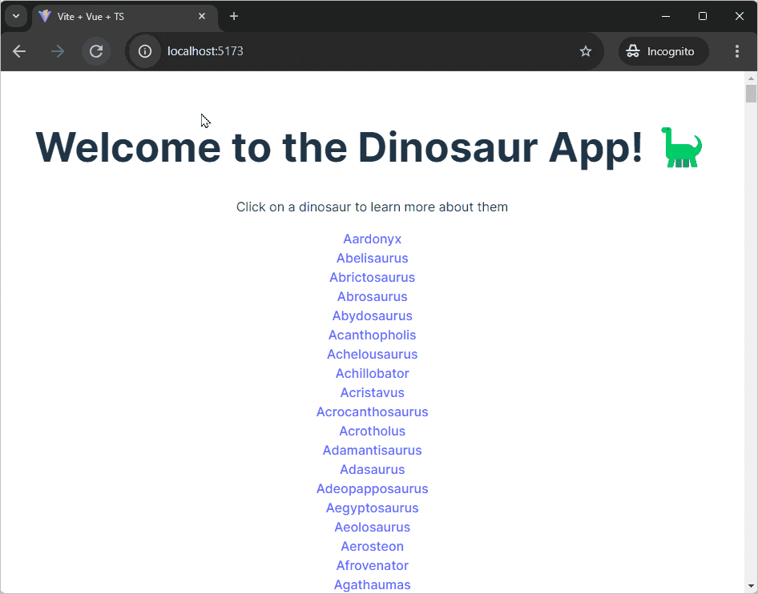

[Vue.js](https://vuejs.org/) is a progressive front-end JavaScript framework. It
provides tools and features for creating dynamic and interactive user
interfaces.

In this tutorial we'll build a simple Vue.js app with Vite and Deno. The app
will display a list of dinosaurs. When you click on one, it'll take you to a
dinosaur page with more details. You can see the
[finished app on GitHub](https://github.com/denoland/tutorial-with-vue).



## Create a Vue.js app with Vite and Deno

We'll use [Vite](https://vitejs.dev/) to scaffold a basic Vue.js app. In your
terminal, run the following command to create a new .js app with Vite:

```shell
deno run -A npm:create-vite
```

When prompted, give your app a name and select `Vue` from the offered frameworks
and `TypeScript` as a variant.

Once created, `cd` into your new project and run the following command to
install dependencies:

```shell
deno install
```

Then, run the following command to serve your new Vue.js app:

```shell
deno task dev
```

Deno will run the `dev` task from the `package.json` file which will start the
Vite server. Click the output link to localhost to see your app in the browser.

## Add a backend

The next step is to add a backend API. We'll create a very simple API that
returns information about dinosaurs.

In the root of your new vite project, create an `api` folder. In that folder,
create a `main.ts` file, which will run the server, and a `data.json`, which
where we'll put the hard coded data.

Copy and paste
[this json file](https://raw.githubusercontent.com/denoland/tutorial-with-vue/refs/heads/main/api/data.json)
into `api/data.json`.

We're going to build out a simple API server with routes that return dinosaur
information. We'll use the [`oak` middleware framework](https://jsr.io/@oak/oak)
and the [`cors` middleware](https://jsr.io/@tajpouria/cors) to enable
[CORS](https://developer.mozilla.org/en-US/docs/Web/HTTP/CORS).

Use the `deno add` command to add the required dependencies to your project:

```shell
deno add jsr:@oak/oak jsr:@tajpouria/cors
```

Next, update `api/main.ts` to import the required modules and create a new
`Router` instance to define some routes:

```ts title="main.ts"
import { Application, Router } from "@oak/oak";
import { oakCors } from "@tajpouria/cors";
import data from "./data.json" with { type: "json" };

const router = new Router();
```

After this, in the same file, we'll define three routes. The first route at `/`
will return the string `Welcome to the dinosaur API`, then we'll set up
`/dinosaurs` to return all the dinosaurs, and finally `/dinosaurs/:dinosaur` to
return a specific dinosaur based on the name in the URL:

```ts title="main.ts"
router
  .get("/", (context) => {
    context.response.body = "Welcome to dinosaur API!";
  })
  .get("/dinosaurs", (context) => {
    context.response.body = data;
  })
  .get("/dinosaurs/:dinosaur", (context) => {
    if (!context?.params?.dinosaur) {
      context.response.body = "No dinosaur name provided.";
    }

    const dinosaur = data.find((item) =>
      item.name.toLowerCase() === context.params.dinosaur.toLowerCase()
    );

    context.response.body = dinosaur ? dinosaur : "No dinosaur found.";
  });
```

Finally, at the bottom of the same file, create a new `Application` instance and
attach the routes we just defined to the application using
`app.use(router.routes())` and start the server listening on port 8000:

```ts title="main.ts"
const app = new Application();
app.use(oakCors());
app.use(router.routes());
app.use(router.allowedMethods());

await app.listen({ port: 8000 });
```

You can run the API server with `deno run --allow-env --allow-net api/main.ts`.
We'll create a task to run this command and update the dev task to run both the
Vue.js app and the API server.

In your `package.json` file, update the `scripts` field to include the
following:

```jsonc
{
  "scripts": {
    "dev": "deno task dev:api & deno task dev:vite",
    "dev:api": "deno run --allow-env --allow-net api/main.ts",
    "dev:vite": "deno run -A npm:vite",
    // ...
}
```

Now, if you run `deno task dev` and visit `localhost:8000`, in your browser you
should see the text `Welcome to dinosaur API!`, and if you visit
`localhost:8000/dinosaurs`, you should see a JSON response of all of the
dinosaurs.

## Build the frontend

### The entrypoint and routing

In the `src` directory, you'll find a `main.ts` file. This is the entry point
for the Vue.js app. Our app will have multiple route, so we'll need a router to
do our client-side routing. We'll use the official
[Vue Router](https://router.vuejs.org/) for this.

Update `src/main.ts` to import and use the router:

```ts
import { createApp } from "vue";
import router from "./router/index.ts";

import "./style.css";
import App from "./App.vue";

createApp(App)
  .use(router)
  .mount("#app");
```

Add the Vue Router module to the project with `deno add`:

```shell
deno add npm:vue-router
```

Next, create a `router` directory in the `src` directory. In it, create an
`index.ts` file with the following content:

```ts title="router/index.ts"
import { createRouter, createWebHistory } from "vue-router";
import HomePage from "../components/HomePage.vue";
import Dinosaur from "../components/Dinosaur.vue";

export default createRouter({
  history: createWebHistory("/"),
  routes: [
    {
      path: "/",
      name: "Home",
      component: HomePage,
    },
    {
      path: "/:dinosaur",
      name: "Dinosaur",
      component: Dinosaur,
      props: true,
    },
  ],
});
```

This will set up a router with two routes: `/` and `/:dinosaur`. The `HomePage`
component will be rendered at `/` and the `Dinosaur` component will be rendered
at `/:dinosaur`.

Finally, you can delete all of the code in the `src/App.vue` file to and update
it to include only the `<RouterView>` component:

```html title="App.vue"
<template>
  <RouterView />
</template>;
```

### The components

Vue.js splits the frontend UI into components. Each component is a reusable
piece of code. We'll create three components: one for the home page, one for the
list of dinosaurs, and one for an individual dinosaur.

Each component file is split into three parts: `<script>`, `<template>`, and
`<style>`. The `<script>` tag contains the JavaScript logic for the component,
the `<template>` tag contains the HTML, and the `<style>` tag contains the CSS.

In the `/src/components` directory, create three new files: `HomePage.vue`,
`Dinosaurs.vue`, and `Dinosaur.vue`.

#### The Dinosaurs component

The `Dinosaurs` component will fetch the list of dinosaurs from the API we set
up earlier and render them as links using the
[`RouterLink` component from Vue Router](https://router.vuejs.org/guide/).
(Because we are making a TypeScript project, don't forget to specify the
`lang="ts"` attribute on the script tag.) Add the following code to the
`Dinosaurs.vue` file:

```html title="Dinosaurs.vue"
<script lang="ts">
  import { defineComponent } from "vue";

  export default defineComponent({
    async setup() {
      const res = await fetch("http://localhost:8000/dinosaurs");
      const dinosaurs = await res.json() as Dinosaur[];
      return { dinosaurs };
    },
  });
</script>

<template>
  <div v-for="dinosaur in dinosaurs" :key="dinosaur.name">
    <RouterLink
      :to="{ name: 'Dinosaur', params: { dinosaur: `${dinosaur.name.toLowerCase()}` } }"
    >
      {{ dinosaur.name }}
    </RouterLink>
  </div>
</template>
```

This code uses the Vue.js
[v-for](https://vuejs.org/api/built-in-directives.html#v-for) directive to
iterate over the `dinosaurs` array and render each dinosaur as a `RouterLink`
component. The `:to` attribute of the `RouterLink` component specifies the route
to navigate to when the link is clicked, and the `:key` attribute is used to
uniquely identify each dinosaur.

#### The Homepage component

The homepage will contain a heading and then it will render the `Dinosaurs`
component. Add the following code to the `HomePage.vue` file:

```html title="HomePage.vue"
<script setup lang="ts">
  import Dinosaurs from "./Dinosaurs.vue";
</script>
<template>
  <h1>Welcome to the Dinosaur App! 🦕</h1>
  <p>Click on a dinosaur to learn more about them</p>
  <Suspense>
    <template #default>
      <Dinosaurs />
    </template>
    <template #fallback>
      <div>Loading...</div>
    </template>
  </Suspense>
</template>
```

Because the `Dinosaurs` component fetches data asynchronously, use the
[`Suspense` component](https://vuejs.org/guide/built-ins/suspense.html) to
handle the loading state.

#### The Dinosaur component

The `Dinosaur` component will display the name and description of a specific
dinosaur and a link to go back to the full list.

First, we'll set up some types for the data we'll be fetching. Create a
`types.ts` file in the `src` directory and add the following code:

```ts title="types.ts"
type Dinosaur = {
  name: string;
  description: string;
};

type ComponentData = {
  dinosaurDetails: null | Dinosaur;
};
```

Then update the `Dinosaur.vue` file:

```html title="Dinosaur.vue"
<script lang="ts">
  import { defineComponent } from "vue";

  export default defineComponent({
    props: { dinosaur: String },
    data(): ComponentData {
      return {
        dinosaurDetails: null,
      };
    },
    async mounted() {
      const res = await fetch(
        `http://localhost:8000/dinosaurs/${this.dinosaur}`,
      );
      this.dinosaurDetails = await res.json();
    },
  });
</script>

<template>
  <h1>{{ dinosaurDetails?.name }}</h1>
  <p>{{ dinosaurDetails?.description }}</p>
  <RouterLink to="/">🠠 Back to all dinosaurs</RouterLink>
</template>
```

This code uses the `props` option to define a prop named `dinosaur` that will be
passed to the component. The `mounted` lifecycle hook is used to fetch the
details of the dinosaur based on the `dinosaur` prop and store them in the
`dinosaurDetails` data property. This data is then rendered in the template.

## Run the app

Now that we've set up the frontend and backend, we can run the app. In your
terminal, run the following command:

```shell
deno task dev
```

Visit the output localhost link in your browser to see the app. Click on a
dinosaur to see more details!


🦕 Now that you can run a Vue app in Deno with Vite you're ready to build real
world applications! If you'd like to expand upon this demo you could consider
building out a backend server to serve the static app once built, then you'll be
able to
[deploy your dinosaur app to the cloud](https://docs.deno.com/deploy/manual/).
