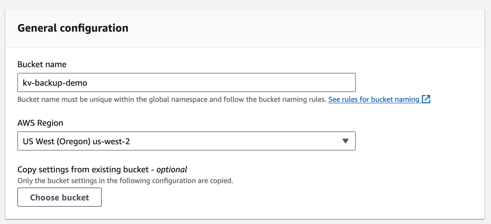
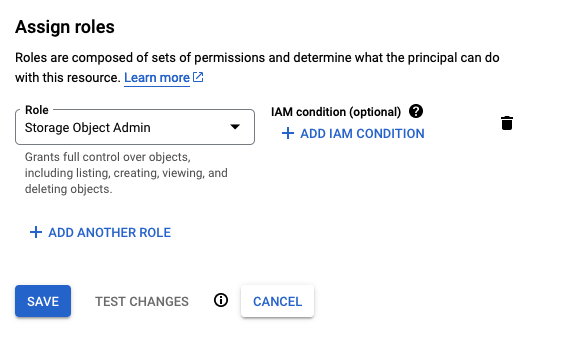

import Admonition from "./_admonition.mdx";
import backupAddBucketToDash from "./images/backup-add-bucket-to-dash.png";
import backupGcsBucketCreate from "./images/backup-gcs-bucket-create.png";

# Backups

<Admonition />

KV databases hosted on Deno Deploy can be continuously backed up to your own S3-compatible storage buckets. This is in
addition to the replication and backups that we internally perform for all data stored in hosted Deno KV databases to ensure
high availability and data durability.

This backup happens continuously with very little lag, enabling _[point-in-time-recovery](https://en.wikipedia.org/wiki/Point-in-time_recovery)_
and live replication. Enabling backup for KV databases unlocks various interesting use-cases:

- Retrieving a consistent snapshot of your data at any point in time in the past
- Running a read-only data replica independent of Deno Deploy
- Pushing data into your favorite data pipeline by piping mutations into streaming platforms and analytical databases like Kafka, BigQuery and ClickHouse

## Configuring backup to Amazon S3

First, create a bucket on the AWS console with default configuration:



Next, create an IAM user and grant it `PutObject` access to the bucket:

```json
{
  "Version": "2012-10-17",
  "Statement": [
    {
      "Effect": "Allow",
      "Action": "s3:PutObject",
      "Resource": "arn:aws:s3:::kv-backup-demo/*"
    }
  ]
}
```

Now, add the bucket in Deno Deploy dashboard:


## Configuring backup to Google Cloud Storage

Google Cloud Storage (GCS) is compatible with the S3 protocol, and can also be used as a backup target. First,
create a bucket:


Then go to "IAM & Admin" in your GCP console, create a service account, and grant it `Storage Object Admin` access to the bucket:



After the new service account is ready, go to the `Settings` section in Cloud Storage console, and find the `Interoperability` tab. Create an HMAC access key for the service account.


Save the access key and secret, and go back to your Deno Deploy dashboard. In KV backup settings, Choose "Google Cloud Storage" and paste the access key and secret values into the "Access key ID" and "Secret access key" fields correspondingly.

## Using backups

S3 backups can be used with the `denokv` tool. Please refer to the [documentation](https://github.com/denoland/denokv) for more details.
