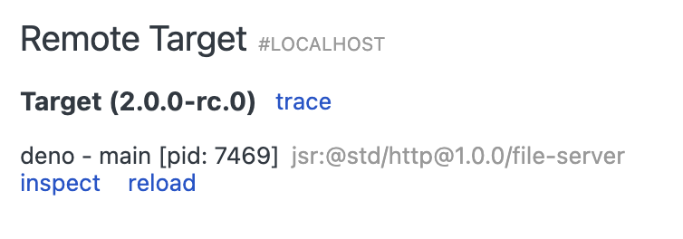
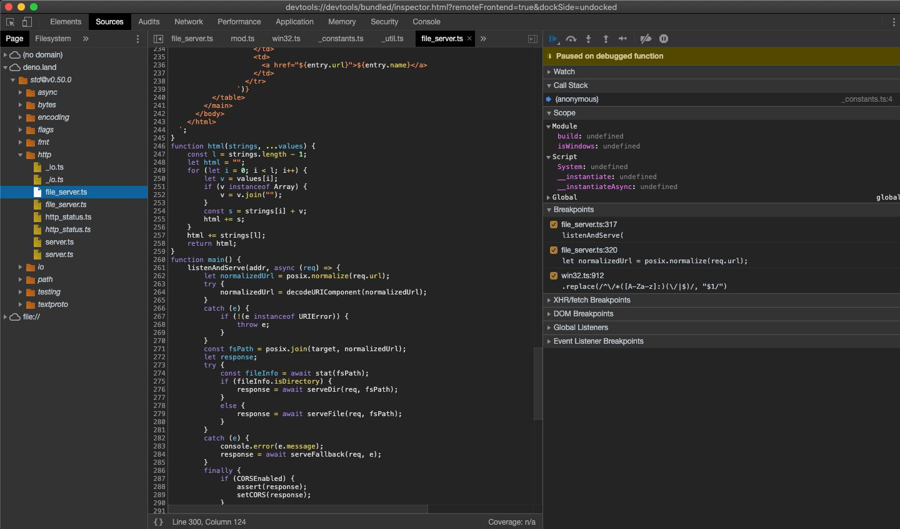
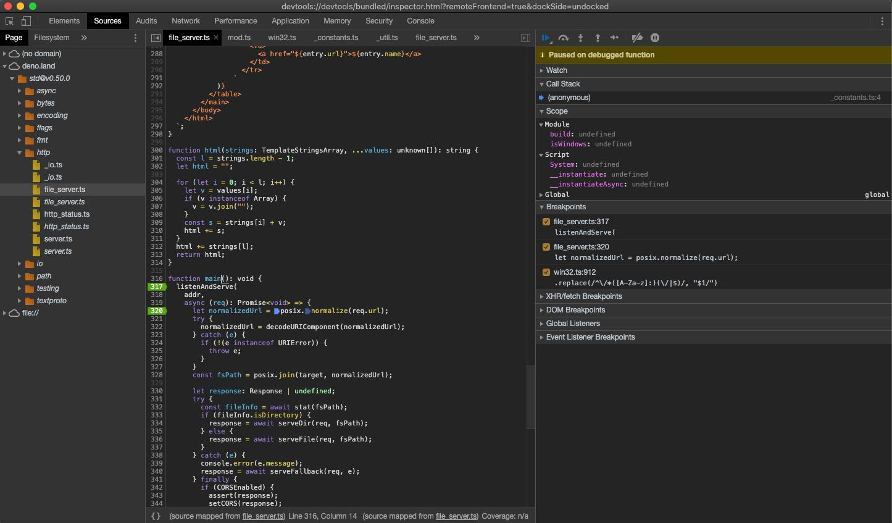
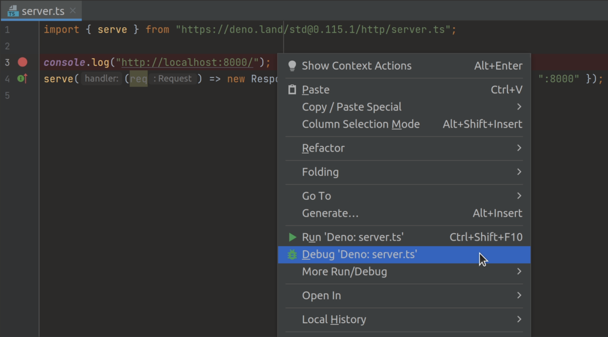

Deno supports the [V8 Inspector Protocol](https://v8.dev/docs/inspector) used by
Chrome, Edge and Node.js. This makes it possible to debug Deno programs using
Chrome DevTools or other clients that support the protocol (for example VSCode).

To activate debugging capabilities run Deno with one of the following flags:

- `--inspect`
- `--inspect-wait`
- `--inspect-brk`

## --inspect

Using the `--inspect` flag will start your program with an inspector server
which allows client connections from tools that support the V8 Inspector
Protocol, for example Chrome DevTools.

Visit `chrome://inspect` in a Chromium derived browser to connect Deno to the
inspector server. This allows you to inspect your code, add breakpoints, and
step through your code.

```sh
deno run --inspect your_script.ts
```

:::note

If you use the `--inspect` flag, the code will start executing immediately. If
your program is short, you might not have enough time to connect the debugger
before the program finishes execution.

In such cases, try running with `--inspect-wait` or `--inspect-brk` flag
instead, or add a timeout at the end of your code.

:::

## --inspect-wait

The `--inspect-wait` flag will wait for a debugger to connect before executing
your code.

```sh
deno run --inspect-wait your_script.ts
```

## --inspect-brk

The `--inspect-brk` flag will wait for a debugger to connect before executing
your code and then put a breakpoint in your program as soon as you connect,
allowing you to add additional breakpoints or evaluate expressions before
resuming execution.

**This is the most commonly used inspect flag**. JetBrains and VSCode IDEs use
this flag by default.

```sh
deno run --inspect-brk your_script.ts
```

## Example with Chrome DevTools

Let's try debugging a program using Chrome Devtools. For this, we'll use
[@std/http/file-server](https://jsr.io/@std/http#file-server), a static file
server.

Use the `--inspect-brk` flag to break execution on the first line:

```sh
$ deno run --inspect-brk -RN jsr:@std/http@1.0.0/file-server
Debugger listening on ws://127.0.0.1:9229/ws/1e82c406-85a9-44ab-86b6-7341583480b1
...
```

In a Chromium derived browser such as Google Chrome or Microsoft Edge, open
`chrome://inspect` and click `Inspect` next to target:



It might take a few seconds after opening the DevTools to load all modules.


You might notice that DevTools pauses execution on the first line of
`_constants.ts` instead of `file_server.ts`. This is expected behavior caused by
the way ES modules are evaluated in JavaScript (`_constants.ts` is left-most,
bottom-most dependency of `file_server.ts` so it is evaluated first).

At this point all source code is available in the DevTools, so let's open up
`file_server.ts` and add a breakpoint there; go to "Sources" pane and expand the
tree:



_Looking closely you'll find duplicate entries for each file; one written
regularly and one in italics. The former is compiled source file (so in the case
of `.ts` files it will be emitted JavaScript source), while the latter is a
source map for the file._

Next, add a breakpoint in the `listenAndServe` method:



As soon as we've added the breakpoint, DevTools automatically opens up the
source map file, which allows us step through the actual source code that
includes types.

Now that we have our breakpoints set, we can resume the execution of our script
so that we can inspect an incoming request. Hit the "Resume script execution"
button to do so. You might even need to hit it twice!

Once our script is running, try send a request and inspect it in Devtools:

```sh
curl http://0.0.0.0:4507/
```


At this point we can introspect the contents of the request and go step-by-step
to debug the code.

## VSCode

Deno can be debugged using VSCode. This is best done with help from the official
`vscode_deno` extension. Documentation for this can be found
[here](/runtime/manual/references/vscode_deno/#using-the-debugger).

## JetBrains IDEs

_**Note**: make sure you have
[this Deno plugin](https://plugins.jetbrains.com/plugin/14382-deno) installed
and enabled in Preferences / Settings | Plugins. For more information, see
[this blog post](https://blog.jetbrains.com/webstorm/2020/06/deno-support-in-jetbrains-ides/)._

You can debug Deno using your JetBrains IDE by right-clicking the file you want
to debug and selecting the `Debug 'Deno: <file name>'` option.



This will create a run/debug configuration with no permission flags set. If you
want to configure them, open your run/debug configuration and add the required
flags to the `Command` field.

## --log-level=debug

If you're having trouble connecting to the inspector, you can use the
`--log-level=debug` flag to get more information about what's happening. This
will show you information like module resolution, network requests, and other
permission checks.

```sh
deno run --inspect-brk --log-level=debug your_script.ts
```

## --strace-ops

Deno ops are an [RPC](https://en.wikipedia.org/wiki/Remote_procedure_call)
mechanism between JavaScript and Rust. They provide functionality like file I/O,
networking, and timers to JavaScript. The `--strace-ops` flag will print out all
ops that are being executed by Deno when a program is run along with their
timings.

```sh
deno run --strace-ops your_script.ts
```

Each op should have a `Dispatch` and a `Complete` event. The time between these
two events is the time taken to execute the op. This flag can be useful for
performance profiling, debugging hanging programs, or understanding how Deno
works under the hood.
