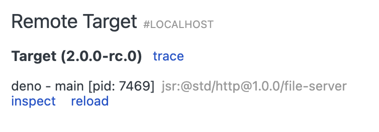
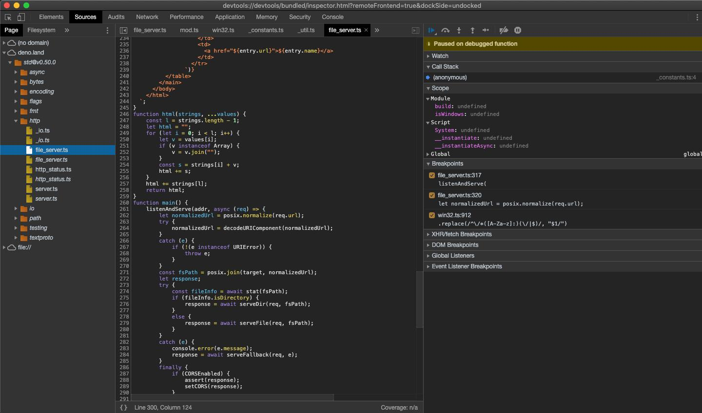
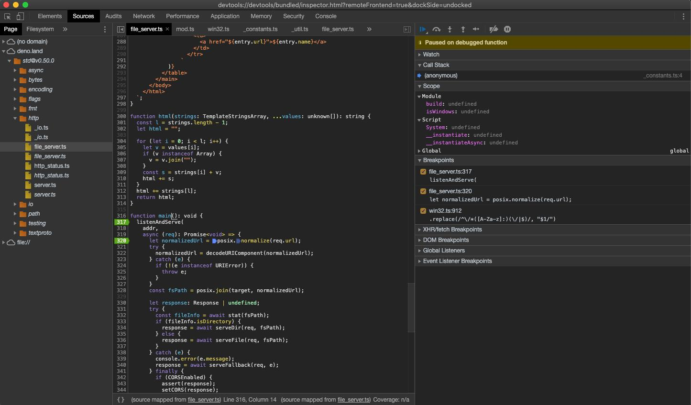
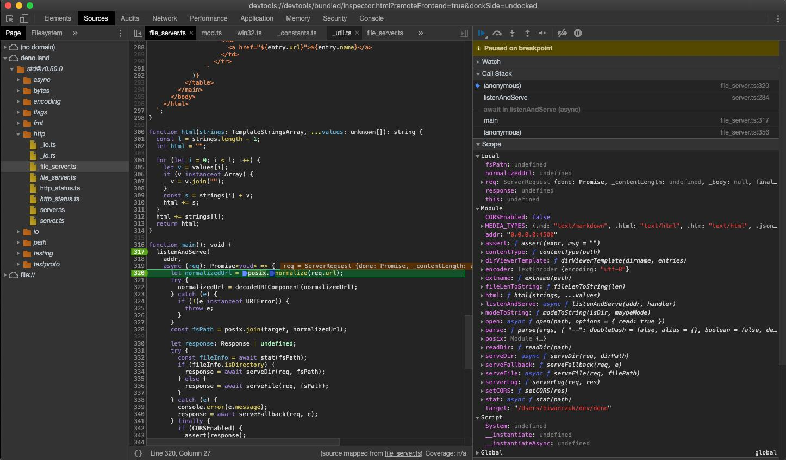
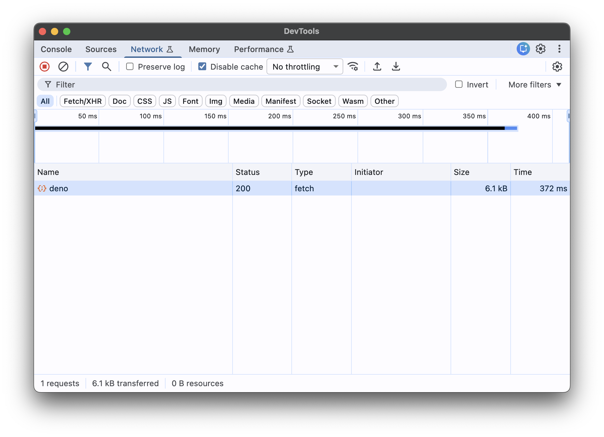
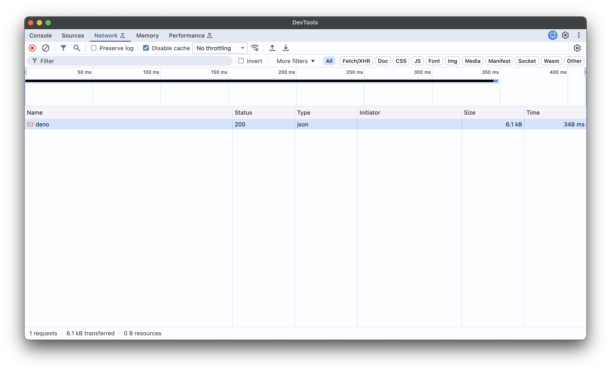
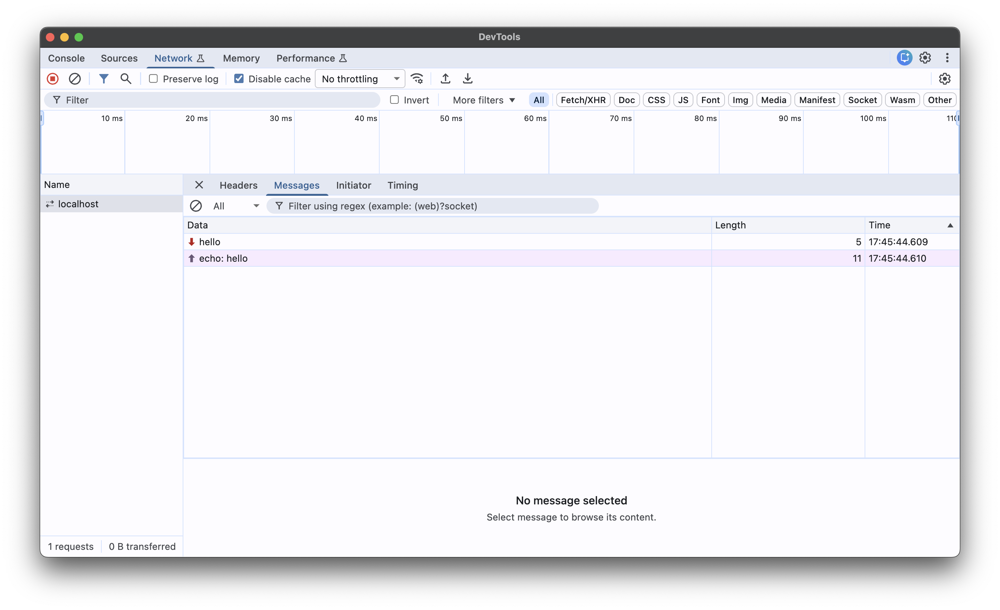
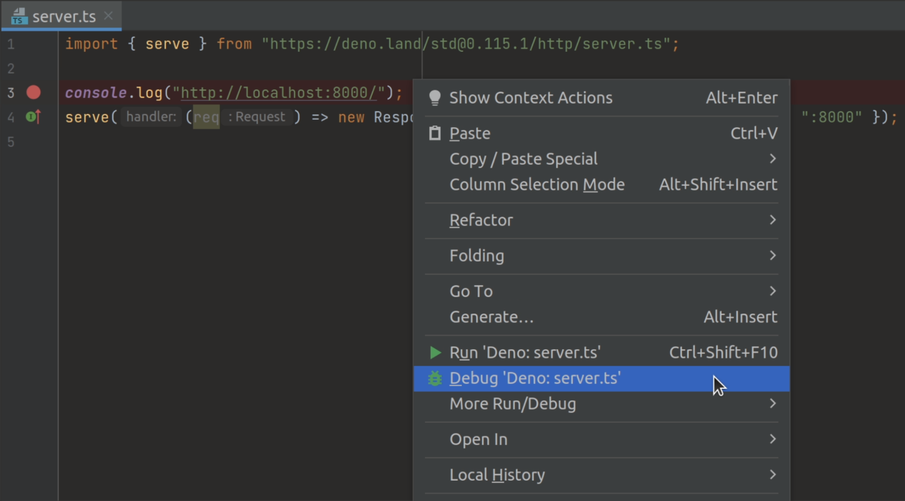

Deno supports the [V8 Inspector Protocol](https://v8.dev/docs/inspector) used by
Chrome, Edge and Node.js. This makes it possible to debug Deno programs using
Chrome DevTools or other clients that support the protocol (for example VSCode).

To activate debugging capabilities run Deno with one of the following flags:

- `--inspect`
- `--inspect-wait`
- `--inspect-brk`

## --inspect

Using the `--inspect` flag will start your program with an inspector server
which allows client connections from tools that support the V8 Inspector
Protocol, for example Chrome DevTools.

Visit `chrome://inspect` in a Chromium derived browser to connect Deno to the
inspector server. This allows you to inspect your code, add breakpoints, and
step through your code.

```sh
deno run --inspect your_script.ts
```

You can optionally specify a host and port for the inspector server. Both the
full address and a bare port number are accepted:

```sh
# Default: listen on 127.0.0.1:9229
deno run --inspect your_script.ts

# Custom port
deno run --inspect=9230 your_script.ts

# Custom host and port
deno run --inspect=0.0.0.0:9229 your_script.ts
```

### --inspect-publish-uid

By default, Deno prints the inspector WebSocket URL to stderr when it starts
listening. You can control this with `--inspect-publish-uid`:

- `stderr` (default) — prints the URL to stderr on startup
- `http` — exposes the URL via the `/json/list` HTTP endpoint on the inspector
  port, instead of printing it; useful for programmatic tooling that polls for
  available targets

```sh
deno run --inspect --inspect-publish-uid=http your_script.ts
```

:::note

If you use the `--inspect` flag, the code will start executing immediately. If
your program is short, you might not have enough time to connect the debugger
before the program finishes execution.

In such cases, try running with `--inspect-wait` or `--inspect-brk` flag
instead, or add a timeout at the end of your code.

:::

## --inspect-wait

The `--inspect-wait` flag will wait for a debugger to connect before executing
your code.

```sh
deno run --inspect-wait your_script.ts
```

## --inspect-brk

The `--inspect-brk` flag will wait for a debugger to connect before executing
your code and then put a breakpoint in your program as soon as you connect,
allowing you to add additional breakpoints or evaluate expressions before
resuming execution.

**This is the most commonly used inspect flag**. JetBrains and VSCode IDEs use
this flag by default.

```sh
deno run --inspect-brk your_script.ts
```

## Activating the inspector at runtime

The `--inspect` flags start the inspector server when the process launches. If
you instead want to open it on demand in an already running program, you can do
so from inside the program with the
[`node:inspector`](https://nodejs.org/api/inspector.html) module, or from
outside it by sending the process a [`SIGUSR1` signal](#sending-sigusr1). This
is handy for long-running processes such as servers, where you only want a
debugger listening after some condition is met rather than for the whole
lifetime of the process.

`inspector.open([port][, host][, wait])` starts the inspector server. The port
defaults to `9229` and the host to `127.0.0.1`. Because it binds a network
socket, the program needs the `--allow-net` permission (or run with `-A`).

```ts title="server.ts"
import inspector from "node:inspector";

Deno.serve((req) => {
  if (new URL(req.url).pathname === "/debug" && !inspector.url()) {
    inspector.open(9229, "127.0.0.1");
    console.log("Inspector listening on", inspector.url());
  }
  return new Response("hello");
});
```

```sh
deno run --allow-net server.ts
```

Send a request to `/debug` and the inspector server starts; open
`chrome://inspect` in a Chromium derived browser to connect. The module exposes
a few related functions:

- `inspector.open(port, host, true)` — passing `true` as the third argument
  blocks until a client connects, the same as `inspector.waitForDebugger()`.
- `inspector.url()` — returns the inspector WebSocket URL, or `undefined` when
  the inspector is not active.
- `inspector.close()` — stops the inspector server.

A `Session` is also available for issuing
[Chrome DevTools Protocol](https://chromedevtools.github.io/devtools-protocol/)
commands programmatically without an external client.

:::caution

Binding the inspector to a public IP with an open port is insecure: it lets any
host that can reach the port connect to the inspector and execute arbitrary
code. Keep the host at `127.0.0.1` unless you fully control the network.

:::

### Sending SIGUSR1

Starting with Deno 2.10, on Linux and macOS you can also activate the inspector
from outside the process by sending it the `SIGUSR1` signal, the same way it
works in Node.js. The inspector server starts on the default `127.0.0.1:9229`
without pausing execution and prints the usual banner to stderr:

```sh
$ deno run server.ts &
$ kill -USR1 <pid>
Debugger listening on ws://127.0.0.1:9229/ws/...
Visit chrome://inspect to connect to the debugger.
```

This is useful for debugging a long-running process, such as a server, that was
started without an `--inspect` flag and cannot easily be restarted. Unlike
`inspector.open()`, it requires no permissions and no cooperation from the
program's code.

A few details to be aware of:

- If the inspector server is already running (an `--inspect*` flag,
  `inspector.open()`, or a previous `SIGUSR1`), the signal has no effect.
- The signal handler is installed shortly after startup, so this is intended for
  programs that run for longer than about half a second.
- Signal listeners added with `Deno.addSignalListener("SIGUSR1")` keep working
  alongside this handler.
- `SIGUSR1` does not exist on Windows, so this is not available there.

## Example with Chrome DevTools

Let's try debugging a program using Chrome Devtools. For this, we'll use
[`@std/http/file-server`](/runtime/reference/std/http/), a static file server.

Use the `--inspect-brk` flag to break execution on the first line:

```sh
$ deno run --inspect-brk -RN jsr:@std/http/file-server
Debugger listening on ws://127.0.0.1:9229/ws/1e82c406-85a9-44ab-86b6-7341583480b1
...
```

In a Chromium derived browser such as Google Chrome or Microsoft Edge, open
`chrome://inspect` and click `Inspect` next to target:



It might take a few seconds after opening the DevTools to load all modules.


You might notice that DevTools pauses execution on the first line of
`_constants.ts` instead of `file_server.ts`. This is expected behavior caused by
the way ES modules are evaluated in JavaScript (`_constants.ts` is left-most,
bottom-most dependency of `file_server.ts` so it is evaluated first).

At this point all source code is available in the DevTools, so let's open up
`file_server.ts` and add a breakpoint there; go to "Sources" pane and expand the
tree:



_Looking closely you'll find duplicate entries for each file; one written
regularly and one in italics. The former is compiled source file (so in the case
of `.ts` files it will be emitted JavaScript source), while the latter is a
source map for the file._

Next, add a breakpoint in the `listenAndServe` method:



As soon as we've added the breakpoint, DevTools automatically opens up the
source map file, which allows us step through the actual source code that
includes types.

Now that we have our breakpoints set, we can resume the execution of our script
so that we can inspect an incoming request. Hit the "Resume script execution"
button to do so. You might even need to hit it twice!

Once our script is running, try send a request and inspect it in Devtools:

```sh
curl http://0.0.0.0:4507/
```



At this point we can introspect the contents of the request and go step-by-step
to debug the code.

## Inspecting network traffic

Starting with Deno 2.8, Chrome DevTools can inspect network traffic made by your
program in the same way it inspects traffic in a browser tab. Run your program
with `--inspect-wait` (or `--inspect` / `--inspect-brk`), open
`chrome://inspect` in a Chromium derived browser, click **Inspect** on the Deno
target, and switch to the **Network** tab.

The following built-in APIs are wired into the Network tab:

- `fetch()` — requests appear with `Type: fetch`
- `node:http` and `node:https` client requests (`http.request`, `http.get`,
  `https.request`, `https.get`) — the **Type** column reflects the response
  content-type (e.g. `json`, `document`), so any npm library that issues HTTP
  requests through `node:http` shows up alongside `fetch()` traffic
- `WebSocket` — client connections appear alongside HTTP requests, with
  handshake status and headers from the upgrade response, message frames, and a
  close event when the socket is closed
- [`Deno.upgradeWebSocket()`](/api/deno/~/Deno.upgradeWebSocket) — server-side
  WebSocket upgrades are instrumented too, so you can inspect both sides of a
  connection from a Deno-to-Deno handshake

For each request you can see the URL, method, status code, request and response
headers, request and response bodies, and timing information.

Let's try it with a small program that uses `fetch()`:

```ts title="net.ts"
const res = await fetch("https://api.github.com/repos/denoland/deno");
console.log(res.status, (await res.json()).stargazers_count);
```

Run it with `--inspect-wait` so the program pauses until DevTools connects:

```sh
$ deno run --inspect-wait --allow-net net.ts
Debugger listening on ws://127.0.0.1:9229/...
Visit chrome://inspect to connect to the debugger.
Deno is waiting for debugger to connect.
```

Open `chrome://inspect`, click **Inspect** on the Deno target, and switch to the
**Network** tab. The `fetch()` request shows up as a regular network entry, with
the request and response panes populated:



Click a request to see its headers, payload, response body, and timing
breakdown:


The same applies to `node:http` and `node:https`, so npm libraries that issue
HTTP requests through Node's built-in client (rather than `fetch()`) also show
up in the Network tab. For example:

```ts title="node-http.ts"
import https from "node:https";

const options = {
  hostname: "api.github.com",
  path: "/repos/denoland/deno",
  headers: { "User-Agent": "deno-docs-example" },
};

https.get(options, (res) => {
  let body = "";
  res.on("data", (chunk) => body += chunk);
  res.on(
    "end",
    () => console.log(res.statusCode, JSON.parse(body).stargazers_count),
  );
});
```

```sh
$ deno run --inspect-wait --allow-net node-http.ts
```

The request appears in the Network tab with the same headers, body, and timing
information as a `fetch()` request — the **Type** column reflects the response
content-type (`json` for this example):



`WebSocket` connections appear in the same Network tab, with messages and the
close event surfaced as the connection progresses:


Server-side WebSockets created with
[`Deno.upgradeWebSocket()`](/api/deno/~/Deno.upgradeWebSocket) are also
instrumented, so you can inspect both sides of a connection — the outgoing
client `WebSocket` and the server upgrade that accepts it. For example, a small
echo server:

```ts title="ws-server.ts"
Deno.serve({ port: 8000 }, (req) => {
  if (req.headers.get("upgrade") !== "websocket") {
    return new Response("send a WebSocket request", { status: 426 });
  }
  const { socket, response } = Deno.upgradeWebSocket(req);
  socket.onmessage = (e) => socket.send(`echo: ${e.data}`);
  return response;
});
```

```sh
$ deno run --inspect-wait --allow-net ws-server.ts
```

After connecting DevTools and resuming execution, connect to the server from
another terminal (for example with `deno eval`):

```sh
deno eval 'const ws = new WebSocket("ws://localhost:8000");
  ws.onopen = () => ws.send("hello");
  ws.onmessage = (e) => { console.log(e.data); ws.close(); };'
```

The upgrade and the message frames show up in the Network tab of the server's
DevTools session:



The same events are also exposed through `node:inspector` for programmatic
clients, so tooling that already speaks the Chrome DevTools Protocol against
Node can attach to Deno and observe the same network traffic without any
changes.

:::note

When no debugger is attached, the network instrumentation has effectively no
overhead — the events are only emitted while a session has opted in via
`Network.enable`.

:::

## VSCode

Deno can be debugged using VSCode. This is best done with help from the official
`vscode_deno` extension. Documentation for this can be found
[here](/runtime/reference/vscode#using-the-debugger).

## JetBrains IDEs

_**Note**: make sure you have
[this Deno plugin](https://plugins.jetbrains.com/plugin/14382-deno) installed
and enabled in Preferences / Settings | Plugins. For more information, see
[this blog post](https://blog.jetbrains.com/webstorm/2020/06/deno-support-in-jetbrains-ides/)._

You can debug Deno using your JetBrains IDE by right-clicking the file you want
to debug and selecting the `Debug 'Deno: <file name>'` option.



This will create a run/debug configuration with no permission flags set. If you
want to configure them, open your run/debug configuration and add the required
flags to the `Command` field.

## --log-level=debug

If you're having trouble connecting to the inspector, you can use the
`--log-level=debug` flag to get more information about what's happening. This
will show you information like module resolution, network requests, and other
permission checks.

```sh
deno run --inspect-brk --log-level=debug your_script.ts
```

## --strace-ops

Deno ops are an [RPC](https://en.wikipedia.org/wiki/Remote_procedure_call)
mechanism between JavaScript and Rust. They provide functionality like file I/O,
networking, and timers to JavaScript. The `--strace-ops` flag will print out all
ops that are being executed by Deno when a program is run along with their
timings.

```sh
deno run --strace-ops your_script.ts
```

Each op should have a `Dispatch` and a `Complete` event. The time between these
two events is the time taken to execute the op. This flag can be useful for
performance profiling, debugging hanging programs, or understanding how Deno
works under the hood.

## CPU profiling

Deno has a built-in CPU profiler: collect a profile while your program runs,
then read it as a Markdown report, an interactive flamegraph, or in Chrome
DevTools. See [CPU profiling](/runtime/fundamentals/cpu_profiling/) for the
flags, report formats, and analysis tips.

## OpenTelemetry integration

For production applications or complex systems, OpenTelemetry provides a more
comprehensive approach to observability and debugging. Deno includes built-in
support for OpenTelemetry, allowing you to:

- Trace requests through your application
- Monitor application performance metrics
- Collect structured logs
- Export telemetry data to monitoring systems

```sh
OTEL_DENO=true deno run your_script.ts
```

This will automatically collect and export runtime observability data,
including:

- HTTP request traces
- Runtime metrics
- Console logs and errors

For full details on Deno's OpenTelemetry integration, including custom metrics,
traces, and configuration options, see the
[OpenTelemetry documentation](/runtime/fundamentals/open_telemetry).

## Debugging Web Workers

Starting with Deno 2.7, Web Workers can be debugged through Chrome DevTools and
VS Code. When you run your program with any `--inspect` flag, each spawned
worker appears as a separate target in `chrome://inspect` alongside the main
thread.

```ts title="main.ts"
const worker = new Worker(import.meta.resolve("./worker.ts"), {
  type: "module",
});
worker.postMessage("start");
```

```ts title="worker.ts"
self.onmessage = (e) => {
  console.log("Worker received:", e.data);
  // Set breakpoints here in DevTools
};
```

```sh
deno run --inspect-brk --allow-read main.ts
```

Open `chrome://inspect`, and you will see both `main.ts` and `worker.ts` listed
as separate inspectable targets. Click **Inspect** on the worker target to open
a dedicated DevTools panel for that worker where you can set breakpoints, step
through code, and inspect variables independently of the main thread.

In VS Code with the Deno extension, workers appear as separate threads in the
**Call Stack** panel of the debugger.

## TLS session debugging

Set the `SSLKEYLOGFILE` environment variable to log TLS session keys to a file.
This enables you to decrypt and inspect encrypted network traffic with tools
like [Wireshark](https://www.wireshark.org/):

```sh
SSLKEYLOGFILE=./keys.log deno run -N main.ts
```

Then load `keys.log` in Wireshark (Edit > Preferences > Protocols > TLS >
(Pre)-Master-Secret log filename) to decrypt captured TLS traffic.
