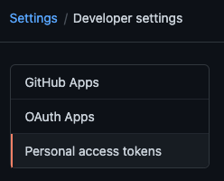
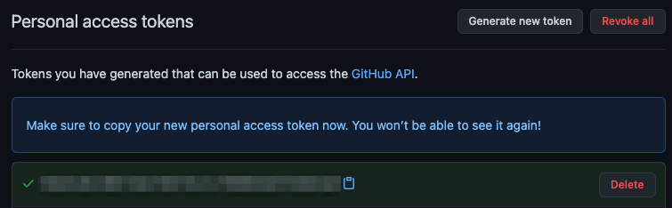

Deno uses
[ECMAScript modules](https://developer.mozilla.org/en-US/docs/Web/JavaScript/Guide/Modules)
as its default module system to align with modern JavaScript standards and to
promote a more efficient and consistent development experience. It's the
official standard for JavaScript modules, allows for better tree-shaking,
improved tooling integration, and native support across different environments.

By adopting ECMAScript modules, Deno ensures compatibility with the
ever-evolving JavaScript ecosystem. For developers, this means a streamlined and
predictable module system that avoids the complexities associated with legacy
module formats like CommonJS.

## Importing modules

In this example the `add` function is imported from a local `calc.ts` module.

```ts title="calc.ts"
export function add(a: number, b: number): number {
  return a + b;
}
```

```ts title="main.ts"
// imports the `calc.ts` module next to this file
import { add } from "./calc.ts";

console.log(add(1, 2)); // 3
```

You can run this example by calling `deno run main.ts` in the directory that
contains both `main.ts` and `calc.ts`.

With ECMAScript modules, local import specifiers must always include the full
file extension. It cannot be omitted.

```ts title="example.ts"
// WRONG: missing file extension
import { add } from "./calc";

// CORRECT: includes file extension
import { add } from "./calc.ts";
```

## Importing third party modules and libraries

When working with third-party modules in Deno, use the same `import` syntax as
you do for local code. Third party modules are typically imported from a remote
registry and start with `jsr:` , `npm:` or `https://`.

```ts title="main.ts"
import { camelCase } from "jsr:@luca/cases@1.0.0";
import { say } from "npm:cowsay@1.6.0";
import { pascalCase } from "https://deno.land/x/case/mod.ts";
```

Deno recommends [JSR](https://jsr.io), the modern JavaScript registry, for third
party modules. There, you'll find plenty of well documented ES modules for your
projects, including the
[Deno Standard Library](/runtime/fundamentals/standard_library/).

You can
[read more about Deno's support for npm packages here](/runtime/fundamentals/node/#using-npm-modules).

## Managing third party modules and libraries

Typing out the module name with the full version specifier can become tedious
when importing them in multiple files. You can centralize management of remote
modules with an `imports` field in your `deno.json` file. We call this `imports`
field the **import map**, which is based on the [Import Maps Standard].

[Import Maps Standard]: https://github.com/WICG/import-maps

```json title="deno.json"
{
  "imports": {
    "@luca/cases": "jsr:@luca/cases@^1.0.0",
    "cowsay": "npm:cowsay@^1.6.0",
    "cases": "https://deno.land/x/case/mod.ts"
  }
}
```

With remapped specifiers, the code looks cleaner:

```ts title="main.ts"
import { camelCase } from "@luca/cases";
import { say } from "cowsay";
import { pascalCase } from "cases";
```

The remapped name can be any valid specifier. It's a very powerful feature in
Deno that can remap anything. Learn more about what the import map can do
[here](/runtime/fundamentals/configuration/#dependencies).

## Differentiating between `imports` or `importMap` in `deno.json` and `--import-map` option

The [Import Maps Standard] requires two entries for each module: one for the
module specifier and another for the specifier with a trailing `/`. This is
because the standard allows only one entry per module specifier, and the
trailing `/` indicates that the specifier refers to a directory. For example,
when using the `--import-map import_map.json` option, the `import_map.json` file
must include both entries for each module (note the use of `jsr:/@std/async`
instead of `jsr:@std/async`):

```json title="import_map.json"
{
  "imports": {
    "@std/async": "jsr:@std/async@^1.0.0",
    "@std/async/": "jsr:/@std/async@^1.0.0/"
  }
}
```

In contrast, `deno.json` extends the import maps standard. When you use the
imports field in `deno.json` or reference an `import_map.json` file via the
`importMap` field, you only need to specify the module specifier without the
trailing `/`:

```json title="deno.json"
{
  "imports": {
    "@std/async": "jsr:@std/async@^1.0.0"
  }
}
```

## Adding dependencies with `deno add`

The installation process is made easy with the `deno add` subcommand. It will
automatically add the latest version of the package you requested to the
`imports` section in `deno.json`.

```sh
# Add the latest version of the module to deno.json
$ deno add jsr:@luca/cases
Add @luca/cases - jsr:@luca/cases@1.0.0
```

```json title="deno.json"
{
  "imports": {
    "@luca/cases": "jsr:@luca/cases@^1.0.0"
  }
}
```

You can also specify an exact version:

```sh
# Passing an exact version
$ deno add jsr:@luca/cases@1.0.0
Add @luca/cases - jsr:@luca/cases@1.0.0
```

Read more in [`deno add` reference](/runtime/reference/cli/add/).

You can also remove dependencies using `deno remove`:

```sh
$ deno remove @luca/cases
Remove @luca/cases
```

```json title="deno.json"
{
  "imports": {}
}
```

Read more in [`deno remove` reference](/runtime/reference/cli/remove/).

## Package Versions

It is possible to specify a version range for the package you are importing.
This is done using the `@` symbol followed by a version range specifier, and
follows the [semver](https://semver.org/) versioning scheme.

For example:

```bash
@scopename/mypackage           # highest version
@scopename/mypackage@16.1.0    # exact version
@scopename/mypackage@16        # highest 16.x version >= 16.0.0
@scopename/mypackage@^16.1.0   # highest 16.x version >= 16.1.0
@scopename/mypackage@~16.1.0   # highest 16.1.x version >= 16.1.0
```

Here is an overview of all the ways you can specify a version or a range:

| Symbol    | Description                                                                                                                                                         | Example   |
| --------- | ------------------------------------------------------------------------------------------------------------------------------------------------------------------- | --------- |
| `1.2.3`   | An exact version. Only this specific version will be used.                                                                                                          | `1.2.3`   |
| `^1.2.3`  | Compatible with version 1.2.3. Allows updates that do not change the leftmost non-zero digit. <br>For example, `1.2.4` and `1.3.0` are allowed, but `2.0.0` is not. | `^1.2.3`  |
| `~1.2.3`  | Approximately equivalent to version 1.2.3. Allows updates to the patch version. <br> For example, `1.2.4` is allowed, but `1.3.0` is not.                           | `~1.2.3`  |
| `>=1.2.3` | Greater than or equal to version 1.2.3. Any version `1.2.3` or higher is allowed.                                                                                   | `>=1.2.3` |
| `<=1.2.3` | Less than or equal to version 1.2.3. Any version `1.2.3` or lower is allowed.                                                                                       | `<=1.2.3` |
| `>1.2.3`  | Greater than version 1.2.3. Only versions higher than `1.2.3` are allowed.                                                                                          | `>1.2.3`  |
| `<1.2.3`  | Less than version 1.2.3. Only versions lower than `1.2.3` are allowed.                                                                                              | `<1.2.3`  |
| `1.2.x`   | Any patch version within the minor version 1.2. For example, `1.2.0`, `1.2.1`, etc.                                                                                 | `1.2.x`   |
| `1.x`     | Any minor and patch version within the major version 1. For example, `1.0.0`, `1.1.0`, `1.2.0`, etc.                                                                | `1.x`     |
| `*`       | Any version is allowed.                                                                                                                                             | `*`       |

## HTTPS imports

Deno also supports import statements that reference HTTP/HTTPS URLs, either
directly:

```js
import { Application } from "https://deno.land/x/oak/mod.ts";
```

or part of your `deno.json` import map:

```json
{
  "imports": {
    "oak": "https://deno.land/x/oak/mod.ts"
  }
}
```

Supporting HTTPS imports enables us to support the following JavaScript CDNs, as
they provide URL access to JavaScript modules:

- [deno.land/x](https://deno.land/x)
- [esm.sh](https://esm.sh)
- [unpkg.com](https://unpkg.com)

HTTPS imports are useful if you have a small, often single file, Deno project
that doesn't require any other configuration. With HTTPS imports, you can avoid
having a `deno.json` file at all. It is **not** advised to use this style of
import in larger applications however, as you may end up with version conflicts
(where different files use different version specifiers).

:::info

Use HTTPS imports with caution, and only **from trusted sources**. If the server
is compromised, it could serve malicious code to your application. They can also
cause versioning issues if you import different versions in different files.
HTTPS imports remain supported, **but we recommend using a package registry for
the best experience.**

:::

### Overriding HTTPS imports

The other situation where import maps can be very useful is to override HTTPS
imports in specific modules.

Let's say you want to override a `https://deno.land/x/my-library@1.0.0/mod.ts`
specifier that is used inside files coming from `https://deno.land/x/example/`
to a local patched version. You can do this by using a scope in the import map
that looks something like this:

```json
{
  "imports": {
    "example/": "https://deno.land/x/example/"
  },
  "scopes": {
    "https://deno.land/x/example/": {
      "https://deno.land/x/my-library@1.0.0/mod.ts": "./patched/mod.ts"
    }
  }
}
```

:::note

HTTPS imports have no notion of packages. Only the import map at the root of
your project is used. Import maps used inside URL dependencies are ignored.

:::

## Publishing modules

Any Deno program that defines an export can be published as a module. This
allows other developers to import and use your code in their own projects.
Modules can be published to:

- [JSR](https://jsr.io) - recommended, supports TypeScript natively and
  auto-generates documentation for you
- [npm](https://www.npmjs.com/) - use [dnt](https://github.com/denoland/dnt) to
  create the npm package
- [deno.land/x](https://deno.com/add_module) - for HTTPS imports, use JSR
  instead if possible

## Reloading modules

By default, Deno uses a global cache directory (`DENO_DIR`) for downloaded
dependencies. This cache is shared across all projects.

You can force deno to refetch and recompile modules into the cache using the
`--reload` flag.

```bash
# Reload everything
deno run --reload my_module.ts

# Reload a specific module
deno run --reload=jsr:@std/fs my_module.ts
```

## Using only cached modules

To force Deno to only use modules that have previously been cached, use the
`--cached-only` flag:

```shell
deno run --cached-only mod.ts
```

This will fail if there are any dependencies in the dependency tree for mod.ts
which are not yet cached.

## Vendoring remote modules

If your project has external dependencies, you may want to store them locally to
avoid downloading them from the internet every time you build your project. This
is especially useful when building your project on a CI server or in a Docker
container, or patching or otherwise modifying the remote dependencies.

Deno offers this functionality through a setting in your `deno.json` file:

```json
{
  "vendor": true
}
```

Add the above snippet to your `deno.json` file and Deno will cache all
dependencies locally in a `vendor` directory when the project is run, or you can
optionally run the `deno install --entrypoint` command to cache the dependencies
immediately:

```bash
deno install --entrypoint main.ts
```

You can then run the application as usual with `deno run`:

```bash
deno run main.ts
```

After vendoring, you can run `main.ts` without internet access by using the
`--cached-only` flag, which forces Deno to use only locally available modules.

## Integrity Checking and Lock Files

Imagine your module relies on a remote module located at https://some.url/a.ts.
When you compile your module for the first time, `a.ts` is fetched, compiled,
and cached. This cached version will be used until you either run your module on
a different machine (such as in a production environment) or manually reload the
cache (using a command like `deno install --reload`).

But what if the content at `https://some.url/a.ts` changes? This could result in
your production module running with different dependency code than your local
module. To detect this, Deno uses integrity checking and lock files.

Deno uses a `deno.lock` file to check external module integrity. To opt into a
lock file, either:

1. Create a `deno.json` file in the current or an ancestor directory, which will
   automatically create an additive lockfile at `deno.lock`.

   Note that this can be disabled by specifying the following in your deno.json:

   ```json title="deno.json"
   {
     "lock": false
   }
   ```

2. Use the `--lock` flag to enable and specify lock file checking.

### Frozen lockfile

By default, Deno uses an additive lockfile, where new dependencies are added to
the lockfile instead of erroring.

This might not be desired in certain scenarios (ex. CI pipelines or production
environments) where you'd rather have Deno error when it encounters a dependency
it's never seen before. To enable this, you can specify the `--frozen` flag or
set the following in a deno.json file:

```json title="deno.json"
{
  "lock": {
    "frozen": true
  }
}
```

When running a deno command with a frozen lockfile, any attempts to update the
lockfile with new contents will cause the command to exit with an error showing
the modifications that would have been made.

If you wish to update the lockfile, specify `--frozen=false` on the command line
to temporarily disable the frozen lockfile.

### Changing lockfile path

The lockfile path can be configured by specifying `--lock=deps.lock` or the
following in a Deno configuration file:

```json title="deno.json"
{
  "lock": {
    "path": "deps.lock"
  }
}
```

## Private repositories

:::note

If you're looking for private npm registries and `.npmrc` support, visit the
[npm support](/runtime/fundamentals/node/#private-registries) page.

:::

There may be instances where you want to load a remote module that is located in
a _private_ repository, like a private repository on GitHub.

Deno supports sending bearer tokens when requesting a remote module. Bearer
tokens are the predominant type of access token used with OAuth 2.0, and are
broadly supported by hosting services (e.g., GitHub, GitLab, Bitbucket,
Cloudsmith, etc.).

### DENO_AUTH_TOKENS

The Deno CLI will look for an environment variable named `DENO_AUTH_TOKENS` to
determine what authentication tokens it should consider using when requesting
remote modules. The value of the environment variable is in the format of _n_
number of tokens delimited by a semi-colon (`;`) where each token is either:

- a bearer token in the format of `{token}@{hostname[:port]}` or
- basic auth data in the format of `{username}:{password}@{hostname[:port]}`

For example, a single token for `deno.land` would look something like this:

```sh
DENO_AUTH_TOKENS=a1b2c3d4e5f6@deno.land
```

or:

```sh
DENO_AUTH_TOKENS=username:password@deno.land
```

And multiple tokens would look like this:

```sh
DENO_AUTH_TOKENS=a1b2c3d4e5f6@deno.land;f1e2d3c4b5a6@example.com:8080;username:password@deno.land
```

When Deno goes to fetch a remote module, where the hostname matches the hostname
of the remote module, Deno will set the `Authorization` header of the request to
the value of `Bearer {token}` or `Basic {base64EncodedData}`. This allows the
remote server to recognize that the request is an authorized request tied to a
specific authenticated user, and provide access to the appropriate resources and
modules on the server.

### GitHub

To access private repositories on GitHub, you would need to issue yourself a
_personal access token_. You do this by logging into GitHub and going under
_Settings -> Developer settings -> Personal access tokens_:



You would then choose to _Generate new token_ and give your token a description
and appropriate access to the `repo` scope. The `repo` scope will enable reading
file contents (more on
[scopes in the GitHub docs](https://docs.github.com/en/apps/oauth-apps/building-oauth-apps/scopes-for-oauth-apps#available-scopes)):


And once created GitHub will display the new token a single time, the value of
which you would want to use in the environment variable:



In order to access modules that are contained in a private repository on GitHub,
you would want to use the generated token in the `DENO_AUTH_TOKENS` environment
variable scoped to the `raw.githubusercontent.com` hostname. For example:

```sh
DENO_AUTH_TOKENS=a1b2c3d4e5f6@raw.githubusercontent.com
```

This should allow Deno to access any modules that the user who the token was
issued for has access to.

When the token is incorrect, or the user does not have access to the module,
GitHub will issue a `404 Not Found` status, instead of an unauthorized status.
So if you are getting errors that the modules you are trying to access are not
found on the command line, check the environment variable settings and the
personal access token settings.

In addition, `deno run -L debug` should print out a debug message about the
number of tokens that are parsed out of the environment variable. It will print
an error message if it feels any of the tokens are malformed. It won't print any
details about the tokens for security purposes.
