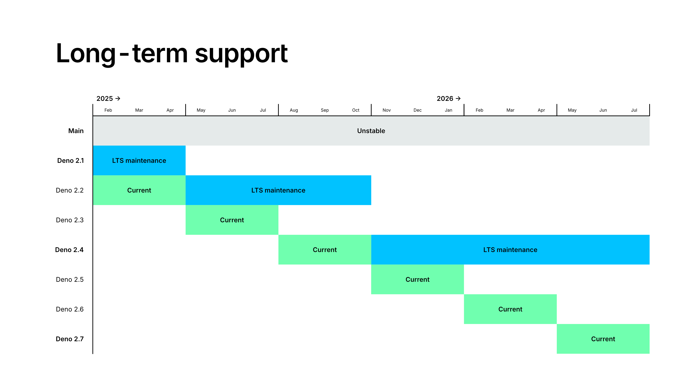

As of Deno 1.0.0, the `Deno` namespace APIs are stable. That means we will
strive to make code working under 1.0.0 continue to work in future versions.

## Release schedule, channels and long term support

Deno releases a new stable, minor version (eg. v2.1.0, v2.0.0) on a monthly
schedule.

Patch releases including bug fixes for the latest minor version are released as
needed - you can expect two or three patch releases before a new minor version
is released.

### Release channels

Deno offers 4 release channels

- `stable` - a semver minor/patch release, as described above. This is **the
  default** distribution channel that is recommended for most users.
- `lts` - long term support for a particular stable release, recommended for
  enterprise users who prefer not to upgrade so often. See below for details.
- `rc` - a release candidate for the upcoming semver minor release.
- `canary` - an unstable release that changes multiple timer per day, allows to
  try out latest bug fixes and new features that might end up in the `stable`
  channel.

### Long Term Support (LTS)

Starting with Deno v2.1.0 (released in November 2024) Deno offers a
LTS (long-term support) channel.

An LTS channel is a semver minor version that we maintain with only backwards
compatible bug fixes.

A new LTS version is twice per year and **supported for 6 months**, giving users
a month long window to upgrade between LTS relases. A new patch version of an
LTS channel will be released at least **once per quarter**.

LTS eligible backports include security fixes and defect fixes (crashes, wrong
answers).

Critical performance improvements **may** be backported based on severity.

API changes and major new features **will not** be backported.

## Unstable APIs

When introducing new APIs, these are first marked as unstable. This means that
the API may change in the future. These APIs are not available to use unless you
explicitly pass an unstable flag, like `--unstable-kv`.
[Learn more about `--unstable-*` flags](/runtime/reference/cli/unstable_flags).

There are also some non-runtime features of Deno that are considered unstable,
and are locked behind unstable flags. For example, the
`--unstable-sloppy-imports` flag is used to enable `import`ing code without
specifying file extensions.

## Standard library

The Deno Standard Library (https://jsr.io/@std) is mostly stable. All standard
library modules that are version 1.0.0 or higher are considered stable. All
other modules (0.x) are considered unstable, and may change in the future.

Using unstable standard library modules is not recommended for production code,
but it is a great way to experiment with new features and provide feedback to
the Deno team. It is not necessary to use any unstable flags to use unstable
standard library modules.
