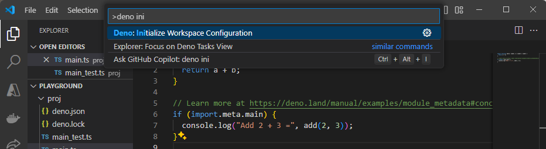

Deno comes with many of the tools that are commonly needed for developing
applications, including a full
[language server (LSP)](/runtime/reference/cli/lsp/) to help power your IDE of
choice. This page will help you set up your environment to get the most out of
Deno while you are developing.

We'll cover:

- How to use Deno with your favorite editor/IDE
- How to generate shell completions

## Setting up your editor/IDE

### Visual Studio Code

If you haven’t already, download and install Visual Studio Code from the
[official website](https://code.visualstudio.com/).

In the Extensions tab, search for "Deno" and install the
[extension by Denoland](https://marketplace.visualstudio.com/items?itemName=denoland.vscode-deno).

Next, open the Command Palette by pressing `Ctrl+Shift+P` and type
`Deno: Initialize Workspace Configuration`. Select this option to configure Deno
for your workspace.



A file called `.vscode/settings.json` will be created in your workspace with the
following configuration:

```json
{
  "deno.enable": true
}
```

That’s it! You’ve successfully set up your developer environment for Deno using
VSCode. You will now get all the benefits of Deno’s LSP, including IntelliSense,
code formatting, linting, and more.

### JetBrains IDEs

To install the Deno Plugin, open your IDE and go to **File** > **Settings**.
Navigate to **Plugins** and search for `Deno`. Install the official Deno plugin.


To configure the Plugin, go to **File** > **Settings** again. Navigate to
**Languages & Frameworks** > **Deno**. Check **Enable Deno for your project**
and specify the path to the Deno executable (if it has not been auto-detected).

Check out
[this blog post](https://blog.jetbrains.com/webstorm/2020/06/deno-support-in-jetbrains-ides/)
to learn more about how to get started with Deno in Jetbrains IDEs.

### Vim/Neovim via plugins

Deno is well-supported on both [Vim](https://www.vim.org/) and
[Neovim](https://neovim.io/) via
[coc.nvim](https://github.com/neoclide/coc.nvim),
[vim-easycomplete](https://github.com/jayli/vim-easycomplete),
[ALE](https://github.com/dense-analysis/ale) and
[vim-lsp](https://github.com/prabirshrestha/vim-lsp). coc.nvim offers plugins to
integrate to the Deno language server while ALE supports it _out of the box_.

### Neovim 0.6+ using the built-in language server

To use the Deno language server install
[nvim-lspconfig](https://github.com/neovim/nvim-lspconfig/) and follow the
instructions to enable the
[supplied Deno configuration](https://github.com/neovim/nvim-lspconfig/blob/master/doc/configs.md#denols).

Note that if you also have `ts_ls` as an LSP client, you may run into issues
where both `ts_ls` and `denols` are attached to your current buffer. To resolve
this, make sure to set some unique `root_dir` for both `ts_ls` and `denols`. You
may also need to set `single_file_support` to `false` for `ts_ls` to prevent it
from running in `single file mode`. Here is an example of such a configuration:

```lua
local nvim_lsp = require('lspconfig')
nvim_lsp.denols.setup {
  on_attach = on_attach,
  root_dir = nvim_lsp.util.root_pattern("deno.json", "deno.jsonc"),
}

nvim_lsp.ts_ls.setup {
  on_attach = on_attach,
  root_dir = nvim_lsp.util.root_pattern("package.json"),
  single_file_support = false
}
```

For Deno, the example above assumes a `deno.json` or `deno.jsonc` file exists at
the root of the project.

#### coc.nvim

Once you have
[coc.nvim](https://github.com/neoclide/coc.nvim/wiki/Install-coc.nvim)
installed, you need to install the required
[coc-deno](https://github.com/fannheyward/coc-deno) via `:CocInstall coc-deno`.

Once the plugin is installed, and you want to enable Deno for a workspace, run
the command `:CocCommand deno.initializeWorkspace` and you should be able to
utilize commands like `gd` (goto definition) and `gr` (go/find references).

#### ALE

ALE supports Deno via the Deno language server out of the box and in many uses
cases doesn't require additional configuration. Once you have
[ALE installed](https://github.com/dense-analysis/ale#installation) you can
perform the command
[`:help ale-typescript-deno`](https://github.com/dense-analysis/ale/blob/master/doc/ale-typescript.txt)
to get information on the configuration options available.

For more information on how to setup ALE (like key bindings) refer to the
[official documentation](https://github.com/dense-analysis/ale#usage).

#### Vim-EasyComplete

Vim-EasyComplete supports Deno without any other configuration. Once you have
[vim-easycomplete installed](https://github.com/jayli/vim-easycomplete#installation),
you need install deno via `:InstallLspServer deno` if you haven't installed
deno. You can get more information from
[official documentation](https://github.com/jayli/vim-easycomplete).

#### Vim-Lsp

After installing Vim-Lsp through
[vim-plug](https://github.com/prabirshrestha/vim-lsp?tab=readme-ov-file#installing)
or vim packages. Add this code to your `.vimrc` configuration:

```vim
if executable('deno')
  let server_config = {
    \ 'name': 'deno',
    \ 'cmd': {server_info->['deno', 'lsp']},
    \ 'allowlist': ['typescript', 'javascript', 'javascriptreact', 'typescriptreact'],
    \ }

  if exists('$DENO_ENABLE') 
    let deno_enabled = $DENO_ENABLE == '1' 
    let server_config['workspace_config'] = { 'deno': { 'enable': deno_enabled ? v:true : v:false } } 
  endif

  au User lsp_setup call lsp#register_server(server_config)
endif
```

You will have two ways to enable the LSP Server. One is to have a `deno.json` or
`deno.jsonc` in your current working directory, or force it with
`DENO_ENABLE=1`. Also if you want to highlight syntax in the intellisense
tooltip, you can add this code to your `.vimrc` configuration too:

```vim
let g:markdown_fenced_languages = ["ts=typescript"]
```

### Emacs

#### lsp-mode

Emacs supports Deno via the Deno language server using
[lsp-mode](https://emacs-lsp.github.io/lsp-mode/). Once
[lsp-mode is installed](https://emacs-lsp.github.io/lsp-mode/page/installation/)
it should support Deno, which can be
[configured](https://emacs-lsp.github.io/lsp-mode/page/lsp-deno/) to support
various settings.

#### eglot

You can also use built-in Deno language server by using
[`eglot`](https://github.com/joaotavora/eglot).

An example configuration for Deno via eglot:

```elisp
(add-to-list 'eglot-server-programs '((js-mode typescript-mode) . (eglot-deno "deno" "lsp")))

  (defclass eglot-deno (eglot-lsp-server) ()
    :documentation "A custom class for deno lsp.")

  (cl-defmethod eglot-initialization-options ((server eglot-deno))
    "Passes through required deno initialization options"
    (list :enable t
    :lint t))
```

### Pulsar

The [Pulsar editor, formerly known as Atom](https://pulsar-edit.dev/) supports
integrating with the Deno language server via the
[atom-ide-deno](https://web.pulsar-edit.dev/packages/atom-ide-deno) package.
`atom-ide-deno` requires that the Deno CLI be installed and the
[atom-ide-base](https://web.pulsar-edit.dev/packages/atom-ide-base) package to
be installed as well.

### Sublime Text

[Sublime Text](https://www.sublimetext.com/) supports connecting to the Deno
language server via the [LSP package](https://packagecontrol.io/packages/LSP).
You may also want to install the
[TypeScript package](https://packagecontrol.io/packages/TypeScript) to get full
syntax highlighting.

Once you have the LSP package installed, you will want to add configuration to
your `.sublime-project` configuration like the below:

```jsonc
{
  "settings": {
    "LSP": {
      "deno": {
        "command": ["deno", "lsp"],
        "initializationOptions": {
          // "config": "", // Sets the path for the config file in your project
          "enable": true,
          // "importMap": "", // Sets the path for the import-map in your project
          "lint": true,
          "unstable": false
        },
        "enabled": true,
        "languages": [
          {
            "languageId": "javascript",
            "scopes": ["source.js"],
            "syntaxes": [
              "Packages/Babel/JavaScript (Babel).sublime-syntax",
              "Packages/JavaScript/JavaScript.sublime-syntax"
            ]
          },
          {
            "languageId": "javascriptreact",
            "scopes": ["source.jsx"],
            "syntaxes": [
              "Packages/Babel/JavaScript (Babel).sublime-syntax",
              "Packages/JavaScript/JavaScript.sublime-syntax"
            ]
          },
          {
            "languageId": "typescript",
            "scopes": ["source.ts"],
            "syntaxes": [
              "Packages/TypeScript-TmLanguage/TypeScript.tmLanguage",
              "Packages/TypeScript Syntax/TypeScript.tmLanguage"
            ]
          },
          {
            "languageId": "typescriptreact",
            "scopes": ["source.tsx"],
            "syntaxes": [
              "Packages/TypeScript-TmLanguage/TypeScriptReact.tmLanguage",
              "Packages/TypeScript Syntax/TypeScriptReact.tmLanguage"
            ]
          }
        ]
      }
    }
  }
}
```

### Nova

The [Nova editor](https://nova.app) can integrate the Deno language server via
the
[Deno extension](https://extensions.panic.com/extensions/jaydenseric/jaydenseric.deno).

### GitHub Codespaces

[GitHub Codespaces](https://github.com/features/codespaces) allows you to
develop fully online or remotely on your local machine without needing to
configure or install Deno. It is currently in early access.

If a project is a Deno enabled project and contains the `.devcontainer`
configuration as part of the repository, opening the project in GitHub
Codespaces should just "work". If you are starting a new project, or you want to
add Deno support to an existing code space, it can be added by selecting the
`Codespaces: Add Development Container Configuration Files...` from the command
pallet and then selecting `Show All Definitions...` and then searching for the
`Deno` definition.

Once selected, you will need to rebuild your container so that the Deno CLI is
added to the container. After the container is rebuilt, the code space will
support Deno.

### Kakoune

[Kakoune](https://kakoune.org/) supports connecting to the Deno language server
via the [kak-lsp](https://github.com/kak-lsp/kak-lsp) client. Once
[kak-lsp is installed](https://github.com/kak-lsp/kak-lsp#installation) an
example of configuring it up to connect to the Deno language server is by adding
the following to your `kak-lsp.toml`:

```toml
[language.typescript]
filetypes = ["typescript", "javascript"]
roots = [".git"]
command = "deno"
args = ["lsp"]
[language.typescript.settings.deno]
enable = true
lint = true
```

### Helix

[Helix](https://helix-editor.com) comes with built-in language server support.
Enabling connection to the Deno language server requires changes in the
`languages.toml` configuration file.

```toml
[[language]]
name = "typescript"
language-id = "typescript"
scope = "source.ts"
injection-regex = "^(ts|typescript)$"
file-types = ["ts"]
shebangs = ["deno"]
roots = ["deno.json", "deno.jsonc", "package.json"]
auto-format = true
language-servers = ["deno-lsp"]

[language-server.deno-lsp]
command = "deno"
args = ["lsp"]

[language-server.deno-lsp.config.deno]
enable = true
```

## Shell completions

Built into the Deno CLI is support to generate shell completion information for
the CLI itself. By using `deno completions <shell>`, the Deno CLI will output to
stdout the completions. Current shells that are supported:

- bash
- elvish
- fish
- powershell
- zsh

### bash example

Output the completions and add them to the environment:

```shell
> deno completions bash > /usr/local/etc/bash_completion.d/deno.bash
> source /usr/local/etc/bash_completion.d/deno.bash
```

### PowerShell example

Output the completions:

```shell
> deno completions powershell >> $profile
> .$profile
```

This will create a Powershell profile at
`$HOME\Documents\WindowsPowerShell\Microsoft.PowerShell_profile.ps1`, and it
will be run whenever you launch the PowerShell.

### zsh example

You should have a directory where the completions can be saved:

```shell
> mkdir ~/.zsh
```

Then output the completions:

```shell
> deno completions zsh > ~/.zsh/_deno
```

And ensure the completions get loaded in your `~/.zshrc`:

```shell
fpath=(~/.zsh $fpath)
autoload -Uz compinit
compinit -u
```

If after reloading your shell and completions are still not loading, you may
need to remove `~/.zcompdump/` to remove previously generated completions and
then `compinit` to generate them again.

### zsh example with ohmyzsh and antigen

[ohmyzsh](https://github.com/ohmyzsh/ohmyzsh) is a configuration framework for
zsh and can make it easier to manage your shell configuration.
[antigen](https://github.com/zsh-users/antigen) is a plugin manager for zsh.

Create the directory to store the completions and output the completions:

```shell
> mkdir ~/.oh-my-zsh/custom/plugins/deno
> deno completions zsh > ~/.oh-my-zsh/custom/plugins/deno/_deno
```

Then your `.zshrc` might look something like this:

```shell
source /path-to-antigen/antigen.zsh

# Load the oh-my-zsh's library.
antigen use oh-my-zsh

antigen bundle deno
```

### fish example

Output the completions to a `deno.fish` file into the completions directory in
the fish config folder:

```shell
> deno completions fish > ~/.config/fish/completions/deno.fish
```

## Other tools

If you are writing or supporting a community integration using the Deno language
server, read more about
[integrating with the Deno LSP](/runtime/reference/lsp_integration/), but also
feel free to join our [Discord community](https://discord.gg/deno) in the
`#dev-lsp` channel.
