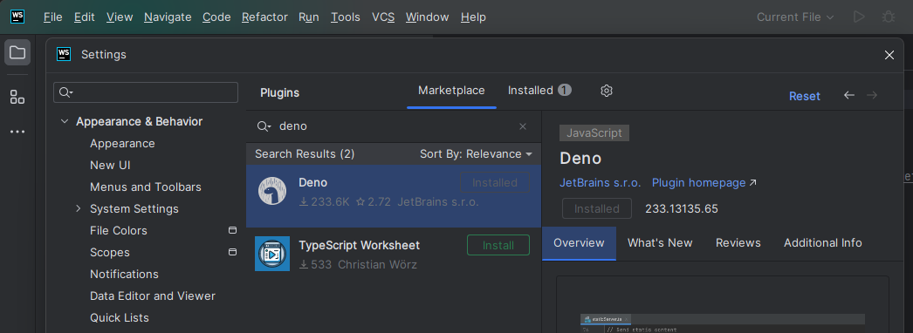

Deno comes with many of the tools that are commonly needed for developing
applications, including a full
[language server (LSP)](/runtime/reference/cli/lsp/) to help power your IDE of
choice. This page will help you set up your environment to get the most out of
Deno while you are developing.

We'll cover:

- How to use Deno with your favorite editor/IDE
- How to generate shell completions

## Setting up your editor/IDE

### Visual Studio Code

If you haven't already, download and install Visual Studio Code from the
[official website](https://code.visualstudio.com/).

In the Extensions tab, search for "Deno" and install the
[extension by Denoland](https://marketplace.visualstudio.com/items?itemName=denoland.vscode-deno).

Next, open the Command Palette by pressing `Ctrl+Shift+P` and type
`Deno: Initialize Workspace Configuration`. Select this option to configure Deno
for your workspace.


A file called `.vscode/settings.json` will be created in your workspace with the
following configuration:

```json
{
  "deno.enable": true
}
```

That's it! You've successfully set up your developer environment for Deno using
VSCode. You will now get all the benefits of Deno's LSP, including IntelliSense,
code formatting, linting, and more.

### JetBrains IDEs

To install the Deno Plugin, open your IDE and go to **File** > **Settings**.
Navigate to **Plugins** and search for `Deno`. Install the official Deno plugin.



To configure the Plugin, go to **File** > **Settings** again. Navigate to
**Languages & Frameworks** > **JavaScript Runtime**. Switch **Preferred
Runtime** to **Deno**. Under **Deno**, specify the path to the Deno executable
(if it has not been auto-detected).

Check out
[this blog post](https://blog.jetbrains.com/webstorm/2020/06/deno-support-in-jetbrains-ides/)
to learn more about how to get started with Deno in Jetbrains IDEs.

### Vim/Neovim

The recommended setup for Neovim 0.6+ is the built-in language server client
with [nvim-lspconfig](https://github.com/neovim/nvim-lspconfig/), which ships a
[ready-made Deno configuration](https://github.com/neovim/nvim-lspconfig/blob/master/doc/configs.md#denols).

If you also have `ts_ls` configured, both servers can attach to the same buffer.
To avoid this, give each a distinct `root_dir` (or `root_markers`) and set
`single_file_support = false` on `ts_ls`:

```lua
vim.lsp.config('denols', {
    on_attach = on_attach,
    root_markers = {"deno.json", "deno.jsonc"},
})

vim.lsp.config('ts_ls', {
    on_attach = on_attach,
    root_markers = {"package.json"},
    single_file_support = false,
})
```

This assumes a `deno.json` or `deno.jsonc` lives at the root of your Deno
project.

#### Kickstart.nvim and Mason LSP

If you use [kickstart.nvim](https://github.com/nvim-lua/kickstart.nvim), add the
equivalent configuration to the `servers` table in your `init.lua`:

```lua
local servers = {
        -- ... some configuration
        ts_ls = {
            root_dir = require("lspconfig").util.root_pattern({ "package.json", "tsconfig.json" }),
            single_file_support = false,
            settings = {},
        },
        denols = {
            root_dir = require("lspconfig").util.root_pattern({"deno.json", "deno.jsonc"}),
            single_file_support = false,
            settings = {},
        },
    }
```

#### Other Vim/Neovim plugins

If you prefer a different plugin ecosystem, Deno also works with the following:

- **[ALE](https://github.com/dense-analysis/ale):** supports the Deno language
  server out of the box. See
  [`:help ale-typescript-deno`](https://github.com/dense-analysis/ale/blob/master/doc/ale-typescript.txt)
  for configuration options.
- **[coc.nvim](https://github.com/neoclide/coc.nvim):** install
  [coc-deno](https://github.com/fannheyward/coc-deno) with
  `:CocInstall coc-deno`, then run `:CocCommand deno.initializeWorkspace` in
  your project.
- **[vim-easycomplete](https://github.com/jayli/vim-easycomplete):** once
  installed, run `:InstallLspServer deno`. See the
  [project README](https://github.com/jayli/vim-easycomplete) for details.
- **[vim-lsp](https://github.com/prabirshrestha/vim-lsp):** register the Deno
  language server in your `.vimrc`:

  ```vim
  if executable('deno')
    let server_config = {
      \ 'name': 'deno',
      \ 'cmd': {server_info->['deno', 'lsp']},
      \ 'allowlist': ['typescript', 'javascript', 'javascriptreact', 'typescriptreact'],
      \ }

    if exists('$DENO_ENABLE')
      let deno_enabled = $DENO_ENABLE == '1'
      let server_config['workspace_config'] = { 'deno': { 'enable': deno_enabled ? v:true : v:false } }
    endif

    au User lsp_setup call lsp#register_server(server_config)
  endif
  ```

  Activate the server either by placing a `deno.json`/`deno.jsonc` in the
  working directory or by setting `DENO_ENABLE=1`. To highlight syntax in
  intellisense tooltips, also add:

  ```vim
  let g:markdown_fenced_languages = ["ts=typescript"]
  ```

### Zed

The [Zed editor](https://zed.dev) can integrate the Deno language server via the
[Deno extension](https://zed.dev/extensions?query=deno&filter=language-servers).

### Helix

[Helix](https://helix-editor.com) comes with built-in language server support.
Enabling connection to the Deno language server requires changes in the
`languages.toml` configuration file.

```toml
[[language]]
name = "typescript"
roots = ["deno.json", "deno.jsonc", "package.json"]
file-types = ["ts", "tsx"]
auto-format = true
language-servers = ["deno-lsp"]

[[language]]
name = "javascript"
roots = ["deno.json", "deno.jsonc", "package.json"]
file-types = ["js", "jsx"]
auto-format = true
language-servers = ["deno-lsp"]

[language-server.deno-lsp]
command = "deno"
args = ["lsp"]
config.deno.enable = true
```

### Emacs

#### lsp-mode

Emacs supports Deno via the Deno language server using
[lsp-mode](https://emacs-lsp.github.io/lsp-mode/). Once
[lsp-mode is installed](https://emacs-lsp.github.io/lsp-mode/page/installation/)
it should support Deno, which can be
[configured](https://emacs-lsp.github.io/lsp-mode/page/lsp-deno/) to support
various settings.

#### eglot

You can also use built-in Deno language server by using
[`eglot`](https://github.com/joaotavora/eglot).

An example configuration for Deno via eglot:

```elisp
(add-to-list 'eglot-server-programs '((js-mode typescript-mode) . (eglot-deno "deno" "lsp")))

  (defclass eglot-deno (eglot-lsp-server) ()
    :documentation "A custom class for deno lsp.")

  (cl-defmethod eglot-initialization-options ((server eglot-deno))
    "Passes through required deno initialization options"
    (list
      :enable t
      :unstable t
      :typescript
        (:inlayHints
          (:variableTypes
            (:enabled t))
          (:parameterTypes
            (:enabled t)))))
```

This is the equivalent of having the following settings in a VSCode
`settings.json`:

```jsonc
{
  "deno.enable": true,
  "deno.unstable": true,
  "typescript.inlayHints.variableTypes.enabled": true,
  "typescript.inlayHints.parameterTypes.enabled": true
}
```

### Sublime Text

[Sublime Text](https://www.sublimetext.com/) supports connecting to the Deno
language server via the [LSP package](https://packagecontrol.io/packages/LSP).
Once it's installed, add a minimal Deno client to your `.sublime-project`:

```jsonc
{
  "settings": {
    "LSP": {
      "deno": {
        "command": ["deno", "lsp"],
        "enabled": true,
        "selector": "source.ts | source.tsx | source.js | source.jsx",
        "initializationOptions": {
          "enable": true,
          "lint": true
        }
      }
    }
  }
}
```

For the full set of supported `initializationOptions` keys (such as `config`,
`importMap`, and `unstable`), see the
[Settings section of the LSP integration reference](/runtime/reference/lsp_integration/#settings)
and the
[LSP package documentation](https://lsp.sublimetext.io/language_servers/).

### Kakoune

[Kakoune](https://kakoune.org/) supports connecting to the Deno language server
via the [kak-lsp](https://github.com/kak-lsp/kak-lsp) client. Once
[kak-lsp is installed](https://github.com/kak-lsp/kak-lsp#installation) an
example of configuring it up to connect to the Deno language server is by adding
the following to your `kak-lsp.toml`:

```toml
[language.typescript]
filetypes = ["typescript", "javascript"]
roots = [".git"]
command = "deno"
args = ["lsp"]
[language.typescript.settings.deno]
enable = true
lint = true
```

### Nova

The [Nova editor](https://nova.app) can integrate the Deno language server via
the
[Deno extension](https://extensions.panic.com/extensions/co.gwil/co.gwil.deno/).

### Pulsar

The [Pulsar editor, formerly known as Atom](https://pulsar-edit.dev/) supports
integrating with the Deno language server via the
[atom-ide-deno](https://web.pulsar-edit.dev/packages/atom-ide-deno) package.
`atom-ide-deno` requires that the Deno CLI be installed and the
[atom-ide-base](https://web.pulsar-edit.dev/packages/atom-ide-base) package to
be installed as well.

## Remote development

### GitHub Codespaces

[GitHub Codespaces](https://github.com/features/codespaces) lets you develop in
a hosted environment with no local Deno install.

If the repository already includes a `.devcontainer` configuration with Deno,
opening it in Codespaces just works. To add Deno to a Codespace that doesn't:

1. Open the command palette (`Cmd/Ctrl+Shift+P`).
2. Run `Codespaces: Add Development Container Configuration Files...`.
3. Choose `Show All Definitions...` and search for `Deno`.
4. Rebuild the container so the Deno CLI is available.

## Shell completions

Built into the Deno CLI is support to generate shell completion information for
the CLI itself. By using `deno completions <shell>`, the Deno CLI will output to
stdout the completions. Current shells that are supported:

- bash
- elvish
- fish
- powershell
- zsh

### bash example

Output the completions and add them to the environment:

```shell
> deno completions bash > /usr/local/etc/bash_completion.d/deno.bash
> source /usr/local/etc/bash_completion.d/deno.bash
```

### PowerShell example

Output the completions:

```shell
> deno completions powershell >> $profile
> .$profile
```

This will create a Powershell profile at
`$HOME\Documents\WindowsPowerShell\Microsoft.PowerShell_profile.ps1`, and it
will be run whenever you launch the PowerShell.

### zsh example

You should have a directory where the completions can be saved:

```shell
> mkdir ~/.zsh
```

Then output the completions:

```shell
> deno completions zsh > ~/.zsh/_deno
```

And ensure the completions get loaded in your `~/.zshrc`:

```shell
fpath=(~/.zsh $fpath)
autoload -Uz compinit
compinit -u
```

If after reloading your shell and completions are still not loading, you may
need to remove `~/.zcompdump/` to remove previously generated completions and
then `compinit` to generate them again.

### zsh example with ohmyzsh and antigen

[ohmyzsh](https://github.com/ohmyzsh/ohmyzsh) is a configuration framework for
zsh and can make it easier to manage your shell configuration.
[antigen](https://github.com/zsh-users/antigen) is a plugin manager for zsh.

Create the directory to store the completions and output the completions:

```shell
> mkdir ~/.oh-my-zsh/custom/plugins/deno
> deno completions zsh > ~/.oh-my-zsh/custom/plugins/deno/_deno
```

Then your `.zshrc` might look something like this:

```shell
source /path-to-antigen/antigen.zsh

# Load the oh-my-zsh's library.
antigen use oh-my-zsh

antigen bundle deno
```

### fish example

Output the completions to a `deno.fish` file into the completions directory in
the fish config folder:

```shell
> deno completions fish > ~/.config/fish/completions/deno.fish
```

## Building your own LSP integration

If you're building or maintaining a community integration with the Deno language
server, see the [LSP integration reference](/runtime/reference/lsp_integration/)
and join the `#dev-lsp` channel on the [Deno Discord](https://discord.gg/deno).
