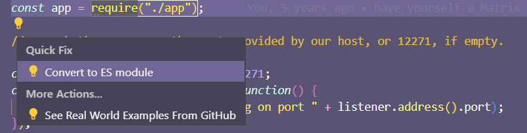

One of Deno's core strengths is a unified toolchain that comes with support for
TypeScript out of the box, and tools like a linter, formatter and a test runner.
Switching to Deno allows you to simplify your toolchain and reduces the number
of moving components in your project. Deno also has a more secure runtime, with
[runtime permissions](../basics/permissions.md) that allow you to control what
your code can access.

This guide will walk you through migrating your Node.js project to Deno and
offer some optional suggestions of ways to optimize your codebase.

## Module imports and exports

Deno supports [ECMAScript modules](../basics/modules/index.md) exclusively. If
your Node.js code uses
[`require`](https://nodejs.org/api/modules.html#modules-commonjs-modules), you
should update it to use `import` statements instead. If your internal code uses
CommonJS-style exports, those will also need to be updated.

A typical CommonJS-style project might look similar to this:

```js title="add_numbers.js"
module.exports = function addNumbers(num1, num2) {
  return num1 + num2;
};
```

```js title="index.js"
const addNumbers = require("./add_numbers");
console.log(addNumbers(2, 2));
```

To convert these to [ECMAScript modules](../basics/modules/index.md), we'll make
a few minor changes:

```js title="add_numbers.js"
export function addNumbers(num1, num2) {
  return num1 + num2;
}
```

```js title="index.js"
import { addNumbers } from "./add_numbers.js";
console.log(addNumbers(2, 2));
```

Exports:

| CommonJS                             | ECMAScript modules                 |
| ------------------------------------ | ---------------------------------- |
| `module.exports = function add() {}` | `export default function add() {}` |
| `exports.add = function add() {}`    | `export function add() {}`         |

Imports:

| CommonJS                                   | ECMAScript modules                       |
| ------------------------------------------ | ---------------------------------------- |
| `const add = require("./add_numbers");`    | `import add from "./add_numbers.js";`    |
| `const { add } = require("./add_numbers")` | `import { add } from "./add_numbers.js"` |

### Quick fix with VS Code

If you are using VS Code, you can use its built-in feature to convert CommonJS
to ES6 modules. Right-click on the `require` statement, or the lightbulb icon
and select `Quick Fix` and then `Convert to ES module`.



### CommonJS vs ECMAScript resolution

An important distinction between the two module systems is that ECMAScript
resolution requires the full specifier **including the file extension**.
Omitting the file extension, and special handling of `index.js`, are features
unique to CommonJS. The benefit of the ECMAScript resolution is that it works
the same across the browser, Deno, and other runtimes.

| CommonJS             | ECMAScript modules            |
| -------------------- | ----------------------------- |
| `"./add_numbers"`    | `"./add_numbers.js"`          |
| `"./some/directory"` | `"./some/directory/index.js"` |

:::tip

Deno can add all the missing file extensions for you by running
`deno lint --fix`. Deno's linter comes with a `no-sloppy-imports` rule that will
show a linting error when an import path doesn't contain the file extension.

:::

## Node.js built-ins

In Node.js 20 and earlier, built-in modules in the Node.js standard library
could be imported with "bare specifiers". Consider the Node program below with a
`.mjs` extension:

```js title="index.mjs"
import * as os from "os";
console.log(os.cpus());
```

The [`os` module](https://nodejs.org/api/os.html#oscpus) is built in to the
Node.js runtime, and can be imported using a bare specifier as above.

:::info .mjs extensions not required in Deno

The `.mjs` file extension is supported but not required in Deno. Because Node
doesn't support ESM by default, it requires you to name any files that use ESM
with a `.mjs` file extension.

:::

Deno provides a compatibility layer that allows the use of Node.js built-in APIs
within Deno programs. However, in order to use them, you will need to add the
[`node:` specifier](./node_specifiers.md) to any import statements that use
them.

For example - if you update the code above to be this instead:

```js
import * as os from "node:os";
console.log(os.cpus());
```

And run it with `deno run index.mjs` - you will notice you get the same output
as running the program in Node.js. Updating any imports in your application to
use `node:` specifiers should enable any code using Node built-ins to function
as it did in Node.js.

## Runtime permissions in Deno

Consider the following simple [Express](https://expressjs.com/) server:

```js
import express from "npm:express@4";

const app = express();

app.get("/", function (_req, res) {
  res.send("hello");
});

app.listen(3000, () => {
  console.log("Express listening on :3000");
});
```

If you run the above with `deno run server.js`, you would be prompted for
permissions required to execute the code and its dependencies.

```sh
$ deno run server.js
┌ ⚠️  Deno requests net access to "0.0.0.0:8000".
├ Requested by `Deno.listen()` API.
├ Run again with --allow-net to bypass this prompt.
└ Allow? [y/n/A] (y = yes, allow; n = no, deny; A = allow all net permissions) >
```

Deno features [runtime security by default](../basics/permissions.md), meaning
that you as the developer must opt in to giving your code access to the
filesystem, network, system environment, and more. Doing this prevents supply
chain attacks and other potential vulnerabilities in your code. By comparison,
Node.js has no concept of runtime security, with all code executed with the same
level of permission as the user running the code.

To run your code like it would in Node.js, you can pass the `-A` flag to enable
all permissions.

```sh
deno run -A server.js
```

For more granular control, you can enable access to specific features by opting
in to [individual permissions](../basics/permissions.md).

## Running scripts from `package.json`

You can continue to use your existing npm scripts with Deno, by using the
[`deno task`](../tools/task_runner.md) subcommand. Consider the following
Node.js project with a script called `start` inside its `package.json`.

```json title="package.json"
{
  "name": "my-project",
  "scripts": {
    "start": "eslint"
  }
}
```

You can execute this script with Deno by running:

```sh
deno task start
```

## Node.js global objects

In Node.js, there are a number of
[global objects](https://nodejs.org/api/globals.html) available in the scope of
all programs, like the `process` object, `Buffer`, or `__dirname` and
`__filename`.

Deno does not add additional objects and variables to the global scope, other
than the [`Deno` global](../runtime/builtin_apis.md). Any API that doesn't exist
as a web-standard browser API will be found in `Deno`. Alternatively, you can
import Node.js built-in modules using the `node:` specifier.

```js
import process from "node:process";
import { Buffer } from "node:buffer";

const __filename = import.meta.filename;
const __dirname = import.meta.dirname;
```

:::note

If you do run into a problem with Node.js compatibility, please let us know by
[opening an issue on GitHub](https://github.com/denoland/deno/issues).

:::

## Optional improvements - deno.json

Deno has its own config file, `deno.json` or `deno.jsonc`, which can be used to
configure your project. You can use it to define tasks, dependencies, path
mappings, and other runtime configurations.

### Migrating npm scripts to `deno.json`

If preferred, you can move your npm scripts over to `deno.json`, where they can
be run using `deno task`. This allows you to manage all necessary permission
flags and other runtime configuration in one place.

```json
{
  "tasks": {
    "dev": "deno run --allow-net --allow-read --allow-env server.js"
  }
}
```

```sh
deno task dev
```

### Migrating npm dependencies to `deno.json`

You can also migrate your dependencies over to `deno.json`. Deno supports
importing dependencies from external package repositories, local files, and/or
URLs. To import your npm dependencies, you can add them to the `imports` field
in `deno.json`, and add the `npm:` specifier to the import path:

```json
{
  "imports": {
    "express": "npm:express@4"
  }
}
```

Deno supports multiple package registries and allows you to import dependencies
from npm, [JSR](https://jsr.io) and HTTP URLs.

```json
{
  "imports": {
    "express": "npm:express@4",
    "@luca/cases": "jsr:@luca/cases@1",
    "foo": "https://example.com/foo.ts"
  }
}
```

## Optional improvements - Linting

Deno ships with a built-in linter that is written with performance in mind. Deno
can lint large projects in just a few milliseconds. You can try it out on your
project by running:

```sh
deno lint
```

This will lint all files in your project. When the linter detects a problem, it
will show the line in your editor and in the terminal output. An example of what
that might look like:

```sh
error[no-constant-condition]: Use of a constant expressions as conditions is not allowed.
 --> /my-project/bar.ts:1:5
  | 
1 | if (true) {
  |     ^^^^
  = hint: Remove the constant expression

  docs: https://lint.deno.land/rules/no-constant-condition


Found 1 problem
Checked 4 files
```

Many linting issues can be fixed automatically by passing the `--fix` flag:

```sh
deno lint --fix
```

A full list of all supported linting rules can be found on
[https://lint.deno.land/](https://lint.deno.land/). To learn more about how to
configure the linter, check out the [`deno lint` subcommand](../tools/linter/).

## Optional improvements - Formatting

Deno ships with a [built-in formatter](../tools/formatter/) that can optionally
format your code according to the Deno style guide. You can run the formatter on
your project by running:

```sh
deno fmt
```

If using `deno fmt` in CI, you can pass the `--check` argument to make the
formatter exit with an error when it detects improperly formatted code.

```sh
deno fmt --check
```

The formatting rules can be configured in your `deno.json` file. To learn more
about how to configure the formatter, check out the
[`deno fmt` subcommand](../tools/formatter/).

## Optional improvements - Testing

Deno encourages writing tests for your code, and provides a built-in test runner
to make it easy to write and run tests. The test runner is tightly integrated
into Deno, so that you don't have to do any additional configuration to make
TypeScript or other features work.

```ts title="my_test.ts"
Deno.test("my test", () => {
  // Your test code here
});
```

```sh
deno test
```

When passing the `--watch` flag, the test runner will automatically reload when
any of the imported modules change.

To learn more about the test runner and how to configure it, check out the
[`deno test` subcommand](../tools/test/) documentation.
