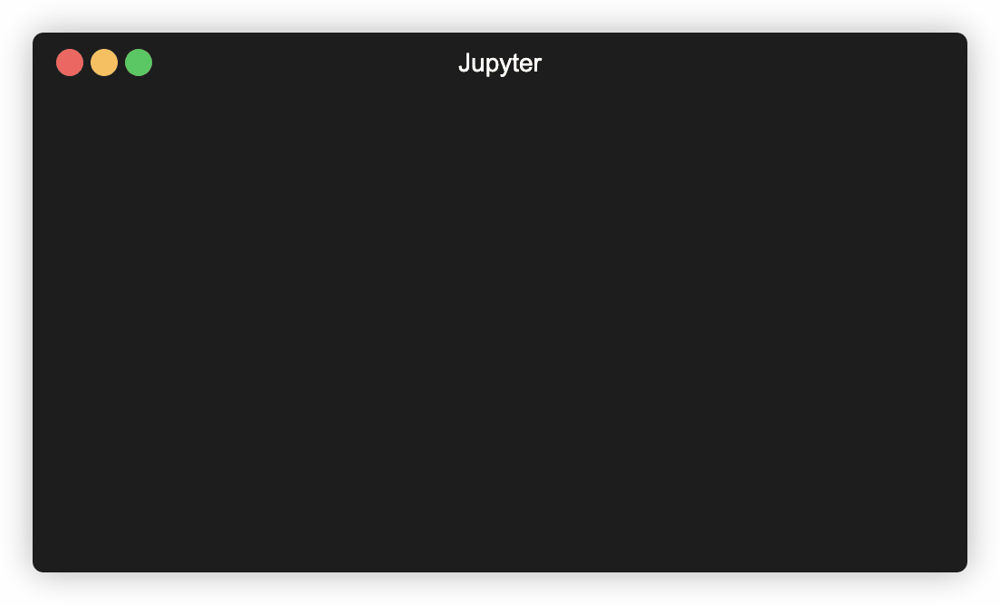

Deno ships with a built-in Jupyter kernel that allows you to write JavaScript
and TypeScript; use Web and Deno APIs and import `npm` packages straight in your
interactive notebooks.

:::caution `deno jupyter` always runs with `--allow-all`

Currently all code executed in the Jupyter kernel runs with `--allow-all` flag.
This is a temporary limitation and will be addressed in the future.

:::

## Quickstart

Run `deno jupyter --unstable` and follow the instructions.

You can run `deno jupyter --unstable --install` to force installation of the
kernel. Deno assumes that `jupyter` command is available in your `PATH`.

After completing the installation process, the Deno kernel will be available in
the notebook creation dialog in JupyterLab and the classic notebook:


You can use the Deno Jupyter kernel in any editor that supports Jupyter
notebooks.

### VS Code

- Install the
  [VSCode Jupyter extension](https://marketplace.visualstudio.com/items?itemName=ms-toolsai.jupyter)
- Open or create a notebook file by opening the Command Palette (Ctrl+Shift+P)
  and selecting "Create: New Jupyter Notebook". This can be done manually by
  creating a file with the ".ipynb" file extension.
- When on a new or existing Notebook, click creating a new Jupyter Notebook
  select "Jupyter kernels" and then select Deno


### JetBrains IDEs

Jupyter Notebooks are available right out of the box.

## Rich content output

`Deno.jupyter` namespaces provides helper function for displaying rich content
in your notebooks
[using MIME types that Jupyter supports](https://docs.jupyter.org/en/latest/reference/mimetype.html).

---

The easiest way to provide a rich output is to return an object that that has a
`[Symbol.for("Jupyter.display")]` method.

This method should return a dictionary mapping a MIME type to a value that
should be displayed.

```ts
{
  [Symbol.for("Jupyter.display")]() {
    return {
      // Plain text content
      "text/plain": "Hello world!",

      // HTML output
      "text/html": "<h1>Hello world!</h1>",
    }
  }
}
```

_Example of an object that returns plain text and HTML output._

:::info

You can also use `Deno.jupyter.$display` instead of typing
`Symbol.for("Jupyter.display")`

:::

This is a regular function, so you you can use any library you want to format
the output - eg. use `@std/fmt/colors` to provide a colorful output:

```ts
import * as colors from "jsr:@std/fmt/colors";

{
  [Deno.jupyter.$display]() {
    return {
      "text/plain": colors.green("Hello world"),
    }
  }
}
```

You can also use `Deno.jupyter.display` function to directly display the MIME
bundle:

```js
await Deno.jupyter.display({
  "text/plain": "Hello, world!",
  "text/html": "<h1>Hello, world!</h1>",
  "text/markdown": "# Hello, world!",
}, { raw: true });
```


Your notebook frontend will automatically select the "richest" MIME type to
display based on its capabilities.

---

`Deno.jupyter` provides several helper methods for rich output of common media
types.

`Deno.jupyter.html` is a tagged template that will render provided string as an
HTML in the notebook.

```js
Deno.jupyter.html`<h1>Hello, world!</h1>
<h2>From Deno kernel</h2>
<p>Lorem ipsum <i>dolor</i> <b>sit</b> <u>amet</u></p>`;
```


`Deno.jupyter.md` is a tagged template that will render provided string as a
Markdown document in the notebook.

```js
Deno.jupyter
  .md`# Notebooks in TypeScript via Deno 

**Interactive compute with Jupyter _built into Deno_!**`;
```


`Deno.jupyter.svg` is a tagged template that will render provided string as an
SVG figure in the notebook.

```js
Deno.jupyter.svg`<svg xmlns="http://www.w3.org/2000/svg" viewBox="0 0 100 100">
      <circle cx="50" cy="50" r="40" stroke="green" stroke-width="4" fill="yellow" />
    </svg>`;
```


## prompt and confirm APIs

You can use `prompt` and `confirm` Web APIs to wait for user input in your
notebook.

<figure>

<video class="w-full" alt="`confirm` and `prompt` APIs example" autoplay muted loop playsinline controls src="../images/jupyter-confirm-prompt.mp4"></video>

<figcaption><span style="font-family: monospace;">confirm</span> and <span style="font-family: monospace;">prompt</span> APIs example</figcaption>

</figure>

## IO pub channel broadcasting

`Deno.jupyter.broadcast` allows to publish messages to the IO pub channel
allowing to provide live updates as the cell is evaluated.

Consider this example that prints a message before we start a compution and
another when the computation is finished:

```js
await Deno.jupyter.broadcast("display_data", {
  data: { "text/html": "<b>Processing...</b>" },
  metadata: {},
  transient: { display_id: "progress" },
});

// Pretend we're doing an expensive compute
await new Promise((resolve) => setTimeout(resolve, 1500));

await Deno.jupyter.broadcast("update_display_data", {
  data: { "text/html": "<b>Done</b>" },
  metadata: {},
  transient: { display_id: "progress" },
});
```

<figure>

<video class="w-full" alt="`Deno.jupyter.broadcast` API example" autoplay muted loop playsinline controls src="../images/jupyter-broadcast.mp4"></video>

<figcaption><span style="font-family: monospace;">Deno.jupyter.broadcast</span> API example</figcaption>

</figure>

## Examples

Here's an example of using `@observablehq/plot` to generate a chart:

```ts
import { document, penguins } from "jsr:@ry/jupyter-helper";
import * as Plot from "npm:@observablehq/plot";

let p = await penguins();

Plot.plot({
  marks: [
    Plot.dot(p.toRecords(), {
      x: "culmen_depth_mm",
      y: "culmen_length_mm",
      fill: "species",
    }),
  ],
  document,
});
```


See https://github.com/rgbkrk/denotebooks for more advanced examples leveraging
data analysis and visualisation libraries like Polars, Observable and d3.

## `jupyter console` integration

You can also use Deno Jupyter kernel in the `jupyter console` REPL. To do that,
you should launch your console with `jupyter console --kernel deno`.


