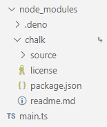

Deno has native support for importing npm packages. This is done using `npm:`
specifiers. For example:

```ts title="main.js"
import * as emoji from "npm:node-emoji";

console.log(emoji.emojify(`:sauropod: :heart:  npm`));
```

Can be run with:

```sh
$ deno run main.js
🦕 ❤️ npm
```

No `npm install` is necessary before the `deno run` command and no
`node_modules` folder is created. These packages are also subject to the same
[permissions](/runtime/fundamentals/security/) as other code in Deno.

npm specifiers have the following format:

```console
npm:<package-name>[@<version-requirement>][/<sub-path>]
```

For examples with popular libraries, please refer to the
[tutorial section](/runtime/tutorials).

## TypeScript types

Many npm packages ship with types, you can import these and use them with types
directly:

```ts
import chalk from "npm:chalk@5";
```

Some packages do not ship with types but you can specify their types with the
[`@deno-types`](/runtime/fundamentals/typescript) directive. For example, using
a
[`@types`](https://www.typescriptlang.org/docs/handbook/2/type-declarations.html#definitelytyped--types)
package:

```ts
// @deno-types="npm:@types/express@^4.17"
import express from "npm:express@^4.17";
```

### Module resolution

The official TypeScript compiler `tsc` supports different
[moduleResolution](https://www.typescriptlang.org/tsconfig#moduleResolution)
settings. Deno only supports the modern `node16` resolution. Unfortunately many
NPM packages fail to correctly provide types under node16 module resolution,
which can result in `deno check` reporting type errors, that `tsc` does not
report.

If a default export from an `npm:` import appears to have a wrong type (with the
right type seemingly being available under the `.default` property), it's most
likely that the package provides wrong types under node16 module resolution for
imports from ESM. You can verify this by checking if the error also occurs with
`tsc --module node16` and `"type": "module"` in `package.json` or by consulting
the [Are the types wrong?](https://arethetypeswrong.github.io/) website
(particularly the "node16 from ESM" row).

If you want to use a package that doesn't support TypeScript's node16 module
resolution, you can:

1. Open an issue at the issue tracker of the package about the problem. (And
   perhaps contribute a fix :) (Although, unfortunately, there is a lack of
   tooling for packages to support both ESM and CJS, since default exports
   require different syntaxes. See also
   [microsoft/TypeScript#54593](https://github.com/microsoft/TypeScript/issues/54593))
2. Use a [CDN](/runtime/fundamentals/modules/#url_imports), that rebuilds the
   packages for Deno support, instead of an `npm:` identifier.
3. Ignore the type errors you get in your code base with `// @ts-expect-error`
   or `// @ts-ignore`.

### Including Node types

Node ships with many built-in types like `Buffer` that might be referenced in an
npm package's types. To load these you must add a types reference directive to
the `@types/node` package:

```ts
/// <reference types="npm:@types/node" />
```

Note that it is fine to not specify a version for this in most cases because
Deno will try to keep it in sync with its internal Node code, but you can always
override the version used if necessary.

### npm executable scripts

npm packages with `bin` entries can be executed from the command line without an
`npm install` using a specifier in the following format:

```console
npm:<package-name>[@<version-requirement>][/<binary-name>]
```

For example:

```sh
$ deno run --allow-read npm:cowsay@1.5.0 Hello there!
 ______________
< Hello there! >
 --------------
        \   ^__^
         \  (oo)\_______
            (__)\       )\/\
                ||----w |
                ||     ||

$ deno run --allow-read npm:cowsay@1.5.0/cowthink What to eat?
 ______________
( What to eat? )
 --------------
        o   ^__^
         o  (oo)\_______
            (__)\       )\/\
                ||----w |
                ||     ||
```

### --node-modules-dir flag

npm specifiers resolve npm packages to a central global npm cache. This works
well in most cases and is ideal since it uses less space and doesn't require a
`node_modules` directory. That said, you may find cases where an npm package
expects itself to be executing from a `node_modules` directory. To improve
compatibility and support those packages, you can use the `--node-modules-dir`
flag.

For example, given `main.ts`:

```ts
import chalk from "npm:chalk@5";

console.log(chalk.green("Hello"));
```

```sh
deno run --node-modules-dir main.ts
```

Running the above command, with a `--node-modules-dir` flag, will create a
`node_modules` folder in the current directory with a similar folder structure
to npm:



This is done automatically when calling `deno run`, no separate install command
necessary.

Alternatively, if you wish to disable the creation of a `node_modules` directory
entirely, you can set this flag to `"none"` (ex. `--node-modules-dir=none`) or
add a `"nodeModulesDir": "none"` entry to your deno.json configuration file to
make the setting apply to the entire directory tree.

In the case where you want to modify the contents of the `node_modules`
directory before execution, you can run `deno install` with
`--node-modules-dir`, modify the contents, then run the script.

For example:

```sh
deno install --node-modules-dir --entrypoint main.ts
deno run --allow-read=. --allow-write=. scripts/your_script_to_modify_node_modules_dir.ts
deno run --node-modules-dir main.ts
```

## Private registries

:::caution

Not to be confused with
[private repositories and modules](/runtime/manual/advanced/private_repositories/).

:::

Deno supports private registries, which allow you to host and share your own
modules. This is useful for organizations that want to keep their code private
or for individuals who want to share their code with a select group of people.

### What are private registries?

Large organizations often host their own private npm registries to manage
internal packages securely. These private registries serve as repositories where
organizations can publish and store their proprietary or custom packages. Unlike
public npm registries, private registries are accessible only to authorized
users within the organization.

### How to use private registries with Deno

First, configure your
[`.npmrc`](https://docs.npmjs.com/cli/v10/configuring-npm/npmrc) file to point
to your private registry. The `.npmrc` file must be in the project root or
`$HOME` directory. Add the following to your `.npmrc` file:

```sh
@mycompany:registry=http://mycompany.com:8111/
//mycompany.com:8111/:_auth=secretToken
```

Replace `http://mycompany.com:8111/` with the actual URL of your private
registry and `secretToken` with your authentication token.

Then update Your `deno.json` or `package.json` to specify the import path for
your private package. For example:

```json title="deno.json"
{
  "imports": {
    "@mycompany/package": "npm:@mycompany/package@1.0.0"
  }
}
```

or if you're using a `package.json`:

```json title="package.json"
{
  "dependencies": {
    "@mycompany/package": "1.0.0"
  }
}
```

Now you can import your private package in your Deno code:

```typescript title="main.ts"
import { hello } from "@mycompany/package";

console.log(hello());
```

and run it using the `deno run` command:

```sh
deno run main.ts
```
