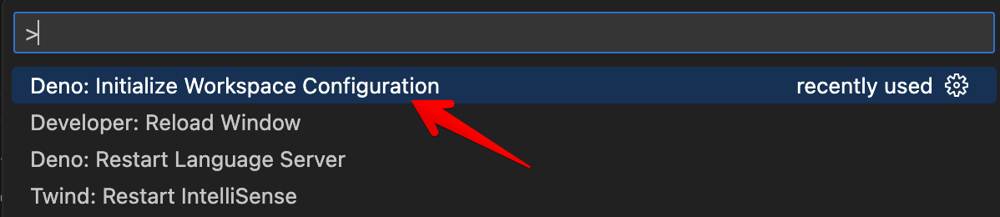
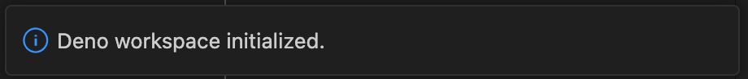

This page covers developing Deno applications using
[Visual Studio Code](https://code.visualstudio.com/) and the official
[vscode_deno](https://marketplace.visualstudio.com/items?itemName=denoland.vscode-deno)
extension.

## Installation

The Deno VS Code extension integrates directly with the Deno CLI using the
[language server protocol](/runtime/reference/lsp_integration/). This helps
ensure that the information you get about your code aligns to how that code will
work when you run it with the Deno CLI.

The Deno extension is installed like other extensions in VS Code. Search for
`Deno` in the extensions tab of VS Code and click the **install** button, or
[this link](vscode:extension/denoland.vscode-deno) will open the extension page
where you can choose to install.

Once you install the extension for the first time, you should receive a splash
page that welcomes you to the extension. (If you missed it, or want to see it
again, <kbd>⌘</kbd> <kbd>⇧</kbd> <kbd>P</kbd> to open the command palette, and
run the **Deno: Welcome** command.)

## Enabling Deno in a VS Code workspace

We realize that not every project you might work on in VS Code is a Deno
project. By default, VS Code comes with a built-in TypeScript/JavaScript
language service which is used when editing TypeScript or JavaScript files.

In order to have support for Deno APIs, as well as the ability to resolve
modules as the Deno CLI does, you need to enable Deno for the workspace. The
most direct way to do this is to use the **Deno: Initialize Workspace
Configuration** from the VS Code
[command palette](https://code.visualstudio.com/docs/getstarted/userinterface#_command-palette).



This command will add `"deno.enable": true` to the workspace configuration (your
workspace root `.vscode/settings.json`). Once the command is finished, you will
get a notification that Deno workspace is initialized.



These settings (and other settings) are available via the VS Code
[settings](https://code.visualstudio.com/docs/getstarted/userinterface#_settings)
panel. In the panel the setting is **Deno: Enable**.

:::note

VS Code has user and workspace settings. You probably don't want to enable Deno
in the **user** settings, instead set it in **workspace** settings, or by
default every workspace will be Deno enabled.

:::

### Workspace folder settings

These are the settings that can be set on a workspace folder. The rest of the
settings currently only apply to the workspace:

- `deno.enable` - Controls if the Deno Language Server is enabled. When enabled,
  the extension will disable the built-in VS Code JavaScript and TypeScript
  language services, and will use the Deno language server instead. _boolean,
  default `false`_
- `deno.enablePaths` - Controls if the Deno Language Server is enabled for only
  specific paths of the workspace folder. Defaults to an empty list.
- `deno.codeLens.test` - Controls if the test code lens is enabled. _boolean,
  default `true`_
- `deno.codeLens.testArgs` - The list of arguments that are passed to
  `deno test` when activating a test code lens. _string array, default
  `["--allow-all"]`_

When a project is enabled, the extension will get information directly from the
installed Deno CLI. The extension will also mute the built-in
TypeScript/JavaScript extension.

## Partially enabling Deno in a VS Code workspace

In a workspace (or workspace folder), sub-paths can be enabled for Deno, while
code outside those paths will be not be enabled and the VS Code built-in
JavaScript/TypeScript language server will be used. Use the **Deno: Enable
Paths** setting (or `deno.enablePaths` if manually editing)

For example if you have a project like this:

```console
project
├── worker
└── front_end
```

Where you only want to enable the `worker` path (and its subpaths) to be Deno
enabled, you will want to add `./worker` to the list of **Deno: Enable Paths**
in the configuration.

## Mixed-Deno projects

With this feature, you can have a mixed Deno project, where some of the
workspace folders are Deno enabled and some are not. This is useful when
creating a project that might have a front-end component, where you want a
different configuration for that front end code.

In order to support this, you would create a new workspace (or add a folder to
an existing workspace) and in the settings configure one of the folders to have
`deno.enable` set to `true` and one set to `false`. Once you save the workspace
configuration, you notice that the Deno language server only applies diagnostics
to the enabled folders, while the other folder will use the built-in TypeScript
compiler of VS Code to supply diagnostics for TypeScript and JavaScript files.

## Linting

The same engine that provides the diagnostics when using `deno lint` can also be
used via the extension. By enabling the **Deno: Lint** setting in the settings
panel (or `deno.lint` if editing settings in JSON) the editor will start to
display lint "warnings" in your code. See the
[Linter](/runtime/reference/cli/linter/) section for more information on how to
use the Deno linter.

## Using a configuration file

A configuration file is not required for a Deno project, but there are a few
scenarios though where it might be useful. If you want to have the same settings
applied as when specifying the `--config` option on the command line, the
**Deno: Config** option can be used (or `deno.config` if manually editing).

The Deno extension will also auto-identify and apply a `deno.jsonc` or
`deno.json` by looking in the workspace root for the configuration file and
applying it. Manually specifying a **Deno: Config** option will override this
automatic behavior.

## Formatting

The Deno CLI comes with a
[built-in formatter](/runtime/reference/cli/formatter/) which can be accessed
using `deno fmt` but can also be configured to be used by VS Code. `Deno` should
be on the drop down list for the **Editor: Default formatter** setting (or if
you are editing settings manually, it would be
`"editor.defaultFormatter": "denoland.vscode-deno"`).

## Setting a path to the Deno CLI

The extension looks for the Deno CLI executable in the host's `PATH`, but
sometimes that isn't desirable and the **Deno: Path** can be set (or `deno.path`
if manually editing) to point to the Deno executable. If the path provided is
relative, it will be resolved relative to the root of the workspace.

## Import suggestions

When attempting to import a module, the extension will offer suggestions to
complete the import. Local relative files will be included in the suggestions,
plus any cached remote files.

The extension supports registry auto-completions, where a remote
registry/website of modules can optionally provide metadata that allows a client
to discover modules. By default, the extension will check hosts/origins to see
if they support suggestions, and if it does, the extension will prompt you to
see if you want to enable it. This behavior can be changed by unchecking the box
under **Deno > Suggest > Imports: Auto Discover** in Settings. (or
`deno.suggest.imports.autoDiscover` if manually editing).

Individual hosts/origins can be enabled or disabled by editing the **Deno >
Suggest > Imports: Hosts** setting - `deno.suggest.imports.hosts` in the
appropriate `settings.json`.

## Caching remote modules

Deno supports remote modules and will fetch remote modules and store them
locally in a cache. When you do something like `deno run`, `deno test`,
`deno info` or `deno install` on the command line, the Deno CLI will go and try
to fetch any remote modules and their dependencies and populate the cache.

While developing code in the editor, if the module is not in the cache, you will
get a diagnostic such as
`Uncached or missing remote URL: "https://deno.land/example/mod.ts"` for any
missing remote modules. Deno will not automatically try to cache the module,
unless it is a completion from a registry import suggestion (see above).

In addition to running a command on a command line, the extension provides ways
to cache dependencies within the editor. A missing dependency will have a _quick
fix_ which is to have Deno try to cache the dependency. Fixes can be accessed by
pressing <kbd>CTRL</kbd> <kbd>.</kbd> or <kbd>⌘</kbd> <kbd>.</kbd> when the
editor is positioned in the import specifier, or hovering over the specifier and
selecting **Quick Fix...**.

There is also the **Deno: Cache Dependencies** command in the command palette
which will attempt to cache any dependencies of the module currently active in
the editor.

## Code lenses

The language server currently supports several code lenses (actionable
contextual information interspersed in the code) that allow you to get greater
insight into the code. Most are disabled by default, but can easily be enabled:

### Deno > Code Lens: Implementations

`deno.codeLens.implementations` - Provides a lens that will list out any
implementations of an item elsewhere in the code.

### Deno > Code Lens: References

`deno.codeLens.references` - Provides a lens that will list out any references
to an item elsewhere in the code.

### Deno > Code Lens: References All Functions

`deno.codeLens.referencesAllFunctions` - Provides a lens that will list out all
references to all functions in the code. All functions are excluded from the
_References_ setting mentioned above.

### Testing code lens

The Deno CLI includes a
[built-in testing API](/runtime/reference/lsp_integration/#testing) available
under `Deno.test`. The extension and language server have a code lens enabled by
default which provides the ability to run a test from within the editor.

When you have a block of code that provides a test:

```ts
import { assert } from "jsr:@std/assert@1";

Deno.test({
  name: "a test case",
  fn() {
    let someCondition = true;
    assert(someCondition);
  },
});
```

You will see a code lens just above the test:

```console
▶ Run Test
```

If you click on the code lens, the extension will start up the Deno CLI to run
the test for you and display the output. Based on your other settings, the
extension will try to run your test with the same settings. If you need to
adjust the arguments provided when doing `deno test`, you can do so by setting
the `deno.codeLens.testArgs` setting.

The extension will also try to track if in the same module you destructure the
`Deno.test` function or assign it to a variable. So you can do something like
this and still have the code lens work:

```ts
const { test: denoTest } = Deno;

denoTest({
  name: "example test",
  fn() {},
});
```

If you want to disable this feature, you can do so by un-setting the **Deno >
CodeLens: Test** setting - `deno.codeLens.test`.

You can run tests from the Test Explorer view, from the code lens decorations,
or via the command palette. You can also use the filter function in the Text
Explorer view to exclude certain tests from a test run.

When a test fails, the failure message, including the stack trace, will be
available when inspecting the test results in VS Code.

### Test Configuration

By default, tests are executed in a similar fashion to if you were to use
`deno test --allow-all` on the command line. These default arguments can be
changed by setting the **Deno > Testing: Args** option in your user or workspace
settings (or `deno.testing.args` if you are configuring manually). Add
individual arguments here which you would have used with the `deno test`
subcommand.

Based on other settings that you have, those options will be automatically
merged into the "command line" used when running tests unless explicitly
provided in the **Deno > Testing: Args** setting.

## Using the debugger

The extension provides integration with the built-in VS Code debugger. You can
generate a configuration by: going to `Run and Debug` panel, clicking
`create a launch.json file` and selecting `Deno` option from the available
debugger options.

## Tasks

While the extension communicates directly with the language server, there are
times when you might prefer to run Deno commands via the CLI. You can define
tasks in a `deno.json` file in the root of your workspace in a
[`tasks` field](/runtime/fundamentals/configuration/#tasks).

## Using a development container

Using a
[development container](https://code.visualstudio.com/docs/remote/containers)
with VS Code is a great way to have an isolated development environment without
having to worry about having to install the Deno CLI on your local system. Deno
supports development containers and the Deno extension will work with them.

If you have an existing Deno project that you would like to add dev container
support to, execute **Remote-Containers: Add Development Container Configuration
Files...** in the command palette, choose **Show All Definitions...** and then
search for the `Deno` definition. This will setup a baseline `.devcontainer`
configuration, which will install the latest version of the Deno CLI in the
container.

Once added, VS Code will prompt if you want to open the project in a dev
container. If you choose to, VS Code will build the development container and
re-open the workspace using the development container, which will have the Deno
CLI and the `vscode_deno` extension installed in it.

## Troubleshooting

The following sections cover challenges you might face when using the extension
and try to give likely causes.

### Errors/diagnostics

`An import path cannot end with a '.ts' extension.` or
`Cannot find name 'Deno'.`

This is normally a situation where Deno is not enabled on a Deno project. If you
look at the source of the diagnostic you are probably going to see a `ts(2691)`.
The `ts` indicates that it is coming from the built-in TypeScript/JavaScript
engine in VS Code. You will want to check that your configuration is set
properly and the **Deno: Enable** setting - `deno.enable` is true.

You can also check what the Deno language server thinks is your current active
configuration by using **Deno: Language Server Status** from the command
palette. This will display a document from the language server with a section
named "Workspace Configuration". This will give you the configuration as
reported by VS Code to the language server.

Also check if the VS Code configuration called `enableProjectDiagnostics`,
located in **TypeScript › Tsserver › Experimental: Enable Project Diagnostics**
is **disabled**. This setting allows TypeScript language server to execute in
the background to check the entire project at once and Deno cannot disable its
behavior so the errors keep showing even when all other settings are correctly
set.

If `"enable"` is set to `true` in there, and the error message still persists,
you might want to try restarting VS Code, as the part of the extension that
"mutes" the built-in TypeScript diagnostics for files is not working as
designed. If the issue still persists after a restart, you may have encountered
a bug that we didn't expect and searching the issues and reporting a bug at
https://github.com/denoland/vscode_deno is the next step.
