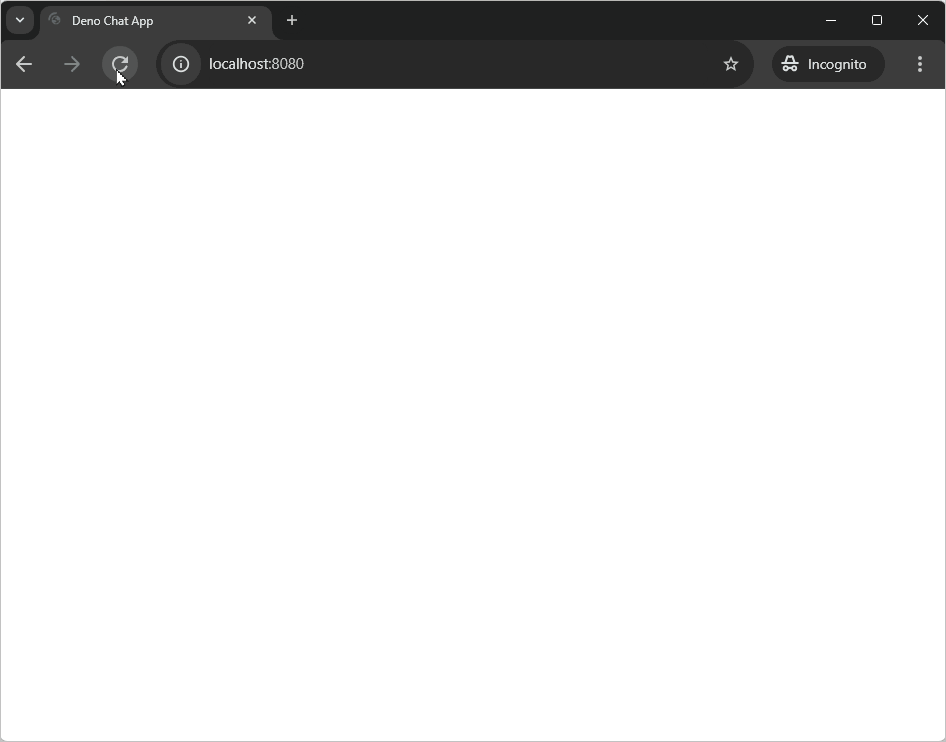

WebSockets are a powerful tool for building real-time applications. They allow
for bidirectional communication between the client and server without the need
for constant polling. A frequent use case for WebSockets are chat applications.

In this tutorial we'll create a simple chat app using Deno and the built in
[WebSockets API](/api/web/websockets). The chat app will allow multiple chat
clients to connect to the same backend and send group messages. After a client
enters a username, they can then start sending messages to other online clients.
Each client also displays the list of currently active users.

You can see the
[finished chat app on GitHub](https://github.com/denoland/tutorial-with-websockets).



## Initialize a new project

First, create a new directory for your project and navigate into it.

```sh
deno init chat-app
cd deno-chat-app
```

## Build the backend

We'll start by building the backend server that will handle the WebSocket
connections and broadcast messages to all connected clients. We'll use the
[`oak`](https://jsr.io/@oak/oak) middleware framework to set up our server,
clients can connect to the server, send messages and receive updates about other
connected users. Additionally the server will serve the static HTML, CSS and
JavaScript files that make up the chat client.

### Import dependencies

First, we'll need to import the necessary dependencies. Use the `deno add`
command to add Oak to your project:

```sh
deno add jsr:@oak/oak
```

### Set up the server

In your `main.ts` file, add the following code:

```ts title="main.ts"
import { Application, Context, Router } from "@oak/oak";
import ChatServer from "./ChatServer.ts";

const app = new Application();
const port = 8080;
const router = new Router();
const server = new ChatServer();

router.get("/start_web_socket", (ctx: Context) => server.handleConnection(ctx));

app.use(router.routes());
app.use(router.allowedMethods());
app.use(async (context) => {
  await context.send({
    root: Deno.cwd(),
    index: "public/index.html",
  });
});

console.log("Listening at http://localhost:" + port);
await app.listen({ port });
```

Next, create a new file called `ChatServer.ts` in the same directory as your
`main.ts` file. In this file we'll put the logic for handling the WebSocket
connections:

```ts title="ChatServer.ts"
import { Context } from "@oak/oak";

type WebSocketWithUsername = WebSocket & { username: string };
type AppEvent = { event: string; [key: string]: any };

export default class ChatServer {
  private connectedClients = new Map<string, WebSocketWithUsername>();

  public async handleConnection(ctx: Context) {
    const socket = await ctx.upgrade() as WebSocketWithUsername;
    const username = ctx.request.url.searchParams.get("username");

    if (this.connectedClients.has(username)) {
      socket.close(1008, `Username ${username} is already taken`);
      return;
    }

    socket.username = username;
    socket.onopen = this.broadcastUsernames.bind(this);
    socket.onclose = () => {
      this.clientDisconnected(socket.username);
    };
    socket.onmessage = (m) => {
      this.send(socket.username, m);
    };
    this.connectedClients.set(username, socket);

    console.log(`New client connected: ${username}`);
  }

  private send(username: string, message: any) {
    const data = JSON.parse(message.data);
    if (data.event !== "send-message") {
      return;
    }

    this.broadcast({
      event: "send-message",
      username: username,
      message: data.message,
    });
  }

  private clientDisconnected(username: string) {
    this.connectedClients.delete(username);
    this.broadcastUsernames();

    console.log(`Client ${username} disconnected`);
  }

  private broadcastUsernames() {
    const usernames = [...this.connectedClients.keys()];
    this.broadcast({ event: "update-users", usernames });

    console.log("Sent username list:", JSON.stringify(usernames));
  }

  private broadcast(message: AppEvent) {
    const messageString = JSON.stringify(message);
    for (const client of this.connectedClients.values()) {
      client.send(messageString);
    }
  }
}
```

This code sets up a `handleConnection` method that is called when a new
WebSocket connection is established. It receives a Context object from the Oak
framework and upgrades it to a WebSocket connection. It extracts the username
from the URL query parameters. If the username is already taken (i.e., exists in
connectedClients), it closes the socket with an appropriate message. Otherwise,
it sets the username property on the socket, assigns event handlers, and adds
the socket to `connectedClients`.

When the socket opens, it triggers the `broadcastUsernames` method, which sends
the list of connected usernames to all clients. When the socket closes, it calls
the `clientDisconnected` method to remove the client from the list of connected
clients.

When a message of type `send-message` is received, it broadcasts the message to
all connected clients, including the sender’s username.

## Build the frontend

We'll build a simple UI that shows a text input and a send button and displays
the sent messages, alongside a list of users in the chat.

### HTML

In your new project directory, create a `public` folder and add an `index.html`
file and add the following code:

```html title="index.html"
<!DOCTYPE html>
<html>
<head>
    <title>Deno Chat App</title>
    <link rel="stylesheet" href="/public/style.css">
    <script defer type="module" src="/public/app.js"></script>
</head>

<body>
    <header>
        <h1>🦕 Deno Chat App</h1>
    </header>
    <aside>
        <h2>Users online</h2>
        <ul id="users"></ul>
    </aside>
    <main>
        <div id="conversation"></div>
        <form id="form">
            <input type="text" id="data" placeholder="send message" autocomplete="off" />
            <button type="submit" id="send">Send ᯓ✉︎</button>
        </form>
    </main>
    <template id="user">
        <li></li>
    </template>
    <template id="message">
        <div>
            <span></span>
            <p></p>
        </div>
    </template>
</body>
</html>
```

### CSS

If you'd like to style your chat app, create a `style.css` file in the `public`
folder and add this
[pre-made CSS](https://raw.githubusercontent.com/denoland/tutorial-with-websockets/refs/heads/main/public/style.css).

### JavaScript

We'll set up the client side JavaScript in an `app.js` file, you'll have seen it
linked in the HTML we just wrote. In the `public` folder and add an `app.js`
file with the following code:

```js title="app.js"
const myUsername = prompt("Please enter your name") || "Anonymous";
const url = new URL(`./start_web_socket?username=${myUsername}`, location.href);
url.protocol = url.protocol.replace("http", "ws");
const socket = new WebSocket(url);

socket.onmessage = (event) => {
  const data = JSON.parse(event.data);

  switch (data.event) {
    case "update-users":
      updateUserList(data.usernames);
      break;

    case "send-message":
      addMessage(data.username, data.message);
      break;
  }
};

function updateUserList(usernames) {
  const userList = document.getElementById("users");
  userList.replaceChildren();

  for (const username of usernames) {
    const listItem = document.createElement("li");
    listItem.textContent = username;
    userList.appendChild(listItem);
  }
}

function addMessage(username, message) {
  const template = document.getElementById("message");
  const clone = template.content.cloneNode(true);

  clone.querySelector("span").textContent = username;
  clone.querySelector("p").textContent = message;
  document.getElementById("conversation").prepend(clone);
}

const inputElement = document.getElementById("data");
inputElement.focus();

const form = document.getElementById("form");

form.onsubmit = (e) => {
  e.preventDefault();
  const message = inputElement.value;
  inputElement.value = "";
  socket.send(JSON.stringify({ event: "send-message", message }));
};
```

This code prompts the user for a username, then creates a WebSocket connection
to the server with the username as a query parameter. It listens for messages
from the server and either updates the list of connected users or adds a new
message to the chat window. It also sends messages to the server when the user
submits the form either by pressing enter or clicking the send button. We use an
[HTML template](https://developer.mozilla.org/en-US/docs/Web/HTML/Element/template)
to scaffold out the new messages to show in the chat window.

## Run the server

To run the server we'll need to grant the necessary permissions to Deno. In your
`deno.json` file, update the `dev` task to allow read and network access:

```diff title="deno.json"
-"dev": "deno run --watch main.ts"
+"dev": "deno run --allow-net --allow-read --watch main.ts"
```

Now if you visit [http://localhost:8080](http://localhost:8080/) you will be
able to start a chat session. You can open 2 simultaneous tabs and try chatting
with yourself.


🦕 Now you can use WebSockets with Deno you're ready to build all kinds of
realtime applications! WebSockets can be used to build realtime dashboards,
games and collaborative editing tools and much more! If you're looking for ways
to expand upon your chat app, perhaps you could consider adding data to the
messages to allow you to style messages differently if they're sent from you or
someone else. Whatever you're building, Deno will WebSocket to ya!
