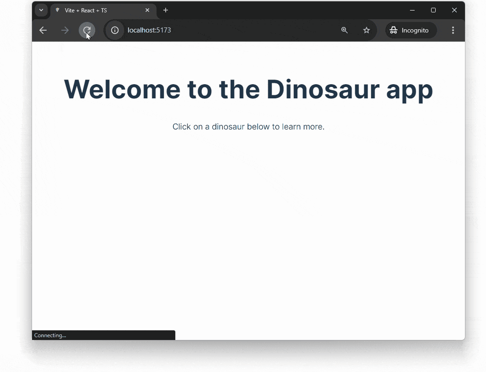

[React](https://reactjs.org) is the most widely used JavaScript frontend
framework.

In this tutorial we'll build a simple React app with Deno. The app will display
a list of dinosaurs. When you click on one, it'll take you to a dinosaur page
with more details.



## Create a React app with Vite and Deno

This tutorial will use [Vite](https://vitejs.dev/) to quickly scaffold a Deno
and React app. Vite is a build tool and development server for modern web
projects. It pairs well with React and Deno, leveraging ES modules and allowing
you to import React components directly.

In your terminal run the following command to create a new React app with Vite:

```sh
deno run --A npm:create-vite-extra
```

From the offered options select `deno-react` and `typescript`.

Then, `cd` into the newly created project folder and the following command to
serve your new react app:

```sh
deno task dev
```

This will start the Vite server, click the output link to localhost to see your
app in the browser.

## Add a backend

The next step is to add a backend API. We'll create a very simple API that
returns information about dinosaurs.

In the root of your new project, create an `api` folder. In that folder, create
a `main.ts` file, which will run the server, and a `data.json`, which will
contain the hard coded dinosaur data.

Copy and paste
[this json file](https://raw.githubusercontent.com/denoland/deno-vue-example/main/api/data.json)
into the `api/data.json` file.

We're going to build out a simple API server with routes that return dinosaur
information. We'll use the [`oak` middleware framework](https://jsr.io/@oak/oak)
and the [`cors` middleware](https://jsr.io/@tajpouria/cors) to enable
[CORS](https://developer.mozilla.org/en-US/docs/Web/HTTP/CORS).

Use the `deno add` command to add the required dependencies to your project:

```shell
deno add @oak/oak @tajpouria/cors
```

Next, update `api/main.ts` to import the required modules and create a new
`Router` instance to define some routes:

```ts title="main.ts"
import { Application, Router } from "@oak/oak";
import data from "./data.json" with { type: "json" };

const router = new Router();
```

After this, in the same file, we'll define three routes. The first route at `/`
will return the string `Welcome to the dinosaur API`, then we'll set up `/api`
to return all the dinosaurs, and finally `/api/:dinosaur` to return a specific
dinosaur based on the name in the URL:

```ts title="main.ts"
router
  .get("/", (context) => {
    context.response.body = "Welcome to dinosaur API!";
  })
  .get("/api", (context) => {
    context.response.body = data;
  })
  .get("/api/:dinosaur", (context) => {
    if (!context?.params?.dinosaur) {
      context.response.body = "No dinosaur name provided.";
    }

    const dinosaur = data.find((item) =>
      item.name.toLowerCase() === context.params.dinosaur.toLowerCase()
    );

    context.response.body = dinosaur ? dinosaur : "No dinosaur found.";
  });
```

Finally, at the bottom of the same file, create a new `Application` instance and
attach the routes we just defined to the application using
`app.use(router.routes())` and start the server listening on port 8000:

```ts title="main.ts"
const app = new Application();
app.use(oakCors());
app.use(router.routes());
app.use(router.allowedMethods());

await app.listen({ port: 8000 });
```

You can run the API server with `deno run --allow-env --allow-net api/main.ts`.
We'll create a task to run this command in the background and update the dev
task to run both the React app and the API server.

In your `deno.json` file, update the `tasks` field to include the following:

```jsonc
{
  "tasks": {
    "dev": "deno task dev:api & deno task dev:vite",
    "dev:api": "deno run --allow-env --allow-net api/main.ts",
    "dev:vite": "deno run -A npm:vite"
    // ...
  }
}
```

If you run `deno task dev` now and visit `localhost:8000`, in your browser you
should see the text `Welcome to dinosaur API!`, and if you visit
`localhost:8000/api`, you should see a JSON response of all of the dinosaurs.

🦕 Lookin' good so far! Now lets build out the client side of the app.

## Add a router

The app will have two routes: `/` and `/:dinosaur`.

We'll use [`react-router-dom`](https://reactrouter.com/en/main) to build out
some routing logic, so we'll need to add the `react-router-dom` dependency to
your project. In the project root run:

```shell
deno add npm:react-router-dom
```

Update the `/src/main.tsx` file to import and use the
[`BrowserRouter`](https://reactrouter.com/en/main/router-components/browser-router)
component from `react-router-dom`:

```tsx title="main.tsx"
import React from "react";
import ReactDOM from "react-dom/client";
import App from "./App";
import { BrowserRouter } from "react-router-dom";
import "./index.css";

ReactDOM.createRoot(document.getElementById("root") as HTMLElement).render(
  <BrowserRouter>
    <App />
  </BrowserRouter>,
);
```

## Create the routes and types

We'll create two pages: `Index` and `Dinosaur`. The `Index` page will list all
the dinosaurs and the `Dinosaur` page will show details of a specific dinosaur.

Create a `pages` folder in the `src` directory and inside that create two files:
`index.tsx` and `Dinosaur.tsx`.

### Types

Both pages will use the `Dino` type to describe the shape of data they're
expecting from the API, so let's create a `types.ts` file in the project root:

```ts title="types.ts"
export type Dino = { name: string; description: string };
```

### Index.tsx

This page will fetch the list of dinosaurs from the API and render them as
links:

```tsx title="index.tsx"
import React, { useEffect, useState } from "react";
import { Link } from "react-router-dom";
import { Dino } from "../../types";

export default function () {
  const [dinosaurs, setDinosaurs] = useState<Dino[]>([]);

  useEffect(() => {
    (async () => {
      const response = await fetch(`http://localhost:8000/api/`);
      const allDinosaurs = await response.json() as Dino[];
      setDinosaurs(allDinosaurs);
    })();
  }, []);

  return (
    <main>
      <h1>Welcome to the Dinosaur app</h1>
      <p>Click on a dinosaur below to learn more.</p>
      {dinosaurs.map((dinosaur: Dino) => {
        return (
          <Link to={`/${dinosaur.name.toLowerCase()}`} key={dinosaur.name}>
            {dinosaur.name}
          </Link>
        );
      })}
    </main>
  );
}
```

### Dinosaur.tsx

This page will fetch the details of a specific dinosaur from the API and render
it in a paragraph:

```tsx title="Dinosaur.tsx"
import React, { useEffect, useState } from "react";
import { Link, useParams } from "react-router-dom";
import { Dino } from "../../types";

export default function () {
  const { selectedDinosaur } = useParams();
  const [dinosaur, setDino] = useState<Dino>({ name: "", description: "" });

  useEffect(() => {
    (async () => {
      const resp = await fetch(`http://localhost:8000/api/${selectedDinosaur}`);
      const dino = await resp.json() as Dino;
      setDino(dino);
    })();
  }, []);

  return (
    <div>
      <h1>{dinosaur.name}</h1>
      <p>{dinosaur.description}</p>
      <Link to="/">🠠 Back to all dinosaurs</Link>
    </div>
  );
}
```

## Update the App component to use the routes

Finally, we can point to these two new pages in the `src/App.tsx` file:

```tsx title="App.tsx"
import { Route, Routes } from "react-router-dom";
import Index from "./pages/index";
import Dinosaur from "./pages/Dinosaur";
import "./App.css";

function App() {
  return (
    <div>
      <Routes>
        <Route exact path="/" element={<Index />} />
        <Route exact path="/:selectedDinosaur" element={<Dinosaur />} />
      </Routes>
    </div>
  );
}

export default App;
```

## Run the app

To run the app use the task you set up earlier

```sh
deno task dev
```

Navigate to the local server in your browser and you should see the list of
dinosaurs displayed which you can click through to find out about each one.


🦕 Now you can scaffold and develop a React app with Vite and Deno! You’re ready
to build blazing-fast web applications. We hope you enjoy exploring these
cutting-edge tools, we can't wait to see what you make!
