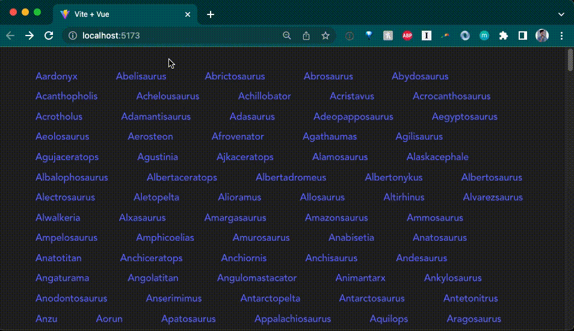

[Vue](https://vuejs.org/) is a progressive front-end JavaScript framework. Vue.js primarily focuses on the view layer. It provides tools and features for creating dynamic and interactive user interfaces. You can think of it as the bridge between your data (model) and what the user sees (view).

In this tutorial we'll build a simple Vue app with Vite and Deno. The app will display a list of dinosaurs. When you click on one, it'll take you to a dinosaur page with more details.

## Create a Vue app with Vite and Deno

We'll use [Vite](https://vitejs.dev/) to scaffold a basic Vue app. In your terminal, run the following command to create a new Vue app with Vite:

```shell
deno run -A npm:create-vite
```

Give your app a name and from the offered options select `vue` and `typescript`.

Then, `cd` into your new project and run the following command to serve your new Vue app:

```shell
deno task dev
```

This will start the Vite server. Click the output link to localhost to see your app in the browser.

## Add a backend

The next step is to add a backend API. We'll create a very simple API that
returns information about dinosaurs.

In the root of your new vite project, create an `api` folder. In that folder, create a
`main.ts` file, which will run the server, and a `data.json`, which where we'll put the hard coded data.

Copy and paste
[this json file](https://raw.githubusercontent.com/denoland/deno-vue-example/refs/heads/main/api/data.json)
into `api/data.json`.

We're going to build out a simple API server with routes that return dinosaur information. We'll use the [`oak` middleware framework](https://deno.land/x/oak) and the [`cors` middleware](https://deno.land/x/cors) to enable [CORS](https://developer.mozilla.org/en-US/docs/Web/HTTP/CORS).

Use the `deno add` command to add the required dependencies to your project:

```shell
deno add @oak/oak @tajpouria/cors
```

Next, update `api/main.ts` to import the required modules and create a new
`Router` instance to define some routes:

```ts title="main.ts"
import { Application, Router } from "@oak/oak";
import { oakCors } from "@tajpouria/cors";
import data from "./data.json" with { type: "json" };

const router = new Router();
```

After this, in the same file, we'll define three routes. The first route at `/`
will return the string `Welcome to the dinosaur API`, then we'll set up `/dinosaurs`
to return all the dinosaurs, and finally `/dinosaurs/:dinosaur` to return a specific
dinosaur based on the name in the URL:

```ts title="main.ts"
router
  .get("/", (context) => {
    context.response.body = "Welcome to dinosaur API!";
  })
  .get("/dinosaurs", (context) => {
    context.response.body = data;
  })
  .get("/dinosaurs/:dinosaur", (context) => {
    if (!context?.params?.dinosaur) {
      context.response.body = "No dinosaur name provided.";
    }

    const dinosaur = data.find((item) =>
      item.name.toLowerCase() === context.params.dinosaur.toLowerCase()
    );

    context.response.body = dinosaur ? dinosaur : "No dinosaur found.";
  });
```

Finally, at the bottom of the same file, create a new `Application` instance and
attach the routes we just defined to the application using
`app.use(router.routes())` and start the server listening on port 8000:

```ts title="main.ts"
const app = new Application();
app.use(oakCors());
app.use(router.routes());
app.use(router.allowedMethods());

await app.listen({ port: 8000 });
```

You can run the API server with `deno run --allow-env --allow-net api/main.ts`.
We'll create a task to run this command in the background and update the dev
task to run both the React app and the API server.

In your `deno.json` file, update the `tasks` field to include the following:

```jsonc
{
  "tasks": {
    "dev": "deno task dev:api & deno task dev:vite",
    "dev:api": "deno run --allow-env --allow-net api/main.ts",
    "dev:vite": "deno run -A npm:vite",
    // ...
  }
}
```

If you run `deno task dev` now and visit `localhost:8000`, in your browser you
should see the text `Welcome to dinosaur API!`, and if you visit
`localhost:8000/dinosaurs`, you should see a JSON response of all of the dinosaurs.

🦕 Lookin' good so far! Now lets build out the client side of the app.

## Build the frontend

Vue splits the frontend UI into components. Each component is a reusable piece of
code. We'll create three components: one for the home page, one for the list of dinosaurs, and one for an individual dinosaur.

Each component file is split into three parts: `<script>`, `<template>`, and
`<style>`. The `<script>` tag contains the JavaScript logic for the component,
the `<template>` tag contains the HTML, and the `<style>` tag contains the CSS.

In the `/src/components` directory, create three new files: `HomePage.vue`,
`Dinosaurs.vue`, and `Dinosaur.vue`.

```shell


Before we create the components, let's add some state management.

## Maintain state with `store`

In order to maintain state across our `<Dinosaur>` and `<Dinosaurs>` components,
we'll use [Vue store](https://vuejs.org/guide/scaling-up/state-management.html).
Note for more complex state management, check out the Vue-endorsed
[Pinia](https://pinia.vuejs.org/) library.

Create a `src/store.js` file:

```shell
touch src/store.js
```

And in it, let's add:

```js
import { reactive } from "vue";

export const store = reactive({
  dinosaur: {},
  setDinosaur(name, description) {
    this.dinosaur.name = name;
    this.dinosaur.description = description;
  },
});
```

We'll import `store` into both `Dinosaurs.vue` and `Dinosaur.vue` to set and
retrieve dinosaur name and description.

## Update Vue components

In `Dinosaurs.vue`, we'll do three things:

- send a `GET` request to our API and return that as `dinosaurs`
- iterate through `dinosaurs` and render each `dinosaur` in `<router-link>` that
  points to the `<Dinosaur>` component
- add `store.setDinosaur()` to `@click` on each `dinosaur`, which will set the
  `store`

Here is the complete code below:

```tsx
<script>
import { ref } from 'vue'
import { store } from '../store.js'
export default ({
  async setup() {
    const res = await fetch("http://localhost:8000/api")
    const dinosaurs = await res.json();
    return {
      dinosaurs
    }
  },
  data() {
    return {
      store
    }
  }
})
</script>

<template>
  <div class="container">
    <div v-for="dinosaur in dinosaurs" class="dinosaur-wrapper">
      <span class="dinosaur">
        <router-link :to="{ name: 'Dinosaur', params: { dinosaur: `${dinosaur.name.toLowerCase()}` }}">
          <span @click="store.setDinosaur(dinosaur.name, dinosaur.description)">
            {{dinosaur.name}}
          </span>
        </router-link>
      </span>
    </div>
  </div>
</template>

<style scoped>
.dinosaur {
}
.dinosaur-wrapper {
  display: inline-block;
  margin: 0.15rem 1rem;
  padding: 0.15rem 1rem;
}
.container {
  text-align: left;
}
</style>
```

In `Dinosaur.vue`, we'll add:

- importing `store`
- rendering `store.dinosaur` in the HTML

```tsx
<script>
import { store } from '../store.js';
export default {
  data() {
    return {
      store
    }
  }
}
</script>

<template>
  Name: {{ store.dinosaur.name }}
  <br />
  Description: {{ store.dinosaur.description }}
</template>
```

Next, we'll update `HomePage.vue`. Since the `Dinosaurs` component needs to
fetch the data from the API, we'll use
[`<Suspense>`](https://vuejs.org/guide/built-ins/suspense.html), which manages
async dependencies in a component tree.

```tsx
<script>
import { ref } from 'vue'
import Dinosaurs from './Dinosaurs.vue'
export default {
  components: {
    Dinosaurs
  }
}
</script>

<template>
  <Suspense>
    <template #default>
      <Dinosaurs />
    </template>
    <template #fallback>
      <div>Loading...</div>
    </template>
  </Suspense>

  <p>
    Check out
    <a href="https://vuejs.org/guide/quick-start.html" target="_blank"
      >create-vue</a
    >, the official Vue + Vite starter
  </p>
  <p class="read-the-docs">Learn more about using Deno and Vite.</p>
</template>

<style scoped>
.read-the-docs {
  color: #888;
}
</style>
```

Tying it all together, let's update `src/App.vue`:

```tsx
<template>
  <router-view />
</template>;
```

## Add routing

You'll notice that we have used `<router-link>` and `<router-view>`. These
components are part of the [`vue-router` library](https://router.vuejs.org/),
which we'll have to setup and configure in another file.

First, let's import `vue-router` in our `vite.config.mjs` file:

```ts
import { defineConfig } from "npm:vite@^3.1.3";
import vue from "npm:@vitejs/plugin-vue@^3.2.39";

import "npm:vue@^3.2.39";
import "npm:vue-router@4";

// https://vitejs.dev/config/
export default defineConfig({
  plugins: [vue()],
});
```

Next, let's create a folder named `router`. In it, let's create `index.ts`:

```console
mkdir router && touch router/index.ts
```

In `router/index.ts`, we'll create `router`, which contains information about
each route and their component, and export it. For more information on using
`vue-router`, check out their [guide](https://router.vuejs.org/guide).

```ts
import { createRouter, createWebHistory } from "vue-router";
import HomePage from "../components/HomePage.vue";
import Dinosaur from "../components/Dinosaur.vue";

const routes = [
  {
    path: "/",
    name: "Home",
    component: HomePage,
  },
  {
    path: "/:dinosaur",
    name: "Dinosaur",
    component: Dinosaur,
    props: true,
  },
];

const router = createRouter({
  history: createWebHistory("/"),
  routes,
});

export default router;
```

Next, in our `src/main.ts` file, which contains all of the logic for the
frontend app, we'll have to import and use `router`:

```ts
import { createApp } from "vue";
import "./style.css";
import App from "./App.vue";
import router from "./router/index.ts";

const app = createApp(App);
app.use(router);
app.mount("#app");
```

Let's run it and see what we get so far:



Awesome!
