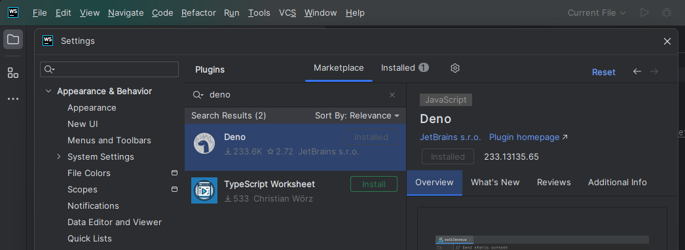

Deno is a secure runtime for JavaScript and TypeScript that comes with a set of
built-in tools and utilities. In this tutorial, we’ll walk you through setting
up your development environment for Deno using Visual Studio Code (VS Code).
We’ll also show you how to configure Deno’s Language Server Protocol (LSP) in
other popular editors like JetBrains IDEs, Vim/Neovim, Emacs, Sublime Text, and
Atom.

The Deno LSP is used to:

- Provide IntelliSense which offers code completion suggestions as you type,
  making coding faster and reducing errors.
- Enable `Go-to Definition` which allows you to quickly navigate to the
  definition of a variable, function, or module.
- Support code formatting, automatically formatting your code according to
  Deno’s style guidelines.
- Code linting, identifying and highlighting potential issues in your code,
  helping maintain code quality.
- Show documentation on hover displaying relevant documentation when you hover
  over a symbol, aiding in understanding and usage.
- Handle module resolution, which manages and resolves module imports, ensuring
  they are correctly referenced and cached23.

## Setting Up Deno in VSCode

If you haven’t already, download and install Visual Studio Code from the
[official website](https://code.visualstudio.com/).

In the Extensions tab, search for "Deno" and install the
[extension by Denoland](https://marketplace.visualstudio.com/items?itemName=denoland.vscode-deno).

Next, open the Command Palette by pressing `Ctrl+Shift+P` and type
`Deno: Initialize Workspace Configuration`. Select this option to configure Deno
for your workspace.


A file called `.vscode/settings.json` will be created in your workspace with the
following configuration:

```json
{
  "deno.enable": true,
  "deno.lint": true,
  "deno.unstable": true
}
```

That’s it! You’ve successfully set up your developer environment for Deno using
VSCode. You will now get all the benefits of Deno’s LSP, including IntelliSense,
code formatting, linting, and more.

## JetBrains IDEs (WebStorm, IntelliJ IDEA, PhpStorm, PyCharm)

To install the Deno Plugin, open your IDE and go to **File** > **Settings**.
Navigate to **Plugins** and search for `Deno`. Install the official Deno plugin.



To configure the Plugin, go to **File** > **Settings** again. Navigate to
**Languages & Frameworks** > **Deno**. Check **Enable Deno for your project**
and specify the path to the Deno executable (if it has not been auto-detected).

## Other Editors

See the
[guide to set up your development environment](/runtime/manual/getting_started/setup_your_environment/).
