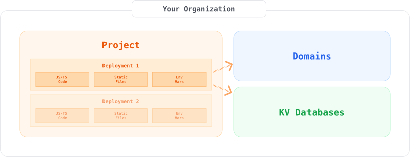

To build Subhosting with Deno Deploy, it helps to understand some key resources
within the system. These resources are also represented in the
[REST API](../api/index.md).



<a id="organizations"></a>

## Organizations

[**Organizations**](https://apidocs.deno.com/#get-/organizations/-organizationId-)
are a container for all data related to a subhosting implementation. Your
organization will have a name and an ID. Each organization has an analytics
endpoint which can be used to get metrics (such as request count and bandwidth
used) from across the organization.

Other Deploy users can be invited to collaborate on an organization, and
[access tokens](https://dash.deno.com/account#access-tokens) can give developers
with organization access the ability to modify resources within the org via API.
New organizations can be created in the
[Deploy dashboard](https://dash.deno.com/orgs/new).

<a id="projects"></a>

## Projects

[**Projects**](https://apidocs.deno.com/#get-/organizations/-organizationId-/projects)
act as organizational containers for deployments. A project contains its
deployments and the analytics and usage information for those deployments.

Projects are free and can be set up as required.

To track usage by individual users for billing there is an API endpoint that
reports analytics (bandwidth usage, request count, etc), per project, with 15
minute granularity.

> All deployments (whether within a same project or between different projects)
> share nothing by default. Projects are a way to organize your deployments and
> do not cost anything. However analytics are reported on a per-project basis,
> if you have multiple tenants we recommend setting up a project for each.
> Particularly if you expect to bill your users for their usage.

<a id="deployments"></a>

## Deployments

[**Deployments**](https://apidocs.deno.com/#get-/projects/-projectId-/deployments):
a deployment is a set of configuration, runnable code, and supporting static
files that can run on an isolate in Deno Deploy. Deployments have an entry file
that can launch a server, can have a [Deno KV](/deploy/kv/manual) database
associated with them, and can be set up to run on custom domains.

A deployment is an immutable object that consists of:

- Source code to run
- Static assets
- Environment variables
- Database bindings
- Other settings

We provide endpoints for querying or streaming build logs and querying or
streaming execution logs.

If you need to block or unblock a deployment you can do so by deleting the
deployment that you need to block or by unassigning its domains. This will make
the deployment unreachable.

The Subhosting system is built so that the behavior or load on one deployment
does not affect other deployments. This also applies to different deployments
within one organization. Capacity is auto-scaled on demand. If you want to limit
resources to a particular deployment or application you can use the analytics
API to provide you with detailed metrics (request count, bandwidth, etc) at
project level granularity. You can use this to decide whether to shut off
deployments and make them unreachable.

> NB. **Deployments are immutable**, however, you can create a new deployment
> and then remap its domain to the new deployment. The redeploy endpoint can
> create a new deployment from an existing one with different settings.

<a id="domains"></a>

## Custom domains

[**Custom domains**](https://apidocs.deno.com/#get-/organizations/-organizationId-/domains)
can be dynamically mapped to deployments, giving them a unique URL (eg
`mycompany.com`).

Before a domain can be used you need to
[verify ownership and provision
or upload TLS certificates](https://github.com/denoland/deploy-api/blob/main/samples.ipynb).

If you are on the [Builder tier](https://deno.com/deploy/pricing?subhosting) you
can use wildcard domains. Once you have a wildcard domain registered, you can
use it in two ways:

- Send all requests for `*.mycompany.com` to a specific deployment
- (Coming soon) Assign different subdomains (e.g. `foo.mycompany.com` and
  `bar.mycompany.com`) to separate deployments.

### Staging vs Production Environments

The Deno Deploy end-user platform automatically creates preview deployments when
a developer opens a github pull request, and commits to the “main” branch are
automatically turned into production deployments. Although subhosting does not
provide github integration out of the box, it has all the primitives you need to
define your own semantics for creating preview and production deployments.

<a id="database"></a>

## Connecting a KV Database

A (KV) database stores key-value pairs You can make a database accessible to a
deployment when you make the deployment. KV databases can be used by multiple
deployments at the same time.

To use KV with Subhosting:

- [Create a database using the API](https://docs.deno.com/deploy/kv/manual)
- When you create a deployment using the Subhosting API, specify the database
  you created.

> NB. Deno Cron and Queues do not currently work for Subhosting.

## OpenAPI specification and tooling

The [OpenAPI specification](https://www.openapis.org/) for the Deploy API can be
found here:

```console
https://api.deno.com/v1/openapi.json
```

This spec document can be used with a
[large number of OpenAPI-compatible tools](https://openapi.tools/). In addition
to the documentation for the REST API maintained here, you can find
auto-generated API documentation (including a browser-based testing tool)
[here](https://apidocs.deno.com/).
